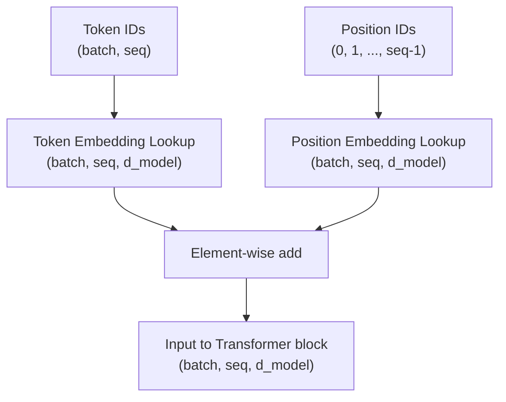
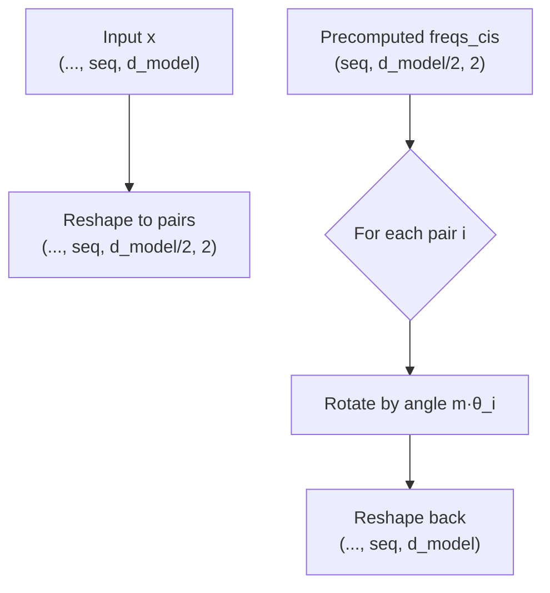
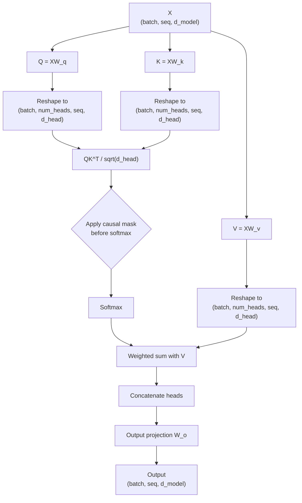
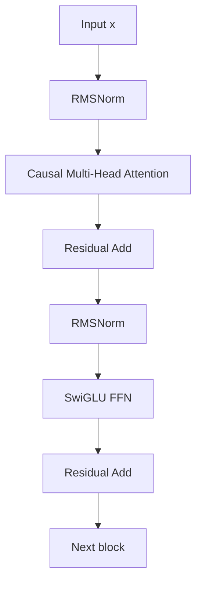

# Week 3 Instructor Notes — Transformer Architecture I: Building Blocks

## Goals for the Session

By the end of this 3-hour session, students should be able to:

1. **Build the mental model of a Transformer block piece by piece.**
   - Explain why a token embedding table is only the first step.
   - Identify where positional information enters the stack.
   - Map every sub-layer (attention, normalization, FFN) to its inputs and outputs.
2. **Derive RoPE and causal attention from first principles.**
   - Write the 2-D rotation matrix for RoPE.
   - Explain why the dot product `q_m · k_n` depends only on `m - n`.
   - Construct the causal mask and justify where it is applied.
3. **Run and inspect each component in isolation.**
   - Execute the four lab scripts in order.
   - Predict tensor shapes before running code.
   - Modify hyperparameters and reason about the resulting changes.
4. **Compare design alternatives on real metrics.**
   - LayerNorm vs. RMSNorm: formula, speed, mean behavior.
   - Standard ReLU FFN vs. SwiGLU: parameter count, expressiveness.
   - RoPE vs. learned absolute positions vs. ALiBi.
   - Broader stack choices: tokenizers, data parallelism, alignment.

## Why This Matters

Modern large language models (Llama, Qwen, GPT, etc.) are not black boxes assembled by trial and error. They are the result of a small set of well-understood building blocks that have been tuned for **stability at scale**, **hardware efficiency**, and **sequence modeling quality**.

- **Embeddings + positions** decide how discrete tokens become continuous, position-aware vectors. A mistake here (e.g., ignoring position, or applying it to values) propagates through every subsequent layer.
- **RoPE** is the default positional encoding in most open-weight LLMs today because it keeps the attention score a function of *relative* distance, which improves length generalization and keeps the model permutation-aware only where it should be.
- **Causal self-attention** is the core of autoregressive generation. Understanding the mask is what separates "language model" from "encoder model" (BERT-style) and is the foundation of inference-time KV-cache optimization.
- **RMSNorm + SwiGLU** are the modern replacements for the original Transformer’s LayerNorm + ReLU FFN. They reduce memory traffic and improve training stability, directly affecting how large a model you can train on a given GPU cluster.

In industry, the same week-3 concepts appear in interview loops, debugging NaNs during pre-training, choosing between tokenizer implementations, and deciding whether FSDP is needed for a new model. The lab scripts are intentionally small so students can focus on the *mechanics* before the *scale*.

## Suggested Timing (3 hours)

| Segment | Time | Activity | Instructor Notes |
|---------|------|----------|------------------|
| **0. Setup & motivation** | 5 min | Welcome, goals, why this matters | Show a one-slide Llama/Qwen architecture diagram; point to the blocks we will build today. |
| **1. Embeddings & positions** | 20 min | Lecture + live run of `01_embeddings.py` | Emphasize that self-attention is permutation-invariant. |
| **2. RoPE derivation** | 25 min | Lecture + live run of `02_rope.py` | Derive the 2-D rotation, then generalize to `d_model`. |
| **Break** | 10 min | — | — |
| **3. Causal self-attention** | 30 min | Lecture + live run of `03_attention.py` | Draw the mask; run single-head and multi-head side by side. |
| **4. RMSNorm & SwiGLU** | 25 min | Lecture + live run of `04_rmsnorm_swiglu.py` | Use the parameter-count example from the notes. |
| **5. Algorithm comparisons** | 15 min | Stand-alone comparison tables | Connect to real systems: tokenizers, parallelism, alignment. |
| **Lab time** | 40 min | Students run scripts, modify, answer exercise questions | Circulate; ask each table to predict a shape before running. |
| **Wrap-up** | 10 min | Collect one takeaway per student; preview Week 4 | Mention optimizer + LR schedule + training loop. |

Total: **180 minutes**. The lab time is deliberately long because the session is hands-on; students retain the architecture better when they have just broken a causal mask or watched RMSNorm not center a mean.

## Pre-Session Setup

Before students arrive:

1. Confirm the environment is activated (top-level `.venv/` or the assignment-specific environment).
2. Run each lab script once to ensure no import errors:
   ```bash
   for f in teaching/week03/lab/*.py; do python "$f"; done
   ```
3. Have a projector/screen ready to show the Mermaid diagrams and live terminal output.
4. Prepare a shared board/ slide with the four core questions from the Discussion Prompts section.

## Lecture Outline

### 1. Embeddings and Positional Information

#### 1.1 From token IDs to dense vectors

- A **token embedding matrix** `E` has shape `(vocab_size, d_model)`.
- Each row `E[t]` is the learned vector for token `t`.
- Given input token IDs of shape `(batch, seq)`, the lookup produces `tok_emb` of shape `(batch, seq, d_model)`.
- The lookup is just a **gather/indexing operation**; there is no nonlinearity yet.

**Concrete example**

Suppose `vocab_size = 5`, `d_model = 4`, and a tiny batch is:

```python
token_ids = torch.tensor([
    [0, 2, 2, 4],
    [1, 0, 3, 2]
])  # shape: (batch=2, seq=4)
```

After `nn.Embedding(5, 4)`:

```text
shape: (2, 4, 4)
```

The same token ID `2` appears at different positions, but *before positional encoding* the model cannot tell them apart.

#### 1.2 Why position matters

- **Self-attention is permutation-invariant**: if you shuffle the input sequence, the set of pairwise dot products does not change (only their ordering changes).
- Language is *not* permutation-invariant: `“the cat sat” ≠ “sat cat the”`.
- Therefore we must inject **position information** into the token vectors.



#### 1.3 Positional encoding options

| Approach | How it works | Pros | Cons | Typical use |
|----------|--------------|------|------|-------------|
| **Learned absolute** (`01_embeddings.py`) | Learn a lookup table `(max_seq_len, d_model)` and add to token embeddings. | Simple, trainable, works well up to `max_seq_len`. | Cannot extrapolate beyond `max_seq_len`; each position has independent parameters. | Original GPT, BERT, many vision transformers. |
| **Sinusoidal** | Add fixed `sin/cos` waves of decreasing frequency. | No extra learned parameters; easy to extrapolate. | Not learned; empirically weaker than RoPE in large LLMs. | Original "Attention Is All You Need" encoder. |
| **RoPE** | Rotate Q/K vectors by position-dependent angles. | Relative-position bias in attention scores; excellent length generalization. | Slightly more code; needs even `d_model`. | Llama, Qwen, Mistral, modern decoder-only LLMs. |
| **ALiBi** | Add a fixed penalty to attention scores proportional to distance. | Strong length extrapolation; no rotary computation. | Biases shorter contexts; less common in open-weight LLMs. | Some BLOOM variants, MPT. |

**Teaching tip**: Ask, *"If I shuffle the input tokens after adding learned positional embeddings, will the output change?"* (Yes, because the position vectors are tied to absolute indices.) Then ask, *"What if I shuffle them before adding positional embeddings?"* (No, the token embeddings are identical for the same ID regardless of position.)

#### 1.4 Code connection: `01_embeddings.py`

Key lines to walk through:

```python
positions = torch.arange(seq, device=token_ids.device).unsqueeze(0).expand(batch, -1)
tok_emb = self.token_embedding(token_ids)
pos_emb = self.position_embedding(positions)
return tok_emb + pos_emb
```

- `positions` has shape `(batch, seq)` and contains `[0, 1, 2, ..., seq-1]` repeated for each batch element.
- The output is `(batch, seq, d_model)`.
- The script also shows that the same token ID at two positions has a nonzero L2 distance, proving the position vector changed the representation.

#### Common misconceptions

| Misconception | Why it is wrong | How to avoid it |
|---------------|-----------------|-----------------|
| "The embedding layer learns grammar." | It only learns a lookup; grammar emerges later via attention and training data. | Point to the `nn.Embedding` implementation: it is just a matrix indexed by ID. |
| "Position embeddings have to be added before the token embedding." | They are added *to* the token embedding; order of the addition does not matter mathematically. | Read the line `tok_emb + pos_emb` and note commutativity. |
| "A model with self-attention knows token order automatically." | Self-attention is permutation-invariant without positional information. | Show the `same_token` demo: identical token IDs produce identical token embeddings. |

---

### 2. Rotary Positional Embeddings (RoPE)

#### 2.1 The key idea

Instead of *adding* a vector to the input, **rotate** the query and key vectors by a position-dependent angle. The angle is a function of the position `m` and the dimension pair `i`.

For a 2-D pair `(x_m^{(1)}, x_m^{(2)})` at position `m`:

```text
R(m) = [[ cos(mθ), -sin(mθ) ],
        [ sin(mθ),  cos(mθ) ]]
```

Then:

```text
q_m = R(m) W_q x_m
k_n = R(n) W_k x_n
```

The dot product `q_m · k_n` depends only on the **relative distance** `m - n`, which is exactly what we want for language modeling.

**Concrete toy example**

Let `θ = 1.0`, `q = (1, 0)` at position `m = 0`, and `k = (1, 0)` at position `n = 2`.

```text
R(0) = I,                so q_0 = (1, 0)
R(2) ≈ [[-0.416, -0.909],
        [ 0.909, -0.416]], so k_2 ≈ (-0.416, 0.909)

dot(q_0, k_2) ≈ -0.416
```

If we instead evaluate `q_2` and `k_0`, the rotation angles swap signs and the dot product is the same (up to sign conventions), demonstrating dependence on `m - n` rather than on `m` and `n` separately.

#### 2.2 Extension to `d_model`

In high dimensions, RoPE treats the `d_model` coordinates as `d_model / 2` independent 2-D planes. Each plane gets its own frequency:

```text
θ_i = base^{-2i / d_model},   i = 0, 1, ..., d_model/2 - 1
```

- Lower `i` → slower rotation (long-wavelength, captures long-range relationships).
- Higher `i` → faster rotation (short-wavelength, captures fine-grained local relationships).

This is why RoPE uses a **frequency spectrum**: a single angle would only encode one wavelength and would lose high-frequency positional detail.



#### 2.3 Code connection: `02_rope.py`

Walk through the two functions:

```python
freqs = 1.0 / (theta ** (torch.arange(0, d_model, 2, dtype=torch.float32) / d_model))
angles = torch.outer(positions, freqs)
freqs_cis = torch.stack([torch.cos(angles), torch.sin(angles)], dim=-1)
```

- `torch.arange(0, d_model, 2)` picks the even indices; dividing by `d_model` gives the exponents `2i / d_model` for the pair index `i`.
- `angles` has shape `(max_seq_len, d_model // 2)`.
- `freqs_cis` stores `(cos, sin)` for every position and pair.

The rotation itself:

```python
rotated0 = x0 * cos - x1 * sin
rotated1 = x0 * sin + x1 * cos
```

This is the matrix multiplication `R(m) @ [x0; x1]` written element-wise for efficiency.

#### 2.4 Algorithm comparison: RoPE vs. alternatives

| Approach | What is encoded | Relative-position behavior | Length extrapolation | Implementation cost | Best for |
|----------|-----------------|----------------------------|----------------------|---------------------|----------|
| **RoPE** | Angle in Q/K subspaces | Exact in dot product | Excellent with adjusted `theta` | Low (precompute sin/cos) | Modern decoder LLMs (Llama, Qwen, Mistral). |
| **Learned absolute** | Absolute index | None beyond training distribution | Poor | Very low | Short, fixed-length sequences; BERT/GPT-1-style models. |
| **Sinusoidal** | Fixed frequency waves | Implicit through phase | Moderate | Very low | Original Transformer encoder; educational baseline. |
| **ALiBi** | Distance penalty added to scores | Explicit linear bias | Strong | Very low | Models targeting very long context without fine-tuning. |

#### Common misconceptions

| Misconception | Why it is wrong | How to avoid it |
|---------------|-----------------|-----------------|
| "RoPE is added to the input like sinusoidal position encoding." | RoPE is applied to **Q and K after projection**, not to the raw input. | Show the lab: `apply_rope(q, freqs_cis)` is called on `q` and `k`, not on the input token IDs. |
| "RoPE should be applied to V as well." | Values are mixed *after* the attention scores; rotating values would break the permutation/equivariance properties we want. | Emphasize: rotate Q and K only; V is left untouched in the lab code. |
| "A single rotation angle is enough." | A single angle cannot distinguish multiple length scales; the frequency spectrum captures both local and long-range structure. | Reference the `theta_i` formula and the varying rotation speeds. |
| "RoPE makes the model know absolute positions." | RoPE makes *attention scores* depend on relative positions; absolute position is not explicitly represented. | Demonstrate with the cross-dot-product exercise in the lab. |

---

### 3. Causal Self-Attention

#### 3.1 Queries, keys, and values

For an input `X` of shape `(batch, seq, d_model)`:

```text
Q = X W_q
K = X W_k
V = X W_v
```

- **Query** (`Q`): "What am I looking for?" — one vector per token.
- **Key** (`K`): "What do I contain?" — one vector per token.
- **Value** (`V`): "What do I pass forward if I am attended to?" — one vector per token.

The attention operation is a **differentiable dictionary lookup**: the query retrieves values weighted by how well it matches each key.

#### 3.2 Scaled dot-product attention

```text
scores = Q K^T / sqrt(d_head)
attn   = softmax(scores, dim=-1)
out    = attn V
```

Why divide by `sqrt(d_head)`?

- As `d_head` grows, the variance of dot products grows linearly with `d_head`.
- Without scaling, softmax inputs become very large, pushing the distribution toward one-hot vectors and killing gradients.
- Division by `sqrt(d_head)` keeps the variance roughly constant (assuming unit-variance entries).

**Concrete example**

Suppose `d_head = 64`. If entries of `Q` and `K` have variance `1`, then `Q_i · K_j` has variance `64`. After dividing by `sqrt(64) = 8`, the variance is `1`, which is a healthy range for softmax.

#### 3.3 The causal mask

A **causal mask** ensures token `i` can only attend to tokens `j ≤ i`.

For `seq_len = 4`:

```text
      j=0  j=1  j=2  j=3
i=0 [  1    0    0    0 ]
i=1 [  1    1    0    0 ]
i=2 [  1    1    1    0 ]
i=3 [  1    1    1    1 ]
```

In code:

```python
mask = torch.tril(torch.ones(size, size, dtype=torch.bool))
scores = scores.masked_fill(~mask, float("-inf"))
attn = F.softmax(scores, dim=-1)
```

The mask is applied **before** softmax. If you mask after softmax, the weights would no longer sum to 1 and future positions would leak information through the normalization denominator.

#### 3.4 Multi-head attention

- Split `d_model` into `num_heads × d_head`.
- Compute attention in parallel for each head.
- Concatenate heads and project with `W_o`.

Shape journey in `03_attention.py`:

```text
(batch, seq, d_model)
  → w_q/k/v → (batch, seq, d_model)
  → view + transpose → (batch, num_heads, seq, d_head)
  → attention → (batch, num_heads, seq, d_head)
  → transpose + reshape → (batch, seq, d_model)
  → w_o → (batch, seq, d_model)
```

**Check-for-understanding**: If `d_model = 64` and `num_heads = 4`, what is `d_head`? (Answer: `16`.) If `d_model` is not divisible by `num_heads`, what happens? (Answer: reshaping fails; the lab raises `ValueError`.)



#### 3.5 Code connection: `03_attention.py`

Two implementations are provided:

- `CausalSelfAttention`: single-head, scaled by `sqrt(d_model)`.
- `MultiHeadCausalAttention`: splits into heads, scaled by `sqrt(d_head)`.

The script prints:

```text
Upper-triangular attention max: 0.000000
```

This is the empirical proof that the causal mask is working: every weight where `j > i` is numerically zero.

#### Common misconceptions

| Misconception | Why it is wrong | How to avoid it |
|---------------|-----------------|-----------------|
| "The causal mask can be applied after softmax." | Applying after softmax leaves nonzero probabilities for future tokens because softmax already normalized over them. | Always set masked positions to `-inf` *before* `softmax`. |
| "We divide by `sqrt(d_model)` in multi-head attention." | Each head has `d_head = d_model / num_heads`; scaling by `sqrt(d_head)` is correct. | Show both classes in the lab and compare denominators. |
| "Multi-head attention uses different inputs per head." | All heads see the same `X`; they differ only by their projection matrices. | Trace the single `x` into `w_q`, `w_k`, `w_v` and the reshape. |
| "Causal attention is only needed at inference." | During training, future tokens are available in the batch, but the model must not see them. | Masking is enforced at every training step; inference reuses the same mask plus KV cache. |
| "Attention weights must be symmetric." | Causal attention is explicitly asymmetric: row `i` can attend to fewer columns than row `i+1`. | Display the lower-triangular attention matrix. |

---

### 4. Normalization and Feed-Forward Networks

#### 4.1 LayerNorm vs. RMSNorm

**LayerNorm** (original Transformer):

```text
y = (x - mean(x)) / sqrt(var(x) + eps) * gamma + beta
```

**RMSNorm** (modern LLMs):

```text
y = x / sqrt(mean(x^2) + eps) * gamma
```

RMSNorm drops the mean-centering and the bias term. Empirically, the mean subtraction is not necessary in deep Transformers and removing it saves compute and memory bandwidth.

**Concrete toy example**

For `x = [1.0, 2.0, 3.0]`:

```text
mean(x^2) = (1 + 4 + 9) / 3 = 14/3 ≈ 4.667
RMS      = sqrt(4.667) ≈ 2.160
RMSNorm(x) ≈ [0.463, 0.926, 1.389]
```

LayerNorm would first subtract `mean(x) = 2.0`, producing `[-1, 0, 1]`, then divide by `std(x) ≈ 0.816`. RMSNorm preserves the original direction and only rescales the magnitude.

| Aspect | LayerNorm | RMSNorm |
|--------|-----------|---------|
| **Formula** | `(x - μ) / sqrt(σ² + ε) · γ + β` | `x / sqrt(mean(x²) + ε) · γ` |
| **Mean-centering?** | Yes | No |
| **Learned parameters** | `γ`, `β` | `γ` only |
| **Speed** | Slightly slower (needs mean and variance) | Slightly faster (RMS only) |
| **Memory traffic** | Higher | Lower |
| **Typical location** | Post-LN or Pre-LN in original Transformers | Pre-RMSNorm in Llama/Qwen/Mistral |
| **Quality** | Comparable; RMSNorm is slightly preferred in very large decoder-only models. | Preferred in most modern LLMs. |

#### 4.2 FFN variants

Original Transformer FFN:

```text
FFN(x) = ReLU(x W_1 + b_1) W_2 + b_2
```

Modern **SwiGLU**:

```text
SwiGLU(x) = (Swish(x W_1) ⊗ (x W_2)) W_3
```

In the lab, `Swish` is implemented as `F.silu`, which is the Swish-1 activation (`x ⊗ σ(x)`). The `⊗` denotes element-wise multiplication; it acts as a **gating** mechanism.

**Parameter-count comparison** for `d_model = 512`:

| Variant | `d_ff` | Formula | Approx. parameters |
|---------|--------|---------|-------------------|
| Standard ReLU FFN (lab demo) | `4 * d_model = 2048` | `2 · d_model · d_ff` | `2 · 512 · 2048 = 2,097,152` |
| SwiGLU (lab default) | `≈ 8/3 · d_model = 1536` | `3 · d_model · d_ff` | `3 · 512 · 1536 = 2,359,296` |
| SwiGLU with same `d_ff` as standard | `2048` | `3 · d_model · d_ff` | `3 · 512 · 2048 = 3,145,728` |

Takeaway: **for the same hidden dimension `d_ff`, SwiGLU has ~50% more parameters** because it has three matrices instead of two. Modern implementations choose `d_ff ≈ 8/3 · d_model` so the *total* FFN size stays similar to a standard `d_ff = 4 · d_model` block while gaining the gating nonlinearity.

#### 4.3 Code connection: `04_rmsnorm_swiglu.py`

Key snippets:

```python
norm = x * torch.rsqrt(x.pow(2).mean(dim=-1, keepdim=True) + self.eps)
return self.weight * norm
```

- `torch.rsqrt` computes `1 / sqrt(...)` in one fused operation.
- `self.weight` is the learned `γ`.

For SwiGLU:

```python
return self.w3(F.silu(self.w1(x)) * self.w2(x))
```

- `self.w1` and `self.w2` both map `d_model → d_ff`.
- `self.w3` maps `d_ff → d_model`.
- The `*` is element-wise multiplication (the gate).



This is the modern **pre-normalization** decoder block used in Llama/Qwen: normalization happens *before* attention and FFN, not after.

#### Common misconceptions

| Misconception | Why it is wrong | How to avoid it |
|---------------|-----------------|-----------------|
| "RMSNorm is just LayerNorm with β removed." | It also removes mean-centering; the output mean is not zero. | Run the lab: compare `LayerNorm output mean` vs. `RMSNorm output mean`. |
| "SwiGLU has the same parameter count as a standard FFN." | Only if you reduce `d_ff`; with equal `d_ff` it has 1.5× the parameters. | Use the table above and the lab’s printed counts. |
| "The SwiGLU gate is a matrix multiplication." | It is element-wise multiplication after two separate linear projections. | Point to `F.silu(self.w1(x)) * self.w2(x)`. |
| "Pre-normalization and post-normalization are equivalent." | Pre-norm is more stable at large depth; post-norm requires careful learning-rate warmup. | Mention that the lab uses pre-RMSNorm, consistent with modern LLMs. |

---

### 5. Broader Algorithm Comparisons

These topics extend beyond the four lab scripts but appear constantly when students read papers or deploy LLMs. Include them in the stand-alone comparison segment or assign as reading.

#### 5.1 Tokenizers: BPE vs. SentencePiece vs. Unigram

| Approach | How it trains | Pros | Cons | Best for |
|----------|---------------|------|------|----------|
| **BPE** | Start with characters; greedily merge the most frequent adjacent pair until vocab size is reached. | Deterministic, fast, widely implemented (GPT-2, RoBERTa). | Can produce many surface variants; poor morphological alignment; needs pre-tokenization. | English-centric generative models. |
| **SentencePiece** | Trains BPE or Unigram on raw text without whitespace pre-tokenization; uses `▁` for word boundaries. | Language-agnostic, handles CJK/no spaces, reversible, built-in normalization. | Slower training, extra special tokens, can be less interpretable. | Multilingual models (mT5, XLM-R). |
| **Unigram** | Start with a large seed vocabulary; iteratively remove tokens to maximize likelihood of the corpus. | Probabilistic framework, multiple segmentation candidates, good morphology. | More complex, less common, slower than BPE. | Morphologically rich languages. |

**Connection to Week 3**: The output of any tokenizer is a sequence of integer token IDs, which is exactly the input to `01_embeddings.py`. A bad tokenizer (e.g., inconsistent handling of numbers) creates embedding-table rows that the model must spend capacity learning to disambiguate.

#### 5.2 Data parallelism: DDP vs. FSDP

| Approach | What each GPU holds | Communication pattern | Pros | Cons | Best for |
|----------|---------------------|----------------------|------|------|----------|
| **DDP** | Full model replica, full optimizer state. | All-reduce gradients after backward. | Simple, minimal code changes, low latency per step. | Models that fit in a single GPU (<~1–3B params on consumer cards). |
| **FSDP** | Shards of parameters, gradients, and optimizer states. | All-gather for forward/backward; reduce-scatter for gradients. | Trains much larger models; saves per-GPU memory. | Large models (e.g., Llama-7B+ on multiple GPUs, multi-node training). |

**Teaching tip**: Frame this as a memory equation. If a model has `P` parameters and optimizer state is `~2P` (Adam), DDP stores `3P` per GPU. FSDP with `N` GPUs stores roughly `3P / N` per GPU, plus transient communication buffers.

#### 5.3 Alignment: RLHF vs. RLVR

| Approach | Reward source | Training loop | Pros | Cons | Best for |
|----------|---------------|---------------|------|------|----------|
| **RLHF** | Human preference labels → reward model. | PPO (or similar) optimizes policy against the reward model. | Captures nuanced human taste; general chat quality. | General conversational assistants. |
| **RLVR** | Automatic, verifiable metric (unit tests, math correctness, compilation). | Same RL machinery, but reward is objective and cheap. | No human labels; reward hacking is easier to detect; scalable. | Code generation, math proofs, structured-output tasks. |

**Caveat**: RLHF reward models can be gamed (the model learns to please the reward model rather than the human). RLVR only works when a correct answer can be checked automatically.

## Live Demo Script

Run the lab scripts live, narrating each output. Keep one terminal visible and one slide with the relevant formula.

### Demo 1 — Embeddings

```bash
python teaching/week03/lab/01_embeddings.py
```

**Talking points**

- Point out the input shape `(4, 16)` and output shape `(4, 16, 64)`.
- Show the `same_token` block: token ID `5` repeated 16 times still produces different vectors because of the position embedding.
- Ask: *"What would happen if `max_seq_len` were smaller than `seq_len`?"* (The position lookup would hit an out-of-bounds index.)

### Demo 2 — RoPE

```bash
python teaching/week03/lab/02_rope.py
```

**Talking points**

- Show that the angle increases down the rows of `angles` (higher positions → larger angles for a given frequency).
- Point out that `self_0` and `self_3` are similar in magnitude because rotation preserves vector norm.
- Ask: *"Why do we need `d_model` (or `d_head`) to be even?"* (We need pairs for 2-D rotations.)

### Demo 3 — Causal Attention

```bash
python teaching/week03/lab/03_attention.py
```

**Talking points**

- Single-head vs. multi-head: both produce `(batch, seq, d_model)`, but multi-head splits the work across heads.
- Highlight the printed `Upper-triangular attention max: 0.000000` as proof of causality.
- Temporarily modify the code to apply the mask *after* softmax and show the upper-triangular values become nonzero. (Do this live or describe it.)

### Demo 4 — RMSNorm & SwiGLU

```bash
python teaching/week03/lab/04_rmsnorm_swiglu.py
```

**Talking points**

- Compare the two printed means: LayerNorm is near zero, RMSNorm is not.
- Walk through the parameter counts and confirm they match the table in Section 4.2.
- Ask: *"If you wanted SwiGLU to have the same parameter count as the standard FFN shown, how would you pick `d_ff`?"*

## Lab Instructions for Students

1. **Activate the environment.**
   ```bash
   source .venv/bin/activate   # or the equivalent for your shell
   cd teaching/week03
   ```
2. **Run each script in order.** Do not skip: the concepts build on each other.
   ```bash
   python lab/01_embeddings.py
   python lab/02_rope.py
   python lab/03_attention.py
   python lab/04_rmsnorm_swiglu.py
   ```
3. **For every script, predict before you run.**
   - What is the input shape?
   - What is the output shape?
   - What should the causal-mask check print?
4. **Change one hyperparameter per script and observe.** Suggested changes:
   - `01_embeddings.py`: set `d_model = 32` and `seq_len = 32`.
   - `02_rope.py`: change `theta` to `500.0` or `100000.0` and compare the attention-score matrix.
   - `03_attention.py`: set `num_heads = 8` (still divisible by `d_model = 64`).
   - `04_rmsnorm_swiglu.py`: set `d_model = 256` and observe how `SwiGLU` rounds `d_ff` to a multiple of 256.
5. **Complete at least two exercises** from `exercises/README.md`.
   - Beginners: start with Exercise 3.2 (visualize attention) and 3.4 (GELU FFN).
   - Advanced: attempt Exercise 3.1 (prove RoPE is relative) and 3.5 (multi-head attention with RoPE).
6. **Checkpoint questions** (students should be able to answer before leaving):
   - Why does the causal mask go *before* softmax?
   - What is the practical consequence of RMSNorm not subtracting the mean?
   - If `d_model = 128` and `num_heads = 12`, why does multi-head attention fail? What is a valid number of heads?

## Discussion Prompts

Use these prompts during lecture, during lab circulation, or as a closing circle.

1. **Why does RoPE use a frequency spectrum instead of a single angle?**
   - *Sample answer*: A single angle can only encode one wavelength. By using a spectrum `θ_i = base^{-2i/d_model}`, different dimensions rotate at different speeds, allowing the model to represent both short-range and long-range positional relationships in the same dot product.

2. **What would happen if we removed the causal mask during training?**
   - *Sample answer*: The model could attend to future tokens, making next-token prediction trivial (it could simply copy the answer). At inference, no future tokens exist, so the model would fail to generate coherent text.

3. **Why is RMSNorm faster than LayerNorm? Is the quality difference noticeable?**
   - *Sample answer*: RMSNorm computes only the root-mean-square and avoids mean subtraction. This reduces memory traffic and fused-op complexity. Empirically, the quality difference is negligible in large decoder-only models, which is why Llama/Qwen use RMSNorm.

4. **Why does SwiGLU need three matrices instead of two?**
   - *Sample answer*: SwiGLU is a gated unit: one linear projection produces the "gate," a second produces the "up" projection, and their element-wise product is projected back down by the third. The gate multiplicatively controls what information flows through the FFN.

5. **When would you choose DDP over FSDP?**
   - *Sample answer*: DDP is simpler and sufficient when the entire model, gradients, and optimizer states fit comfortably on one GPU. FSDP becomes necessary when scaling beyond a single GPU’s memory.

6. **How does the tokenizer choice affect the embedding layer?**
   - *Sample answer*: The tokenizer defines `vocab_size`, which directly determines the number of rows in the embedding matrix. A larger or noisier vocabulary increases memory and can make learning harder if many tokens are rare or redundant.

## Common Misconceptions / Pitfalls

| Pitfall | Why it happens | How to avoid it |
|---------|----------------|-----------------|
| **RoPE output has unexpected shape** | `d_model` (or `d_head`) is not even. | Always assert `d_model % 2 == 0` before RoPE; the lab already does this. |
| **Multi-head reshape fails** | `d_model % num_heads != 0`. | Choose `num_heads` that divides `d_model`; the lab raises a clear `ValueError`. |
| **Attention weights not causal** | Mask applied after softmax. | Apply `masked_fill` with `-inf` before `F.softmax`. |
| **NaN in attention** | Scores too large because scaling factor is wrong or missing. | Divide by `sqrt(d_head)` (or `sqrt(d_model)` for single-head). |
| **SwiGLU parameter-count mismatch** | Forgetting that SwiGLU has three matrices, or using a different `d_ff` than expected. | Use the table in Section 4.2 and print `w1.out_features`. |
| **Confusing batch and sequence dimensions** | PyTorch defaults to `(batch, seq, feature)`, but some papers use `(seq, batch, feature)`. | Always print shapes after each transformation; name variables clearly (`batch`, `seq`, `d_model`). |
| **RoPE applied to V** | Students generalize "add position everywhere." | Reinforce that RoPE is only for Q and K because the attention score is `q·k`. |
| **Assuming LayerNorm and RMSNorm are interchangeable without re-tuning** | Removing mean-centering changes activation statistics. | If swapping one for the other in a full model, re-run a small training ablation. |

## Teaching Tips for a 3-Hour Session

### Engagement questions

- *"If I gave you a bag of word vectors and shook it, could a Transformer still understand the sentence?"* (No, until we add position.)
- *"Why do we say attention is a `soft dictionary lookup`? What is the key, and what is the value?"*
- *"If you had to pick one component to remove from the modern Transformer block—RMSNorm, SwiGLU, or causal attention—which would break generation first?"* (Causal attention; the others hurt quality/efficiency but do not break autoregression.)

### Live-demo talking points

- Use a dark-terminal theme so attention heatmaps and printed tensors are readable.
- When showing `03_attention.py`, temporarily print the full `attn[0,0]` matrix and highlight the lower-triangular pattern.
- In `04_rmsnorm_swiglu.py`, deliberately comment out the `* self.weight` line and show that the output is pure unit-RMS; then restore it to show the learned gain.

### Check-for-understanding moments

1. After embeddings: *"What is the shape of `tok_emb`? What is the shape of `pos_emb`? Why can we add them?"*
2. After RoPE: *"If I rotate Q and K by the same angle at the same position, does the dot product change? Why or why not?"* (No; `R(m) q · R(m) k = q · k` because rotation preserves inner products.)
3. After attention: *"If the causal mask is removed, what is the maximum value in the upper triangle?"* (Nonzero.)
4. After RMSNorm: *"Will RMSNorm output have zero mean for a vector with positive entries?"* (No; it preserves sign.)

### Pacing advice

- The RoPE derivation is the hardest conceptual segment. Do not rush the 2-D rotation; the generalization to `d_model` pairs is then straightforward.
- Give students 5 minutes of "silent prediction" before running each script in lab time. Predicting shapes forces them to internalize the dimension bookkeeping.
- Leave 2–3 minutes at the end of each hour for quick clarifying questions before moving on.

## Homework / Follow-Up

### Required follow-up

1. **Finish the lab scripts and at least two exercises.** Submit a short report (≤1 page) with:
   - A screenshot or text showing RoPE rotates Q/K correctly.
   - Evidence that causal attention masks future tokens.
   - A parameter-count table comparing standard FFN and SwiGLU.
2. **Re-derive the causal mask** on paper for `seq_len = 5`. Write the boolean matrix and the corresponding `masked_fill` call.
3. **Trace shapes** through the multi-head attention forward pass for `batch=2`, `seq=10`, `d_model=64`, `num_heads=4`. Write the shape after every line.

### Stretch goals

1. Implement **multi-head attention with RoPE** (Exercise 3.5). Confirm that combining the two labs requires applying RoPE to the reshaped Q and K *before* computing scores.
2. Read the pre-reading docs:
   - PyTorch & Resource Accounting chapter of the course book (English translation pending)
   - Language Model Architecture & Training chapter of the course book (English translation pending)
3. Compare **GELU FFN** against ReLU and SwiGLU (Exercise 3.4). Which activation produces the smoothest gradients? Why might GELU be preferred over ReLU in some models?
4. Experiment with the **RoPE base (`theta`)** and observe how it changes the attention-score magnitudes at different relative positions. What happens if `theta` is extremely large?

### Connection to future weeks

- **Week 4** assembles these blocks into a full decoder-only Transformer and adds optimizer + learning-rate schedule + training loop.
- **Week 5** uses the same attention block inside SFT and GRPO alignment pipelines.
- **Week 6** evaluates models built from these components.

## Troubleshooting

| Issue | Likely cause | Fix |
|-------|--------------|-----|
| `RuntimeError: index out of range in self` from `01_embeddings.py` | `seq_len` exceeds `max_seq_len`. | Increase `max_seq_len` or truncate input. |
| `ValueError: d_model must be even for RoPE` | `d_model` or `d_head` is odd. | Use an even dimension or add an assertion in production code. |
| `Upper-triangular attention max` is not zero | Mask applied after softmax or mask shape is wrong. | Apply `masked_fill(~mask, float("-inf"))` before `F.softmax`; confirm mask has shape `(1, 1, seq, seq)` for multi-head. |
| NaN in attention weights | Missing or incorrect scaling; or all-masked rows. | Divide by `sqrt(d_head)`; check that the causal mask leaves at least one valid position per row. |
| SwiGLU parameter count does not match expectations | Confusing `d_ff` values between standard FFN and SwiGLU. | Print `swiglu.w1.out_features` and compute `3 * d_model * d_ff`. |
| RMSNorm output mean is large | This is expected; RMSNorm does not center. | Compare against LayerNorm on the same input to verify behavior. |
| Gradients vanish in a deep block | Pre-normalization helps, but initialization and learning rate also matter. | Ensure RMSNorm/attention weights are initialized properly (next week). |
| Lab scripts run slowly | Running on CPU with large `d_model` or `seq_len`. | Reduce `d_model` to `64`–`128` and `seq_len` to `8`–`16` for laptop demos. |

## Next Week Preview

Week 4 assembles the blocks from Week 3 into a complete **decoder-only Transformer**:

- Stack multiple RMSNorm → attention → SwiGLU blocks.
- Add token embeddings, a final language-modeling head, and weight tying.
- Introduce an optimizer (AdamW), a learning-rate schedule (warmup + cosine decay), and a real training loop.
- Save and load checkpoints.

Students will leave Week 4 with a trainable (if small) language model and the conceptual map needed to understand open-source implementations like Llama and Qwen.
