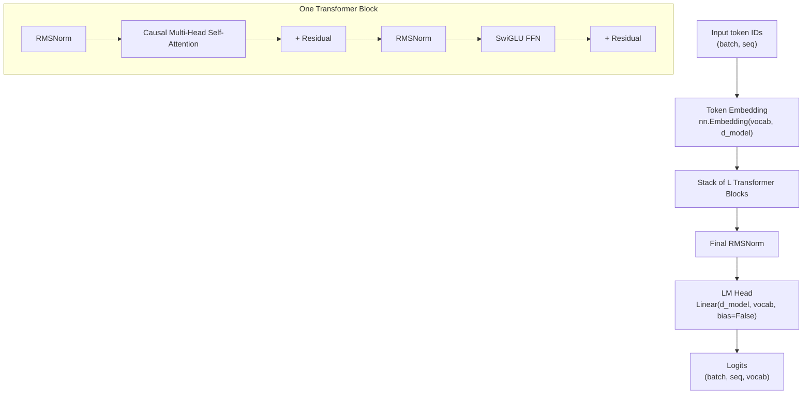
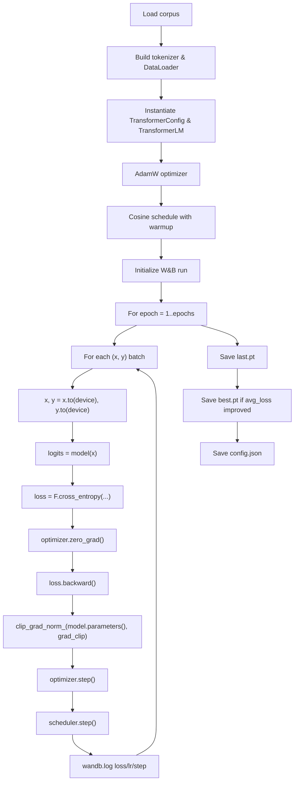
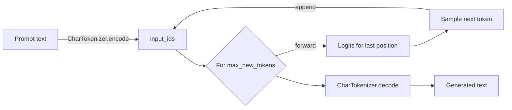

# Week 4 Instructor Notes — Transformer Architecture II: Full Model & Training Loop

> **Scope of this week:** Students move from isolated building blocks (embeddings, attention, normalization, FFN) to a **complete decoder-only Transformer language model**. They implement a modern training loop, generate text, and manage checkpoints. The lab is deliberately tiny so every student can train a model on a laptop in minutes.

---

## Goals for the Session

By the end of the 3-hour session students should be able to:

1. **Assemble a full decoder-only Transformer**
   - Explain how **token embeddings**, **positional information (RoPE)**, **causal self-attention**, **SwiGLU FFNs**, **RMSNorm**, and **residual connections** compose a model.
   - Trace a forward pass from token IDs to vocabulary logits.
   - Identify which design choices in `lab/model.py` mirror Llama/Qwen-style architectures.

2. **Implement and reason about a modern training loop**
   - Compute **cross-entropy** next-token loss with **teacher forcing**.
   - Configure **AdamW**, a **cosine LR schedule with linear warmup**, and **gradient clipping**.
   - Log metrics and save/load full checkpoints.

3. **Generate coherent text from a trained checkpoint**
   - Use **temperature scaling**, **top-k**, and **nucleus (top-p)** sampling.
   - Explain the trade-off between diversity and quality.

4. **Practice checkpoint hygiene and debugging**
   - Save model + optimizer + scheduler + config together.
   - Load a checkpoint for generation without shape/config mismatches.
   - Diagnose common failures: loss not dropping, OOM, repetitive output.

---

## Why This Matters

Decoder-only Transformers power the models students read about every week (GPT-4, Llama, Qwen, DeepSeek, etc.). This session is the first time they see **all** the pieces in one executable file:

- **Industry relevance:** The same components in `lab/model.py` appear in production LLMs. The main differences are scale, data, and distributed training, not the fundamental architecture.
- **Research relevance:** Understanding pre-norm, RMSNorm, RoPE, and SwiGLU is prerequisite for reading modern papers and reproducing open-weight models.
- **Debugging relevance:** A complete training loop exposes interactions that isolated exercises hide — e.g., how a bad LR schedule can mask a correct model, or how weight tying changes parameter counts and optimization dynamics.
- **Pedagogical relevance:** The lab is small enough that students can experiment with ablations (remove RoPE, swap normalization, change depth) and see results within a single class period.

---

## Suggested Timing (3 hours)

| Segment | Time | Activity | Instructor mode |
|---------|------|----------|-----------------|
| **1. Hook & motivation** | 5 min | Why a full model now? | Short talk |
| **2. Architecture assembly** | 40 min | Lecture + live walkthrough of `model.py` | Lecture + live coding |
| **3. Data pipeline** | 15 min | Inspect `data.py` and a batch | Live demo |
| **4. Training loop** | 35 min | Walk through `train.py`; run a quick demo; algorithm comparisons | Lecture + demo |
| **Break** | 10 min | — | — |
| **5. Generation & sampling** | 25 min | Run `generate.py`; compare greedy / temperature / top-p | Live demo |
| **6. Lab time** | 45 min | Students train tiny models + at least one ablation | Circulate / office hours |
| **7. Wrap-up** | 15 min | Show a student result, discuss common failures, assign follow-up | Discussion |

> **Pacing note:** The architecture lecture is the longest segment because every subsequent topic depends on it. Keep the first demo short (2 epochs) so students spend lab time experimenting, not watching loss decrease.

---

## Pre-Session Setup

Before class:

1. Run `python -m py_compile teaching/week04/lab/{model,data,train,generate}.py`.
2. Run a quick training run locally so you know exact wall-clock time on the classroom hardware:
   ```bash
   cd teaching/week04/lab
   python train.py --epochs 2 --batch_size 8 --seq_len 32 --d_model 64 --num_layers 2
   python generate.py --checkpoint week04/outputs/last.pt --prompt "The quick "
   ```
3. Have a W&B project ready (or be prepared to run offline) and a browser tab open to the dashboard.
4. Warn students that `generate.py` rebuilds the character tokenizer from `week04/data/corpus.txt`; if they move the corpus, generation will fail.

---

## Lecture Outline

### 1. Full Model Architecture

#### 1.1 High-level data flow

A **decoder-only Transformer language model** predicts the next token given all previous tokens. The `TransformerLM` in `lab/model.py` stacks `TransformerBlock`s and ends with a projection back to the vocabulary.



**Key points to narrate:**

- **No encoder:** The model only attends to earlier positions (causal mask), unlike original Transformer encoders.
- **Pre-norm:** Normalization happens *before* the sub-layer, not after it.
- **Residual stream:** The `x + sublayer(norm(x))` pattern lets gradients flow even when the network is deep.
- **No bias:** All `nn.Linear` layers use `bias=False`, reducing memory and following Llama-style design.
- **Weight tying:** When `tie_weights=True`, `lm_head.weight` is the same tensor as `token_embedding.weight`, saving parameters.

#### 1.2 RMSNorm

`lab/model.py` uses **Root Mean Square Layer Normalization**:

```python
norm = x * torch.rsqrt(x.pow(2).mean(dim=-1, keepdim=True) + self.eps)
return self.weight * norm
```

Mathematically, for a vector $x \in \mathbb{R}^{d}$:

$$
\text{RMSNorm}(x)_i = \frac{x_i}{\sqrt{\frac{1}{d}\sum_{j=1}^{d} x_j^2 + \varepsilon}} \cdot g_i
$$

where $g_i$ is a learned **gain** parameter initialized to 1.

**Concrete example:**

```python
x = torch.tensor([[1.0, -2.0, 3.0]])
rms = torch.sqrt(torch.mean(x**2))      # sqrt(14/3) ≈ 2.160
norm = x / rms                          # [0.463, -0.926, 1.389]
```

**Why RMSNorm here:** It removes the mean-centering step of LayerNorm, saving compute and memory at scale while preserving training stability.

##### Comparison: LayerNorm vs RMSNorm

| Criterion | **LayerNorm** | **RMSNorm** |
|-----------|---------------|-------------|
| Computation | Mean subtraction + variance scaling | Only RMS scaling |
| Learned params | **Gain + bias** | **Gain only** |
| Stability | Very stable, the default for years | Slightly more sensitive to initialization, but works well with pre-norm |
| Speed | Slower (two reduction ops) | Faster (one reduction op) |
| Typical use | BERT, GPT-2, T5 original | Llama, Qwen, modern LLMs |
| Best when | You want maximum stability or post-norm | You want pre-norm speed/scale and can tune init |

**Teaching moment:** Ask students to predict what would happen if `eps` were set to `0.0` (division by zero on all-zero vectors) or to `1e-2` (over-smoothing of small activations).

#### 1.3 Causal Multi-Head Self-Attention

The lab implements scaled dot-product attention with **RoPE** and a causal mask:

$$
\text{Attention}(Q, K, V) = \text{softmax}\left(\frac{QK^T}{\sqrt{d_{head}}} + M\right)V
$$

where $M_{ij} = -\infty$ for $j > i$ (upper triangle is masked out).

In code (`CausalSelfAttention`):

1. Project `x` into $Q$, $K$, $V$ using `w_q`, `w_k`, `w_v`.
2. Reshape to `(batch, num_heads, seq, d_head)`.
3. Apply RoPE to $Q$ and $K$.
4. Compute scores, apply causal mask, softmax, dropout, and multiply by $V$.
5. Project with `w_o`.

**Toy example of the causal mask for `seq=4`:**

```
      t0 t1 t2 t3
  t0 [ 1  0  0  0 ]
  t1 [ 1  1  0  0 ]
  t2 [ 1  1  1  0 ]
  t3 [ 1  1  1  1 ]
```

Position `t2` may attend to `t0, t1, t2` but not `t3`.

##### Comparison: RoPE vs Learned Absolute Positional Embeddings

| Criterion | **RoPE (Rotary Position Embedding)** | **Learned Absolute Embeddings** |
|-----------|--------------------------------------|---------------------------------|
| How position enters | Rotates $Q/K$ pairs by a position-dependent angle | Adds a learned vector to each token embedding |
| Relative position awareness | Built-in: dot products encode relative distances | Must be learned implicitly by attention |
| Extrapolation | Better to longer sequences than training (with scaling) | Worse; embeddings for unseen positions are random |
| Memory | No extra parameters per position | Stores `max_seq_len` embedding vectors |
| Implementation | Slightly more code (pair-wise rotation) | One `nn.Embedding` lookup |
| Typical use | Llama, Qwen, Mistral, modern LLMs | GPT-2, BERT original |
| Best when | Long context, relative-position reasoning, or fewer params | Simple baselines or very short fixed-length inputs |

**RoPE concrete example:** In `lab/model.py` the frequency for dimension pair $m$ is

$$
f_m = \theta^{-2m/d_{head}}
$$

and position $pos$ rotates the pair $(x_{2m}, x_{2m+1})$ by angle $pos \cdot f_m$:

```python
rotated0 = x0 * cos - x1 * sin
rotated1 = x0 * sin + x1 * cos
```

This is exactly a 2D rotation matrix, applied independently to each pair of dimensions.

**Misconception alert:** RoPE is **not** an additive vector like sinusoidal embeddings. It reparameterizes $Q$ and $K$ so that their dot product naturally decays with distance.

#### 1.4 SwiGLU Feed-Forward Network

The FFN in `lab/model.py` is a **SwiGLU**:

```python
return self.w3(self.dropout(F.silu(self.w1(x)) * self.w2(x)))
```

Mathematically:

$$
\text{SwiGLU}(x) = W_3\bigl(\text{SiLU}(W_1 x) \odot W_2 x\bigr)
$$

- $W_1, W_2$ expand to `d_ff`.
- $\text{SiLU}(t) = t \cdot \sigma(t)$ is the Swish activation.
- $\odot$ is element-wise multiplication (the "gating" part).
- $W_3$ projects back to `d_model`.

**Concrete example:** Suppose `d_model=4`, `d_ff=8`, and `x = [0.5, -0.5, 1.0, 0.0]`.

- $W_1 x$ and $W_2 x$ each produce 8 numbers.
- SiLU squashes negative half-entries toward zero.
- The gate zeros out some pathways and amplifies others.
- $W_3$ collapses the 8 gated values back to 4.

##### Comparison: SwiGLU vs ReLU/GeLU FFNs

| Criterion | **SwiGLU** | **ReLU FFN** | **GeLU FFN** |
|-----------|------------|--------------|--------------|
| Formula | $W_3(\text{SiLU}(W_1x) \odot W_2x)$ | $\text{ReLU}(W_1x)W_2$ | $\text{GeLU}(W_1x)W_2$ |
| Extra params | Two up-projections ($W_1, W_2$) | One up-projection | One up-projection |
| Expressiveness | Higher because of gating | Lower; hard zeros | Smooth, well-behaved |
| Compute | More FLOPs (two matmuls up) | Cheaper | Cheaper |
| Typical use | Llama, PaLM, modern LLMs | Original Transformer, GPT-1 | GPT-2, BERT, early models |
| Best when | Quality matters more than marginal cost | Minimal footprint | Smooth alternative to ReLU |

#### 1.5 Pre-norm vs Post-norm

`TransformerBlock` applies normalization **before** each sub-layer:

```python
x = x + self.attn(self.attn_norm(x))
x = x + self.ffn(self.ffn_norm(x))
```

This is **pre-norm**. The original Transformer used post-norm (`LayerNorm(x + Sublayer(x))`), which is harder to train in very deep networks because the gradient has to pass through LayerNorm inside the residual path.

##### Comparison: Pre-norm vs Post-norm

| Criterion | **Pre-norm** | **Post-norm** |
|-----------|--------------|---------------|
| Normalization location | Before sub-layer | After sub-layer |
| Gradient flow | Cleaner: residual path bypasses the sub-layer directly | Residual path goes through LayerNorm |
| Training stability at depth | Better; default for deep LLMs | Requires careful init/LR (e.g., learning-rate warmup, LayerNorm scaling) |
| Final accuracy (with tuning) | Comparable or slightly lower in some small-scale studies | Can be slightly higher if trained carefully |
| Typical use | GPT-3, Llama, Qwen | Original "Attention Is All You Need", BERT |
| Best when | Training deep models without hand-tuned warmups | Reproducing older architectures or specific papers |

### 2. Training Loop Components

#### 2.1 Data flow in the lab

```mermaid
flowchart LR
    RAW["Tiny English corpus<br/>(~600 chars)"] -->|build_corpus_file repeats=100| FILE["corpus.txt"]
    FILE -->|CharTokenizer<br/>sorted(set(text))| IDS["Integer IDs"]
    IDS -->|CharDataset<br/>__getitem__ idx| PAIRS["(x, y) pairs<br/>x = ids[idx:idx+seq]<br/>y = ids[idx+1:idx+seq+1]"]
    PAIRS -->|DataLoader<br/>shuffle=True| BATCH["Batch (B, S)"]
    BATCH -->|TransformerLM| LOGITS["Logits (B, S, V)"]
    LOGITS -->|F.cross_entropy| LOSS["Mean cross-entropy loss"]
```

**Teacher forcing:** During training the input $x$ already contains the ground-truth tokens $t_0, t_1, \dots, t_{S-1}$; the target $y$ is the same sequence shifted left by one. The model never feeds its own prediction back in during training. This is why the training forward pass is parallel across the whole sequence, while generation is autoregressive and sequential.

**Concrete example:**

```text
text  = "The quick brown fox..."
x     =  [T, h, e,  , q, u, i, c, k]
y     =  [h, e,  , q, u, i, c, k,  ]
```

The loss for the third position compares the model's prediction for token after "The" against the true token `e`.

#### 2.2 Cross-entropy loss

For one target token $t$ and logits $z$:

$$
\mathcal{L} = -\log \frac{e^{z_t}}{\sum_{j} e^{z_j}}
$$

Across the batch and sequence:

```python
loss = F.cross_entropy(logits.view(-1, logits.size(-1)), y.view(-1))
```

This flattens the batch and sequence dimensions and averages over all tokens. Because the lab dataset has no padding, no `ignore_index` is needed; if students add padding, they must set `ignore_index=pad_id`.

#### 2.3 AdamW optimizer

```python
optimizer = AdamW(model.parameters(), lr=args.lr, weight_decay=args.weight_decay)
```

AdamW **decouples** weight decay from the adaptive gradient update. In plain Adam, $L_2$ regularization gets multiplied by the adaptive learning rate, which makes large-gradient parameters regularized less. AdamW applies weight decay directly to the parameters after the adaptive step, giving more consistent regularization.

**Concrete update rule (simplified):**

$$
\theta_{t+1} = \theta_t - \eta \, m_t / (\sqrt{v_t} + \epsilon) - \eta \, \lambda \, \theta_t
$$

where $\lambda$ is `weight_decay`.

##### Comparison: AdamW vs SGD with Momentum

| Criterion | **AdamW** | **SGD + Momentum** |
|-----------|-----------|--------------------|
| Adaptive LR | Per-parameter | Same for all parameters |
| Bias correction | Built-in for $m, v$ | Not needed |
| Weight decay | Decoupled | Coupled (standard $L_2$) |
| Memory | Stores two moving averages per param | Stores one momentum vector |
| Typical use | Default for LLMs | Common for vision fine-tuning; can match AdamW with heavy tuning |
| Best when | Fast, stable convergence; transformers | Large batches, long training, expert tuning |

#### 2.4 Cosine LR schedule with linear warmup

The schedule in `lab/train.py`:

1. **Warmup:** LR rises linearly from 0 to the base LR over the first `warmup_ratio * total_steps` steps.
2. **Decay:** LR follows a cosine half-cycle down to `min_lr_ratio * base_lr`.

```python
def lr_lambda(current_step):
    if current_step < num_warmup_steps:
        return current_step / max(1, num_warmup_steps)
    progress = (current_step - num_warmup_steps) / max(1, num_training_steps - num_warmup_steps)
    return min_lr_ratio + (1 - min_lr_ratio) * 0.5 * (1 + cos(pi * progress))
```

**Why warmup matters:** Early in training gradients are large and Adam's second-moment estimates are uninitialized. A cold start with a high LR can destabilize attention scores or blow up RMSNorm activations.

**Why cosine decay:** It gives the model most of its learning budget at medium LRs and gently anneals, often producing better final minima than step decay for language modeling.

#### 2.5 Gradient clipping

```python
torch.nn.utils.clip_grad_norm_(model.parameters(), grad_clip)
```

This rescales the **global gradient norm** so that if $\|\nabla\| > C$, all gradients are multiplied by $C / \|\nabla\|$. It does **not** change the gradient direction, only its magnitude.

**Concrete example:** If the global norm is 4.2 and `grad_clip=1.0`, every parameter gradient is multiplied by $1.0 / 4.2 \approx 0.238$.

**Misconception alert:** Gradient clipping is not weight clipping. Weight clipping limits parameter values; gradient clipping limits how far a single step can move.

#### 2.6 Full training loop diagram



### 3. Generation & Sampling

#### 3.1 Autoregressive decoding loop



Key code in `generate.py`:

```python
for _ in range(max_new_tokens):
    if input_tensor.size(1) > model.config.max_seq_len:
        input_tensor = input_tensor[:, -model.config.max_seq_len:]
    logits = model(input_tensor)
    next_logits = logits[0, -1, :]
    next_token = sample_next_token(next_logits, temperature, top_k, top_p)
    input_tensor = torch.cat([input_tensor, torch.tensor([[next_token]], device=device)], dim=1)
```

**Important:** `model.eval()` disables dropout during generation. Forgetting this makes outputs stochastic between calls even with greedy decoding.

#### 3.2 Temperature scaling

$$
p_i = \frac{e^{z_i / T}}{\sum_j e^{z_j / T}}
$$

- $T \to 0$: distribution becomes one-hot (greedy / high confidence).
- $T = 1$: original softmax.
- $T \gg 1$: distribution approaches uniform (random text).

**Concrete example:** Suppose logits are `[2.0, 1.0, 0.1]`.

| Temperature | Approx. probabilities | Effect |
|-------------|-----------------------|--------|
| $T=0.1$ | `[1.00, 0.00, 0.00]` | Deterministic, repetitive |
| $T=1.0$ | `[0.66, 0.24, 0.10]` | Balanced |
| $T=2.0$ | `[0.50, 0.30, 0.19]` | Diverse, risk of nonsense |

#### 3.3 Top-k and top-p sampling

**Top-k:** Keep only the $k$ most likely tokens, renormalize, and sample.

**Top-p (nucleus):** Sort tokens by probability, keep the smallest set whose cumulative probability exceeds $p$, then sample.

```python
# Top-k: zero out everything below the k-th largest probability
indices_to_remove = probs < torch.topk(probs, top_k).values[..., -1, None]

# Top-p: sort, cumulative sum, then keep until cumulative > p
sorted_probs, sorted_indices = torch.sort(probs, descending=True)
cumulative = torch.cumsum(sorted_probs, dim=-1)
sorted_indices_to_remove = cumulative > top_p
# Shift by one so the first token over the threshold is still kept
sorted_indices_to_remove[..., 1:] = sorted_indices_to_remove[..., :-1].clone()
sorted_indices_to_remove[..., 0] = False
```

##### Comparison: Top-k vs Top-p

| Criterion | **Top-k** | **Top-p** |
|-----------|-----------|-----------|
| Fixed size? | Yes, always $k$ candidates | Dynamic, depends on distribution shape |
| Effect on flat distributions | May include very unlikely tokens if $k$ is large | Adapts; keeps only high-probability nucleus |
| Effect on peaked distributions | May discard reasonable second choices if $k$ is small | Keeps only the sharp peak |
| Typical default | $k=50$ | $p=0.9$ |
| Best when | Vocab is small or you want strict budget | Vocab is large and distribution shape varies |

**Practical tip:** Many production systems use both: `top_k=50` then `top_p=0.9`. The lab uses either/or in `sample_next_token`.

### 4. Checkpoint Hygiene

A checkpoint in `lab/train.py` contains:

```python
checkpoint = {
    "epoch": epoch,
    "model_state_dict": model.state_dict(),
    "optimizer_state_dict": optimizer.state_dict(),
    "scheduler_state_dict": scheduler.state_dict(),
    "config": model.config,
}
```

Best practices:

1. **Save config alongside weights.** `config.json` is written separately for easy inspection; the checkpoint also embeds the `TransformerConfig` dataclass.
2. **Keep `last.pt` and `best.pt`.** `last.pt` resumes training; `best.pt` is your inference artifact.
3. **Load with `map_location=device`.** This makes CPU-trained checkpoints runnable on GPU and vice versa.
4. **Match model config before loading.** `TransformerLM(config).to(device)` must be constructed with the same `d_model`, `num_layers`, etc. used during training.
5. **Set `model.eval()` before generation.** Dropout and batch-norm-like layers behave differently in train mode.

### 5. Algorithm Comparisons Beyond the Lab

These topics are not in `lab/model.py` but are essential context for why the field converged on this architecture. Mention them briefly during the wrap-up or assign them as reading.

#### 5.1 Distributed training: DDP vs FSDP

| Criterion | **DDP (DistributedDataParallel)** | **FSDP (Fully Sharded Data Parallel)** |
|-----------|-----------------------------------|----------------------------------------|
| What is replicated | Each GPU holds a full copy of the model | Model weights/gradients/optimizer states sharded across GPUs |
| Memory per GPU | Full model + batch | Shard of model + larger batch |
| Max model size | Limited by single-GPU memory | Scales to much larger models |
| Communication | All-reduce gradients each step | All-gather weights + reduce-scatter gradients |
| Code complexity | Simpler (`torch.nn.parallel.DistributedDataParallel`) | More setup (`torch.distributed.fsdp`) |
| Typical use | Training 1B–7B models on 8 GPUs | Training 70B+ models or fitting larger batches |
| Best when | Model fits comfortably on one GPU | Model exceeds single-GPU memory |

#### 5.2 Alignment: RLHF vs RLVR

| Criterion | **RLHF (Reinforcement Learning from Human Feedback)** | **RLVR (Reinforcement Learning with Verifiable Rewards)** |
|-----------|-------------------------------------------------------|-----------------------------------------------------------|
| Reward source | Human preference model | Verifiable metric (e.g., unit-test pass, math correctness) |
| Reward model | Train a separate preference model | Often rule-based or compiler-based |
| Credit assignment | Sparse, noisy | Dense, exact when verifiable |
| Use cases | Chat, summarization, style | Code, math, formal reasoning |
| Algorithms | PPO, DPO, IPO | GRPO, PPO with exact rewards |
| Best when | Task is subjective and humans disagree | Task has a ground-truth checker |

#### 5.3 Tokenization: BPE vs SentencePiece

The lab uses a character tokenizer for speed, but Exercise 4.3 asks students to integrate a Week 2 BPE tokenizer.

| Criterion | **BPE (Byte-Pair Encoding)** | **SentencePiece (Unigram/BPE)** |
|-----------|------------------------------|---------------------------------|
| Input assumption | Pre-tokenized words / whitespace | Raw text, including whitespace |
| Pretokenization | Usually required (e.g., GPT-2) | Optional; can treat space as a normal symbol |
| Vocab size control | Merge until target vocab | Directly optimizes for target vocab (Unigram) |
| Multilingual | Works, but whitespace handling varies | Better for languages without spaces (Chinese, Japanese) |
| Typical tools | `tokenizers`, `tiktoken` | `sentencepiece`, Llama tokenizer |
| Best when | English-heavy, whitespace-delimited text | Multilingual models or whitespace-free scripts |

---

## Live Demo Script

Run this in class on the projected machine. Adjust `--d_model`, `--num_layers`, and `--epochs` based on classroom hardware.

```bash
# 1. Sanity-check syntax
python -m py_compile lab/model.py lab/data.py lab/train.py lab/generate.py

# 2. Inspect the data pipeline
python lab/data.py
# Expected output: corpus length, vocab size, number of samples, first (x, y) pair.

# 3. Quick architecture sanity check
python lab/model.py
# Expected output: parameter count and output shape matching input batch.

# 4. Train a 2-layer, d_model=64 model for 2 epochs (fast enough for class)
python lab/train.py --epochs 2 --batch_size 8 --seq_len 32 \
       --d_model 64 --num_layers 2 --num_heads 4

# 5. Generate with different sampling strategies
python lab/generate.py --checkpoint week04/outputs/last.pt \
       --prompt "The quick " --temperature 0.01 --top_k 1

python lab/generate.py --checkpoint week04/outputs/last.pt \
       --prompt "The quick " --temperature 0.8 --top_p 0.9
```

**Talking points during the demo:**

- Show the W&B dashboard refreshing after every 10 steps.
- Point out that loss starts near `log(vocab_size)` (roughly uniform guessing).
- After generation, read the output aloud and ask students: "Is this sensible? Why/why not?" (It won't be — the model is tiny — which sets up the ablation discussion.)
- Switch `temperature` live and show how the same prompt can produce very different continuations.

---

## Lab Instructions for Students

Students should work in pairs or individually. The goal is not a perfect model but deep familiarity with the code.

1. **Review `model.py`.**
   - Trace one token through `TransformerLM.forward`.
   - Identify every `nn.Parameter` and every `nn.Buffer`.

2. **Run the default tiny training.**
   ```bash
   python lab/train.py --epochs 5
   ```
   Confirm that loss decreases and checkpoints are written to `week04/outputs/`.

3. **Generate text from the trained checkpoint.**
   ```bash
   python lab/generate.py --checkpoint week04/outputs/last.pt \
          --prompt "The quick " --temperature 0.8 --top_p 0.9
   ```

4. **Experiment with hyperparameters.**
   - Change `--d_model` (64, 128, 256) and observe parameter count vs. loss.
   - Change `--lr` (1e-4, 3e-4, 1e-3) and observe stability.
   - Change `--num_layers` and `--num_heads` while keeping `d_model % num_heads == 0`.

5. **Complete at least one ablation from `exercises/README.md`.**
   - Exercise 4.2 (No RoPE / post-norm) is strongly recommended because it directly tests the lecture comparisons.
   - Exercise 4.5 (sampling comparison) is a quick win if hardware is slow.

---

## Discussion Prompts

Use these to check for understanding during and after the session.

1. **RMSNorm:** What happens if you remove `self.weight` from RMSNorm? Will the model still train? (Yes, but with less capacity to rescale activations.)
2. **Causal mask:** If the mask were removed, what task would the model learn instead of language modeling? (Something like masked language modeling / bidirectional encoding.)
3. **RoPE:** Why does RoPE not need an explicit positional embedding vector? (It bakes relative position into the $QK^T$ dot product via rotation.)
4. **LR schedule:** What would happen if we skipped warmup with a base LR of `1e-2`? (Likely loss spikes or NaNs early on.)
5. **Sampling:** Why is top-p often preferred over top-k in practice? (It adapts to the shape of the distribution; see comparison table.)
6. **Checkpoints:** Why is it dangerous to load a checkpoint into a model created with different `d_model` or `num_layers`? (State dict keys/shapes mismatch; PyTorch raises an error or silently loads wrong tensors.)
7. **Weight tying:** If `tie_weights=True`, how does the parameter count change? (Saves `vocab_size * d_model` parameters, but the model can still express a full output projection because the embedding matrix is reused.)

---

## Common Misconceptions / Pitfalls

| Misconception | Why it happens | How to avoid it |
|---------------|----------------|-----------------|
| "RMSNorm is just LayerNorm without the bias." | Both use a scaling parameter, but RMSNorm also removes mean subtraction. | Show the formula side by side and point to the single `rsqrt` call in `lab/model.py`. |
| "RoPE adds a positional vector to embeddings." | Older models (BERT, GPT-2) do exactly that. | Emphasize that RoPE **rotates** $Q$ and $K$ pairs; there is no additive position vector. |
| "Gradient clipping changes the direction of the gradient." | The word "clipping" sounds like truncation. | Explain it rescales the whole gradient vector by a scalar if the norm exceeds the threshold. |
| "Teacher forcing means the model sees the future." | The input sequence includes future tokens. | Clarify that the **causal mask** prevents attention to future tokens; $x$ is the prompt and $y$ is the same prompt shifted left. |
| "I can train with `dropout=0.5` to prevent overfitting on a tiny corpus." | Tiny corpora are easily memorized; high dropout slows learning. | Recommend `dropout=0.0` for this lab and focus on architecture/size changes. |
| "`model.eval()` is optional during generation." | In many small models dropout is easy to forget. | Always call `model.eval()` and wrap generation in `torch.no_grad()`. |
| "A lower loss always means better text." | Loss measures next-token perplexity, not coherence. | Have students read generated samples; often the most fluent output is not the lowest-loss run. |
| "Saving only `model.state_dict()` is enough." | Students forget LR schedule state when resuming. | Save optimizer + scheduler + epoch + config; see `save_checkpoint`. |

---

## Teaching Tips for a 3-Hour Session

### Engagement hooks

- **Start with a riddle:** "Last week we built the engine and the wheels. This week we put them in a car. What happens if we forget the steering wheel?" (Answer: the residual connection / normalization.)
- **Show a parameter count:** Before training, run `python lab/model.py` and ask: "If every parameter is 4 bytes (float32), how many MB is this model?"
- **Live bug injection:** Deliberately change `max_seq_len` in `generate.py` to a smaller value and show the crop. Ask students why the code must crop the context.

### Check-for-understanding moments

1. After the architecture diagram, ask students to sketch `TransformerBlock` from memory in the chat/on paper.
2. After the LR schedule plot, ask: "At what fraction of total steps is the LR highest?"
3. After the generation demo, ask: "What changed between the greedy and nucleus-sampled outputs?"
4. Before lab time, ask: "What is the first thing you should check if `generate.py` says `RuntimeError: size mismatch`?"

### Live-demo talking points

- When showing `data.py`, decode the first `(x, y)` pair aloud to reinforce the shift-by-one target.
- When training starts, point to the initial loss and ask students to compute the theoretical uniform-guessing loss ($-\log(1/V)$).
- When generation produces gibberish, celebrate it: "This is exactly what we expect from 2 layers and 2 epochs. The architecture is correct; now the game is scale and data."

### Pacing guardrails

- If the lecture runs long, skip the DDP/FSDP and RLHF/RLVR comparisons; they are labeled as "beyond the lab."
- If hardware is slow, use `--epochs 2` for the demo and let students run `--epochs 10` on their own.
- Keep W&B optional; the script will fail gracefully only if `wandb` is imported. If offline machines are a concern, demonstrate how to comment out `wandb.init` and the `wandb.log` calls.

---

## Homework / Follow-Up

Students should leave with concrete next steps. Recommend assigning 2–3 of these.

1. **Complete all exercises in `teaching/week04/exercises/README.md`.**
   - Exercise 4.2 (ablation) is the highest-priority follow-up.
   - Exercise 4.3 (BPE tokenizer) connects Week 2 to Week 4.

2. **Train a slightly larger model overnight.**
   ```bash
   python lab/train.py --epochs 20 --d_model 128 --num_layers 4 --num_heads 4 --batch_size 16
   ```
   Save the loss curve and a generated sample.

3. **Implement `--resume`.**
   - Modify `train.py` to accept `--resume week04/outputs/last.pt`.
   - Load the checkpoint, restore model/optimizer/scheduler/epoch, and continue training.
   - Verify that the LR schedule resumes from the saved step, not from step 0.

4. **Add a validation set.**
   - Hold out 10% of the corpus as validation data.
   - Compute validation perplexity each epoch: $\exp(\text{val loss})$.
   - Observe when training loss keeps dropping but validation loss rises (overfitting on the tiny corpus).

5. **Read ahead.**
   - Week 5 pre-reading: GPU architecture, memory hierarchy, profiling.
   - Optional: Karpathy's "Let's build GPT" or the Llama architecture paper for deeper context on why every design choice in `model.py` was selected.

---

## Troubleshooting

| Issue | Cause | Fix |
|-------|-------|-----|
| **Loss not decreasing** | LR too high, model too small, or too few epochs | Lower `--lr`, increase `--d_model`/`--num_layers`, or train longer |
| **Loss becomes NaN** | LR too high, gradient explosion, or bad initialization | Reduce `--lr`, lower warmup ratio, increase `--grad_clip`, or use `--d_model` divisible by `--num_heads` |
| **OOM during training** | Batch size or sequence length too large | Reduce `--batch_size` or `--seq_len`; use gradient accumulation if needed |
| **Generated text repetitive** | Temperature too low or top-k too small | Increase `--temperature`, use `--top_p 0.9`, or both |
| **Generated text random/gibberish** | Temperature too high, under-trained model, or prompt not in vocab | Lower temperature, train longer, or use prompt characters present in the corpus |
| **Checkpoint load error** | Config mismatch between training and generation | Use the same `--d_model`, `--num_layers`, `--num_heads`; load from `config.json` if possible |
| **`d_model % num_heads != 0`** | Incompatible config | Choose `d_model` divisible by `num_heads`; the config already raises `ValueError` |
| **W&B login prompt blocks training** | Not logged in or no internet | Run `wandb login` beforehand, or remove W&B calls for offline machines |
| **`generate.py` cannot find corpus** | Training data path changed | Ensure `week04/data/corpus.txt` exists, or adjust the path in `load_model` |

---

## Next Week Preview

**Week 5** moves from model correctness to **systems**: GPU architecture, the memory hierarchy (HBM, SRAM, registers), and profiling tools. Students will learn why a correct model can still be slow, how to measure memory bandwidth vs. compute utilization, and what optimizations like FlashAttention change in practice. Encourage them to keep their Week 4 checkpoint — they will use it as a profiling target.
