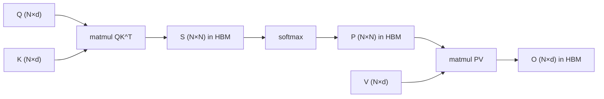
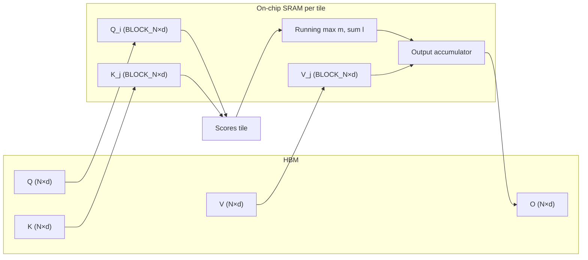
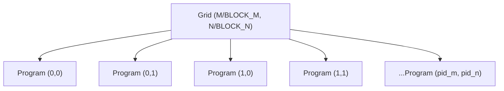
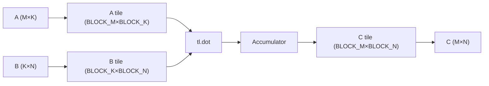
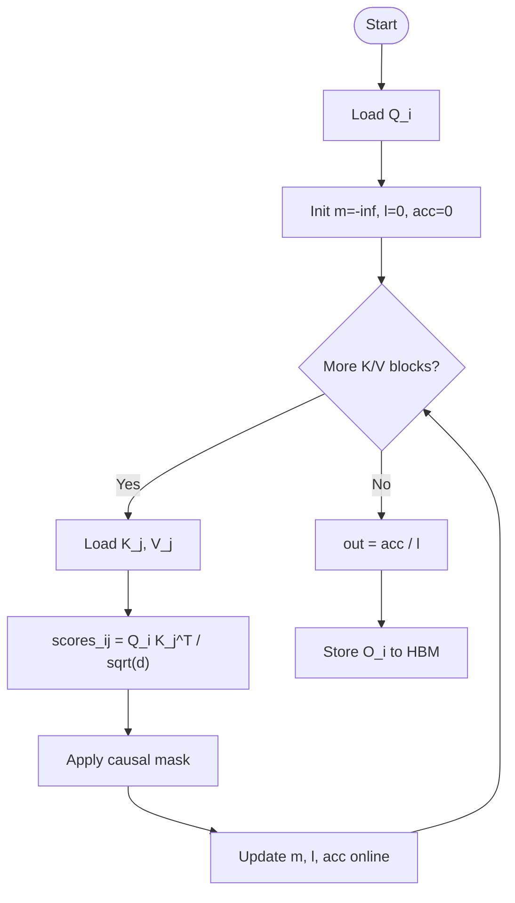

# Week 6 Instructor Notes — High-Performance Kernels with Triton

> **Session focus:** Memory bandwidth, fused kernels, Triton syntax, and a hands-on build-up to FlashAttention-style tiled attention.  
> **Primary files to connect theory to code:** `lab/01_matmul_triton.py`, `lab/02_flash_attention.py`.

---

## Goals for the Session

By the end of this 3-hour block, students should be able to:

1. **Motivate fused kernels from first principles**
   - Explain the difference between **compute-bound** and **memory-bound** operations on a GPU.
   - Use the **memory bandwidth equation** to estimate when kernel fusion wins.
   - Trace the HBM traffic of a standard PyTorch attention forward pass.

2. **Read and modify simple Triton kernels**
   - Understand the **program grid** abstraction: each program handles one output tile.
   - Use `tl.program_id`, `tl.arange`, `tl.load`, `tl.store`, and `tl.dot`.
   - Write pointer-arithmetic expressions for 2-D tensor tiles.

3. **Implement a tiled matrix multiplication kernel**
   - Split matrices into `BLOCK_M × BLOCK_K` and `BLOCK_K × BLOCK_N` tiles.
   - Accumulate in higher precision (`tl.float32`) and cast to `tl.float16` on store.
   - Mask incomplete tiles at matrix edges.
   - Benchmark against `torch.matmul` and interpret when Triton wins or loses.

4. **Build FlashAttention intuition block by block**
   - Explain why standard attention is **O(N²)** in memory.
   - Re-derive **online softmax** from the safe-softmax formula.
   - See how tiling + running statistics let us compute exact attention without materializing the full `N × N` score matrix.
   - Map the simplified lab kernel onto the full FlashAttention paper.

5. **Diagnose practical kernel issues**
   - Block-size limits from shared memory.
   - Numerical differences caused by accumulation order and `fp16` dot products.
   - Compilation-time overhead from autotuning.

---

## Why This Matters

Modern transformer training is dominated by two costs:

| Cost | Where it hurts | Why kernel fusion helps |
|------|----------------|-------------------------|
| **Memory bandwidth** | Long sequences, large batches, repeated HBM round-trips | Fused kernels read/write fewer bytes to high-bandwidth memory (HBM) |
| **Memory capacity** | Storing `N × N` attention matrices during training | FlashAttention reduces attention activation memory from `O(N²)` to `O(N)` |

Real-world impact:

- **Long-context LLMs** (e.g., 128k context windows) cannot afford to materialize the full attention matrix.
- **Training throughput** for large models is often memory-bound; fused attention kernels such as FlashAttention, FlashAttention-2, and Flash-Decoding are now standard in frameworks like PyTorch, JAX, vLLM, and Hugging Face.
- **Inference serving** is limited by batch-size * sequence length; memory-efficient attention enables higher batch sizes and lower latency.
- **Kernel DSLs like Triton** lower the barrier to writing custom GPU kernels without hand-tuning CUDA C++ for every GPU generation.

**Bottom line for students:** Understanding *why* fused kernels are fast and *how* to express them in Triton is the bridge between “I use PyTorch ops” and “I can reason about model-systems co-design.”

---

## Suggested Timing (3 hours)

| Segment | Time | Activity | Key deliverable |
|---------|------|----------|-----------------|
| **Why fused kernels?** | 20 min | Lecture + memory-bandwidth recap | Students can estimate whether an op is compute- or memory-bound |
| **Triton basics** | 25 min | Blocks, programs, `tl.load/store` | Students can read the matmul kernel skeleton |
| **Live demo: matmul kernel** | 30 min | Walk through `lab/01_matmul_triton.py` | Run `--test` and `--benchmark` |
| **Break** | 10 min | — | — |
| **FlashAttention concept** | 25 min | Tiling + online softmax | Students can re-derive online softmax update |
| **Live demo: attention kernel** | 30 min | Walk through `lab/02_flash_attention.py` | Run `--test` and `--benchmark` |
| **Lab time** | 30 min | Benchmark and experiment | Each student produces at least one edited run |

**Pacing tip:** Keep the first live demo tight. The FlashAttention conceptual block is where most students get stuck; budget extra time for the softmax algebra and the pointer walk-through.

---

## Lecture Outline

### 1. Fused Kernels and Memory Bandwidth

#### 1.1 GPU Memory Hierarchy

A GPU is not a single uniform memory space. There is a fast-but-small **SRAM / L2 cache / shared memory** and a large-but-slow **HBM (high-bandwidth memory)**.

| Level | Typical size | Typical bandwidth | Latency |
|-------|--------------|-------------------|---------|
| **Registers** | KB per thread | ~10s TB/s | 1 cycle |
| **Shared memory / SRAM** | ~100 KB per SM | ~10 TB/s | ~10s cycles |
| **L2 cache** | MBs | ~TB/s | ~100s cycles |
| **HBM** | GBs | ~1–2 TB/s | ~100s ns |

The key lesson: **every round-trip to HBM costs time**. A kernel that repeatedly reads/writes the same data to HBM is wasting bandwidth.

#### 1.2 Standard PyTorch Attention as an Unfused Sequence

A typical attention forward pass in PyTorch is four separate kernel launches:

```text
Q, K, V in HBM
  ↓
compute S = QK^T  → write S (N×N) to HBM
  ↓
compute P = softmax(S)  → write P (N×N) to HBM
  ↓
compute O = PV  → write O (N×d) to HBM
```

Each arrow reads/writes `O(N²)` bytes from HBM. For long sequences, the total HBM traffic is roughly:

```text
HBM traffic ≈ 4 × N² × sizeof(dtype)   (for S and P, forward only)
```

Because the arithmetic intensity (FLOPs per byte moved) is low, the operation is **memory-bandwidth bound**, not compute bound.

**Mermaid diagram — unfused attention data flow:**



#### 1.3 Fused Attention (FlashAttention) at a High Level

Instead of materializing `S` and `P` globally, we keep tiles in SRAM and compute one output tile at a time:

```text
For each output tile O_i:
  Load block of queries Q_i
  For each key/value block (K_j, V_j):
    Load K_j, V_j into SRAM
    Compute scores S_ij = Q_i K_j^T
    Compute partial softmax statistics
    Accumulate partial output
  Write only final O_i back to HBM
```

The HBM traffic drops from `O(N²)` to `O(N)`, which is the difference between an operation that scales quadratically in memory and one that scales linearly.

**Mermaid diagram — fused attention data flow:**



#### 1.4 Roofline Quick Check

A fast way to classify an operation is to compute its **arithmetic intensity**:

```text
Arithmetic intensity = FLOPs / bytes moved
```

For standard attention forward pass with sequence length `N` and head dimension `d`:

| Operation | FLOPs | HBM bytes | Arithmetic intensity |
|-----------|-------|-----------|----------------------|
| `QK^T` | `2 N² d` | `2 N d + N²` | `≈ 2d` (low for small `d`) |
| Softmax + `PV` | `O(N² d)` | `O(N²)` | `≈ d` |

When arithmetic intensity is below the machine’s memory-bandwidth ceiling, the operation is **memory-bound**; increasing FLOPs per byte (e.g., by fusion) is the only way to speed it up.

---

### 2. Triton Kernel Structure

#### 2.1 From CUDA to Triton

A Triton kernel is a Python function decorated with `@triton.jit`. It is launched over a **grid** of programs. Each program handles one output tile. The compiler automatically handles thread blocks, shared memory, and instruction scheduling.

**Mermaid diagram — program grid for a 2-D output matrix:**



#### 2.2 Key Primitives

| Primitive | Purpose | Lab example |
|-----------|---------|-------------|
| `tl.program_id(axis)` | Which tile this program handles | `pid_m`, `pid_n` in `01_matmul_triton.py` |
| `tl.arange(start, end)` | Generate indices for a tile | `offs_m`, `offs_n`, `offs_k` |
| `tl.load(ptr, mask=..., other=...)` | Load a block from HBM to SRAM | Loading `A` and `B` tiles in matmul |
| `tl.store(ptr, value, mask=...)` | Write a block back to HBM | Storing `C` tile in matmul |
| `tl.dot(a, b)` | Tile matrix multiply using tensor cores | `accumulator += tl.dot(a, b)` |
| `tl.zeros`, `tl.full` | Initialize SRAM tensors | Accumulator and softmax statistics |
| `tl.cdiv(a, b)` | Ceiling division for grid sizing | `triton.cdiv(M, BLOCK_M)` |

#### 2.3 Anatomy of a Minimal Triton Kernel

```python
@triton.jit
def kernel(a_ptr, b_ptr, c_ptr, M, N, K, ...):
    pid_m = tl.program_id(0)   # row of output tile
    pid_n = tl.program_id(1)   # column of output tile

    # Absolute offsets for this tile
    offs_m = pid_m * BLOCK_M + tl.arange(0, BLOCK_M)
    offs_n = pid_n * BLOCK_N + tl.arange(0, BLOCK_N)
    offs_k = tl.arange(0, BLOCK_K)

    # Pointer arithmetic: start of A tile and B tile
    a_block_ptr = a_ptr + (offs_m[:, None] * K + offs_k[None, :])
    b_block_ptr = b_ptr + (offs_k[:, None] * N + offs_n[None, :])

    accumulator = tl.zeros((BLOCK_M, BLOCK_N), dtype=tl.float32)
    for k in range(0, K, BLOCK_K):
        a = tl.load(a_block_ptr, mask=..., other=0.0)
        b = tl.load(b_block_ptr, mask=..., other=0.0)
        accumulator += tl.dot(a, b)
        a_block_ptr += BLOCK_K
        b_block_ptr += BLOCK_K * N

    c_block_ptr = c_ptr + (offs_m[:, None] * N + offs_n[None, :])
    tl.store(c_block_ptr, accumulator.to(tl.float16), mask=...)
```

**Concrete pointer arithmetic example:**

Suppose `A` is `(M=64, K=64)` stored in row-major order. The element `A[m, k]` lives at `a_ptr + m * K + k`. For a program with `pid_m=1`, `BLOCK_M=32`, `BLOCK_K=32`, the tile rows are `offs_m = [32, 33, ..., 63]`. With broadcasting:

```python
offs_m[:, None] * K + offs_k[None, :]
```

produces a `(32, 32)` index matrix where row `r`, column `c` is `(32+r)*64 + c`. That is exactly the contiguous block `A[32:64, 0:32]`.

---

### 3. Tiled Matrix Multiplication in Detail

#### 3.1 The Block Algorithm

Standard matrix multiply `C = A @ B` with `A: (M, K)`, `B: (K, N)`, `C: (M, N)`.

For one output tile `C[m:m+BLOCK_M, n:n+BLOCK_N]`:

```text
C_tile = sum over k-blocks of (A[m:m+BLOCK_M, k:k+BLOCK_K] @ B[k:k+BLOCK_K, n:n+BLOCK_N])
```

**Mermaid diagram — matmul tiling:**



#### 3.2 Masking Edge Tiles

If `M` is not divisible by `BLOCK_M`, the last tile has fewer valid rows. The kernel uses a **mask** to avoid loading/storing garbage:

```python
mask = (offs_m[:, None] < M) & (offs_n[None, :] < N)
tl.store(c_block_ptr, c, mask=mask)
```

For the `K` dimension, the mask ensures we do not read beyond the matrix width; the `other=0.0` value safely contributes zero to the accumulator.

#### 3.3 Numerical Accumulation

The lab kernel accumulates in `tl.float32` but stores in `tl.float16`:

```python
accumulator = tl.zeros((BLOCK_M, BLOCK_N), dtype=tl.float32)
...
c = accumulator.to(tl.float16)
```

This is a standard pattern: tensor cores run fast in `fp16`, but summing many `fp16` values would accumulate rounding error. Keeping the accumulator in `fp32` preserves accuracy.

---

### 4. FlashAttention Tiling

#### 4.1 Why Standard Attention Is Expensive in Memory

Standard causal self-attention:

```python
scores = (Q @ K.T) / sqrt(d)
causal_mask = torch.tril(torch.ones(N, N, dtype=torch.bool))
scores = scores.masked_fill(~causal_mask, float("-inf"))
attn = F.softmax(scores, dim=-1)
out = attn @ V
```

The intermediate tensors are:

| Tensor | Shape | Bytes (fp16, N=4096, d=64) |
|--------|-------|----------------------------|
| `scores` | `(N, N)` | 33.5 MB |
| `attn` | `(N, N)` | 33.5 MB |
| `out` | `(N, d)` | 0.5 MB |

During **training** we also need the backward pass, which materializes `dL/d(scores)` — another `O(N²)` tensor. Long-context training quickly runs out of GPU memory.

#### 4.2 Safe Softmax and the Online Softmax Trick

Recall the safe softmax of a vector `x`:

```text
m = max_i x_i
y_i = exp(x_i - m) / sum_j exp(x_j - m)
```

Now imagine we process `x` in two chunks, `x^(1)` and `x^(2)`:

```text
m^(1) = max(x^(1)),  l^(1) = sum exp(x^(1) - m^(1))
m^(2) = max(x^(2)),  l^(2) = sum exp(x^(2) - m^(2))
```

To merge them:

```text
m_new = max(m^(1), m^(2))
l_new = l^(1) * exp(m^(1) - m_new) + l^(2) * exp(m^(2) - m_new)
```

This is the **online softmax update**. It lets us compute softmax incrementally over tiles without keeping the full vector in memory.

**Concrete toy example:**

`x = [1, 2, 3, 4]` split into `[1, 2]` and `[3, 4]`.

- Chunk 1: `m1 = 2`, `l1 = exp(-1) + exp(0) ≈ 1.368`
- Chunk 2: `m2 = 4`, `l2 = exp(-1) + exp(0) ≈ 1.368`
- Merge: `m_new = 4`
- `l_new = 1.368 * exp(2-4) + 1.368 * exp(4-4) = 1.368 * 0.135 + 1.368 = 1.553`

Full softmax denominator: `exp(-3)+exp(-2)+exp(-1)+exp(0) ≈ 1.553`. Matches.

#### 4.3 Online Softmax in the Lab Kernel

The lab kernel maintains two running statistics per query row:

```python
m = tl.full((BLOCK_N,), float("-inf"), dtype=tl.float32)  # running max
l = tl.full((BLOCK_N,), 0.0, dtype=tl.float32)             # running sum
```

For each key/value block, it computes scores, updates `m` and `l`, rescales the output accumulator, then adds the contribution of the current value block.

```python
m_new = tl.maximum(m, tl.max(scores, axis=1))
alpha = tl.exp(m - m_new)
p = tl.exp(scores - m_new[:, None])
l = l * alpha + tl.sum(p, axis=1)
acc = acc * alpha[:, None] + tl.dot(p.to(tl.float16), v)
m = m_new
```

This is the exact same algebra as the toy example, applied row-wise and tile-wise.

**Mermaid diagram — online softmax loop:**



#### 4.4 Causal Masking as a Tile Property

In the lab, each program handles a query block starting at `pid * BLOCK_N`. Because of causality, a query at position `i` may only attend to keys at positions `j <= i`.

The kernel exploits this by limiting the key-loop range:

```python
for start_n in range(0, (pid + 1) * BLOCK_N, BLOCK_N):
```

and then masking within the final key block:

```python
causal_mask = n_offs[None, :] <= q_offs[:, None]
scores = tl.where(causal_mask, scores, float("-inf"))
```

This means earlier query programs do strictly less work than later ones — a property FlashAttention-2 later exploits for load balancing.

---

## Algorithm Comparisons

The following comparisons are scoped to this week’s topic: kernel fusion, attention kernels, and tiling strategies.

### Comparison 1: Fused Kernel vs. Unfused PyTorch Op Sequence

| Aspect | Unfused PyTorch ops | Fused Triton kernel |
|--------|---------------------|---------------------|
| **HBM round trips** | One per operator (`QK^T`, `softmax`, `PV`) | One read of `Q,K,V` and one write of `O` |
| **Memory for activations** | Stores full `S` and `P` | Stores only tile-sized partials |
| **Kernel launch overhead** | Multiple launches | Single launch |
| **Readability** | Very high | Lower |
| **Flexibility** | Reuse pre-built ops | Requires writing and tuning new code |
| **Best use case** | Research prototypes, small models | Production attention, long contexts, custom ops |

### Comparison 2: Triton vs. Hand-Written CUDA vs. PyTorch

| Aspect | PyTorch ops | Triton | Hand-written CUDA |
|--------|-------------|--------|-------------------|
| **Abstraction level** | High | Medium | Low |
| **Performance ceiling** | Good | Excellent | Excellent (often best) |
| **Portability across GPU generations** | Automatic | Compiler handles most | Manual tuning |
| **Learning curve** | Low | Medium | High |
| **Safety / guardrails** | Many | Some | Few |
| **Best use case** | Standard layers | Custom fusions, attention kernels | Libraries (cuBLAS, cuDNN, CUTLASS) |

### Comparison 3: Standard Attention vs. FlashAttention

| Aspect | Standard attention | FlashAttention |
|--------|--------------------|----------------|
| **Memory (forward)** | `O(N²)` for `S` and `P` | `O(N)` activations per tile |
| **Memory (backward)** | `O(N²)` for score gradients | `O(N)` by recomputing statistics |
| **Numerical output** | Exact | Exact (same arithmetic, different order) |
| **Speed** | Memory-bound at long sequences | Faster when `N²` HBM traffic dominates |
| **Implementation complexity** | Low | High |
| **Best use case** | Short sequences, teaching | Long contexts, large-batch training |

### Comparison 4: FP16 vs. FP32 Accumulation in Tile Dot Products

| Aspect | FP16 accumulator | FP32 accumulator |
|--------|------------------|------------------|
| **Register/shared-memory usage** | Lower | Higher |
| **Tensor-core throughput** | Fast | Fast, but stores in FP32 |
| **Numerical accuracy** | Risk of rounding drift | Stable |
| **Typical pattern** | Rarely used for accumulation | Load FP16, compute FP16 dot, accumulate FP32 |
| **Best use case** | Inference with very short reductions | Training, long reductions, attention |

### Comparison 5: Causal vs. Non-Causal Attention Tiling

| Aspect | Non-causal | Causal |
|--------|------------|--------|
| **Key-loop range** | All `N` blocks | At most `(pid+1)` blocks |
| **FLOPs** | `N² d` | `~½ N² d` |
| **Masking** | Optional padding mask | Lower-triangular mask per tile |
| **Load balance across programs** | Uniform | Later programs do more work |
| **Best use case** | Encoder, cross-attention | Decoder, autoregressive models |

---

## Common Misconceptions / Pitfalls

### Pitfall 1: “Triton is always faster than PyTorch.”

**Why it happens:** Students see attention speedups and assume the pattern generalizes.

**Reality:** PyTorch/CUDA libraries are heavily optimized. The lab matmul is intentionally simple and will likely be **slower** than `torch.matmul` for small matrices. Triton wins when:
- The operation is memory-bound and fusion removes HBM round-trips.
- Custom logic cannot be expressed as a sequence of vendor ops.
- Amortization overcomes Triton compilation overhead.

**How to avoid:** Always benchmark on realistic sizes and include vendor baselines.

### Pitfall 2: “FlashAttention is an approximation.”

**Why it happens:** The name “Flash” sounds like a heuristic, and it avoids storing the full matrix.

**Reality:** FlashAttention computes **exactly** the same `softmax(QK^T / sqrt(d)) V` as standard attention. The only difference is the order of operations (online softmax). The output is mathematically identical up to floating-point associativity.

**How to avoid:** Walk through the safe-softmax merge formula in class. Show that the lab kernel matches PyTorch within a small tolerance.

### Pitfall 3: “Block size bigger is always better.”

**Why it happens:** Larger tiles reuse more data and reduce loop iterations.

**Reality:** Block size is bounded by **shared-memory capacity** (and sometimes register pressure). If `BLOCK_N × BLOCK_D` plus other tiles exceeds SRAM per SM, the kernel fails to compile or spills to local memory.

**How to avoid:** Start with small blocks (e.g., 32), then explain how autotune sweeps find the hardware sweet spot.

### Pitfall 4: “Masking only matters for irregular sizes.”

**Why it happens:** Benchmarks often use powers of two.

**Reality:** Even if `N` is a power of two, sequence lengths in real data vary. Without proper masks, Triton loads out-of-bounds memory and produces silent wrong results or illegal memory accesses.

**How to avoid:** Run a correctness test with `N=65` or `N=100` after running on `N=64`.

### Pitfall 5: “Numerical differences mean the kernel is wrong.”

**Why it happens:** Students compare `max_diff` to zero.

**Reality:** FP16 dot products accumulate in a different order than PyTorch’s cuBLAS path, so differences of `1e-3` to `1e-2` are expected. The lab uses `fp32` accumulators specifically to keep these differences small.

**How to avoid:** Use relative tolerance, not absolute zero. Re-run with `fp32` inputs to see the difference shrink.

---

## Teaching Tips for the 3-Hour Session

### Engagement Questions

1. **Opening hook:** “If attention is `O(N²)` in compute and memory, why does it often run slower than the FLOP count suggests?”
   - Goal: Surface memory bandwidth as the hidden bottleneck.

2. **After the matmul walkthrough:** “Why does the lab accumulate in `float32` but store in `float16`?”
   - Goal: Reinforce numerical accuracy vs. memory trade-off.

3. **Before online softmax:** “We want softmax over a vector we cannot fit in SRAM. What algebra lets us split it?”
   - Goal: Let students discover the max-first trick.

4. **During FlashAttention demo:** “Which query programs do the most work in the causal case? How does FlashAttention-2 fix the imbalance?”
   - Goal: Connect to modern systems research.

### Live-Demo Talking Points

- **Run `01_matmul_triton.py --test` first.** Emphasize that correctness comes before speed.
- **Show the benchmark table.** Ask students to predict which size will show the largest speedup.
- **Edit `BLOCK_M` live** to a non-power-of-two and watch compilation fail or performance drop. Then restore `32` and explain why powers of two matter for tensor-core alignment.
- **Run `02_flash_attention.py --test` with `d=63`.** Point out `BLOCK_D = triton.next_power_of_2(d)` and how padding is handled.
- **Compare `max_diff` across `fp16` and `fp32` inputs.** Explain why associativity matters.

### Check-for-Understanding Moments

| Time | Question | Expected answer |
|------|----------|-----------------|
| 20 min in | “Is matmul compute-bound or memory-bound at N=256?” | Depends on hardware; often memory-bound for small matrices, compute-bound for large ones |
| 45 min in | “What does `tl.program_id(0)` return?” | The index of the current program along grid axis 0 |
| 70 min in | “Why does FlashAttention not store the full `N×N` matrix?” | It computes softmax online and accumulates the output tile by tile |
| 100 min in | “What happens if `BLOCK_N` is doubled beyond available SRAM?” | Kernel compile error or shared-memory overflow |
| 150 min in | “When should you prefer PyTorch over a custom Triton kernel?” | When built-in ops are already optimized and not memory-bound |

### Lab-Time Facilitation

- Circulate and ask each student to change one parameter: block size, sequence length, or head dimension.
- Encourage students to run `--test` after every change before running `--benchmark`.
- If a student has no CUDA GPU, pair them with someone who does, or have them trace the pointer arithmetic on paper.

---

## Live Demo Script

1. **Install Triton if needed:**
   ```bash
   uv pip install triton
   ```

2. **Run the matmul correctness test:**
   ```bash
   cd teaching/week06
   python lab/01_matmul_triton.py --test
   ```
   **Talking point:** The output is `fp16`, so expect a small but non-zero `max_diff`.

3. **Run the matmul benchmark:**
   ```bash
   python lab/01_matmul_triton.py --benchmark
   ```
   **Talking point:** Compare speedup across matrix sizes. Ask why the simple Triton kernel may lose to cuBLAS at small sizes.

4. **Run the attention correctness test:**
   ```bash
   python lab/02_flash_attention.py --test
   ```
   **Talking point:** Show the causal mask and explain why the kernel is exact.

5. **Run the attention benchmark:**
   ```bash
   python lab/02_flash_attention.py --benchmark
   ```
   **Talking point:** As sequence length grows, the gap between Triton and PyTorch widens because HBM traffic dominates.

6. **Experiment live:**
   - Change `BLOCK_N` from `32` to `64` in `02_flash_attention.py` and re-run.
   - Change `d` to `63` and observe `triton.next_power_of_2` behavior.
   - Discuss block-size tuning and numerical accuracy.

---

## Lab Instructions for Students

1. **Prerequisites:** Ensure you are on a Linux + CUDA machine with `triton` installed.

2. **Run both benchmark scripts:**
   ```bash
   python lab/01_matmul_triton.py --test --benchmark
   python lab/02_flash_attention.py --test --benchmark
   ```

3. **Try changing block sizes** (must be powers of two for stable tensor-core performance):
   - In `01_matmul_triton.py`: edit `BLOCK_M`, `BLOCK_N`, `BLOCK_K`.
   - In `02_flash_attention.py`: edit `BLOCK_N`.

4. **Plot speedup vs. matrix size / sequence length.** Use the printed tables or export to a CSV/JSON for plotting.

5. **Run a non-power-of-two test:**
   ```bash
   # Edit the --test tensor shapes to N=65 or d=33
   ```
   Verify that masking works correctly.

6. **Experiment with numerics:**
   - Modify `01_matmul_triton.py` to use `tl.float16` accumulation.
   - Observe how `max_diff` vs. `torch.matmul` changes.

---

## Discussion Prompts

- **Why does Triton matmul only win at larger matrix sizes?**
  - Consider kernel launch overhead, compiler optimization, and how cuBLAS has highly tuned micro-kernels.

- **What happens if the block size exceeds available SRAM?**
  - Discuss shared-memory limits per SM, register spilling, and compile-time errors.

- **How does FlashAttention maintain exactness despite not storing the full attention matrix?**
  - Derive the online softmax update. Show that the final output is `sum exp(score - m_global) / l_global`, identical to standard softmax.

- **When would you still prefer standard PyTorch attention over FlashAttention?**
  - Short sequences, debugging, models where the extra implementation complexity is not worth it.

- **What would change if we removed the causal mask?**
  - Loop over all key blocks, uniform load balance, but same memory complexity.

---

## Troubleshooting

| Issue | Cause | Fix |
|-------|-------|-----|
| `ImportError: No module named triton` | Triton not installed | `uv pip install triton` |
| Kernel fails to compile | Wrong block size, unsupported dtype, or out-of-shared-memory | Check Triton docs; reduce `BLOCK_SIZE`; ensure block dims are powers of two |
| Results differ from PyTorch | Accumulation order / `fp16` rounding | Use `fp32` accumulation; compare with tolerance, not exact equality |
| Out of shared memory | Block size too large | Reduce `BLOCK_M`, `BLOCK_N`, or `BLOCK_K` |
| Slow first run | Triton compilation / autotune cache warmup | Run a warmup loop; subsequent launches are cached |
| Illegal memory access | Missing or incorrect mask | Verify `offs_*` masks for all `tl.load` and `tl.store` calls |
| Causal mask produces wrong output | `q_offs` and `n_offs` broadcast mismatch | Check shapes: `causal_mask = n_offs[None, :] <= q_offs[:, None]` |

---

## Homework / Follow-Up Suggestions

### Immediate (before next session)

1. **Block-size sweep.** Complete Exercise 6.1: test multiple `(BLOCK_M, BLOCK_N, BLOCK_K)` combinations for a 1024×1024 matmul and produce a results table.

2. **Causal masking in matmul.** Complete Exercise 6.2: write a short markdown explanation of how to make the matmul kernel compute only the lower-triangular part.

3. **Numerics report.** Complete Exercise 6.3: compare `fp16` vs. `fp32` accumulation differences in the attention kernel.

### Deeper dive

4. **Roofline analysis.** Complete Exercise 6.4: add the tiled attention kernel to the roofline plot from Week 5 and compare arithmetic intensity.

5. **Read real FlashAttention.** Complete Exercise 6.5: read the FlashAttention-2 paper or the official Triton tutorial and summarize the key optimizations beyond this lab (sequence parallelism, better causal load balancing, warp-level tuning).

### Stretch goals

6. **Add dropout support.** Sketch how you would store the dropout mask during the forward pass so the backward pass can reuse it.

7. **Implement a transposed matmul kernel.** Modify `01_matmul_triton.py` to support `A^T @ B` without materializing the transpose.

8. **Profile with Nsight Compute.** Run `ncu` on the attention kernel and identify whether it is memory-bound or compute-bound.

---

## Next Week Preview

Week 7 scales training to multiple GPUs with **distributed data parallelism (DDP)** and **model parallelism (FSDP / tensor parallelism)**. We will return to the question “my model fits in HBM, but how do I make it train faster across many chips?” The memory-bandwidth vocabulary from this week is essential background for understanding why communication patterns dominate distributed training.
