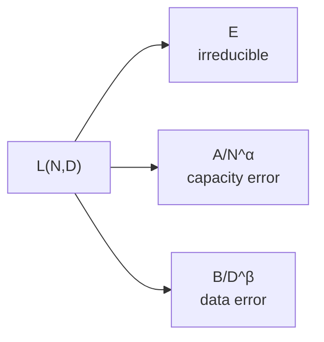
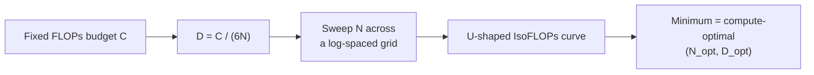
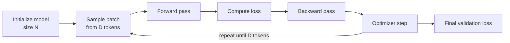
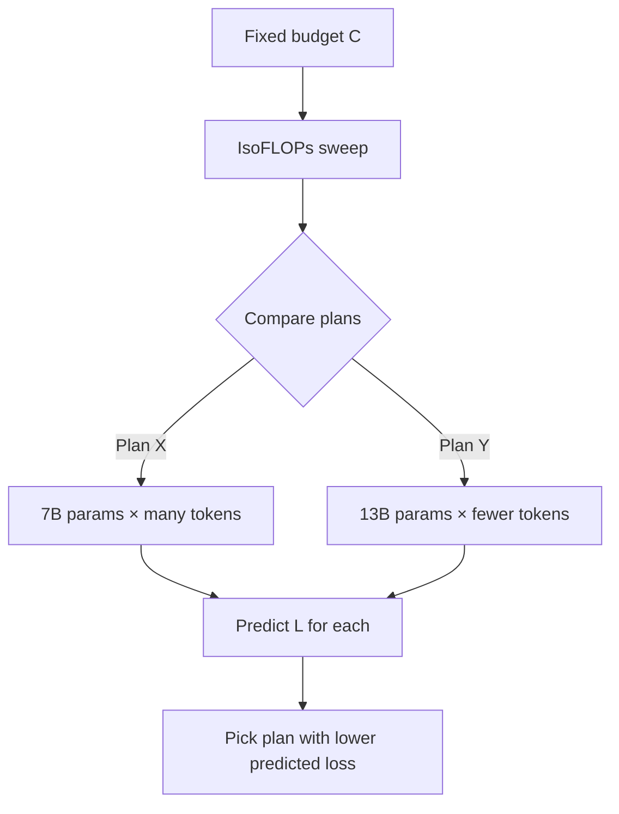

# Week 8 Instructor Notes — Scaling Laws & Compute-Optimal Training

> **Week theme:** Use small, cheap experiments to predict the loss of large models and to decide how to split a fixed training budget between **model size (N)** and **data (D)**.

---

## 1. Goals for the Session

By the end of the 3-hour block, students should be able to:

1. **Explain** what a scaling law is, why it is empirical rather than physical, and what assumptions it hides.
2. **Interpret** every term in the Chinchilla law `L(N, D) = E + A/N^α + B/D^β` in plain language.
3. **Fit** the law to a set of `(N, D, loss)` triples using `scipy.optimize.curve_fit`, with sensible initialization and bounds.
4. **Derive** the approximate training FLOPs formula `FLOPs ≈ 6ND` and use it to convert a compute budget into an IsoFLOPs sweep.
5. **Design** an IsoFLOPs experiment: fix a FLOPs budget, sweep `N`, set `D = C/(6N)`, and locate the compute-optimal allocation.
6. **Apply** the fitted law to predict loss for a new model size or token budget.
7. **Critique** scaling-law predictions: know when they break (capacity-constrained regime, data repetition, distribution shift, architectural changes).
8. **Connect** scaling-law reasoning to broader LLM design choices (normalization, positional embeddings, parallelism, alignment, tokenization).

---

## 2. Why This Matters

Large language models are expensive. Training a single 70B-parameter model can cost millions of dollars in GPU time and weeks of wall-clock time. You cannot afford to train it three times just to discover that you used too little data or too small a batch size.

**Scaling laws turn small experiments into a forecasting tool.**

- **Before committing big budgets**, you can train 5–10 small models (10M–1B parameters) for a few hours each, measure their final validation loss, and fit a curve that predicts the loss of a 10B or 100B model.
- **They settle architecture debates empirically.** If you want to know whether Transformer is better than LSTM, or whether μP stabilizes hyperparameters across scale, you do not guess — you train a scaling curve for each recipe and compare the offsets.
- **They guide the model-vs-data trade-off.** The Chinchilla paper showed that many earlier models (e.g., GPT-3) were **under-trained**: they would have performed better if the same compute had been spent on a smaller model trained on more tokens. This observation changed industry practice (LLaMA, Mistral, Llama 3 all use much higher token-per-parameter ratios than GPT-3).
- **They separate training-optimal from inference-optimal.** Chinchilla optimizes *training compute*, but in production you pay for *inference*. A smaller model trained on far more data (e.g., Mistral 7B on ~110 tokens/param) can be cheaper to serve at nearly the same quality as a larger model.

> **Real-world framing for students:** “Imagine your manager asks whether to train a 7B model or a 13B model with the same $200k budget. Scaling laws let you give a numerical answer instead of a gut feeling.”

---

## 3. Suggested Timing (3 hours)

| Segment | Time | Activity | Instructor Tip / Check-for-Understanding |
|---------|------|----------|------------------------------------------|
| **Opening & recap** | 0:00–0:10 | Logistics; review Week 7; preview today | Ask: *“What two knobs do we have when we scale up a model?”* |
| **Lecture Part 1 — Scaling laws** | 0:10–0:50 | Chinchilla law, fitting, FLOPs derivation | CFU: *“Why do we use non-embedding parameters?”* |
| **Live Demo 1 — Fit synthetic data** | 0:50–1:15 | Run `lab/scaling_law.py`, inspect params & plot | Show the JSON file that is produced |
| **Live Demo 2 — Predict loss** | 1:15–1:30 | Run `lab/predict.py --N 1e8 --D 2e9` | Ask students to predict the number before you reveal it |
| **Break** | 1:30–1:40 | — | — |
| **Lecture Part 2 — IsoFLOPs** | 1:40–2:00 | Derive `D = C/(6N)`, compute-optimal ratio | CFU: *“What does a flat IsoFLOPs curve mean?”* |
| **Live Demo 3 — IsoFLOPs sweep** | 2:00–2:25 | Run `lab/isoflops.py --flops 1e18` | Point out the U-shape and the ~20 tokens/param optimum |
| **Synthesis & discussion** | 2:25–2:40 | Discuss prompts; compare industry ratios | CFU: *“When would you deliberately train left of the optimum?”* |
| **Lab time** | 2:40–3:00 | Students run the three scripts; start real-data collection | Circulate; check that everyone generated `scaling_params.json` |

**Total: 180 minutes.**

---

## 4. Lecture Outline

### 4.1 What Is a Scaling Law?

- A **scaling law** is an empirical equation that relates some measurable quantity of a trained model (usually validation **loss**) to the resources used to train it (parameters, data, compute).
- It is **not** a theorem. It is a curve that happens to fit well over a wide range, usually a **power law**.
- In log–log space, a power law becomes a straight line, which makes extrapolation visually simple.
- The earliest modern neural scaling law is often credited to Hestness et al. (2017); OpenAI’s *Scaling Laws for Neural Language Models* (Kaplan et al., 2020) popularized it for Transformers; DeepMind’s **Chinchilla** paper (Hoffmann et al., 2022) refined the model-vs-data trade-off.

> **Concrete idea:** If you plot `log(D)` on the x-axis and `log(L − E)` on the y-axis, you expect a straight line with negative slope `−β`.

### 4.2 The Chinchilla Law

The functional form used in the lab and in the Chinchilla paper is:

```text
L(N, D) = E + A / N^α + B / D^β
```

| Symbol | Meaning | Role in the loss | Approx. Chinchilla value |
|--------|---------|------------------|--------------------------|
| **N** | Non-embedding parameters | Model capacity | varies |
| **D** | Training tokens | Amount of data | varies |
| **E** | Irreducible loss | Bayes-optimal lower bound | ≈ 1.69 |
| **A** | Capacity prefactor | How much capacity hurts when N is small | ≈ 406.4 |
| **α** | Capacity exponent | Diminishing returns to scale | ≈ 0.34 |
| **B** | Data prefactor | How much data scarcity hurts | ≈ 410.7 |
| **β** | Data exponent | Diminishing returns to data | ≈ 0.28 |

- **E** captures the fact that even an infinitely large model trained on infinite data cannot predict random noise or ambiguous text perfectly.
- **A/N^α** is the **capacity error**: the reducible loss left because the model is too small.
- **B/D^β** is the **data error**: the reducible loss left because the model has not seen enough tokens.
- The two error terms are treated as **additive and independent**; there is no `N × D` interaction term in the basic law.

> **Toy example:** If `N = 10^9`, `D = 2 × 10^10`, using the Chinchilla constants:
>
> ```text
> A/N^α ≈ 406.4 / (10^9)^0.34 ≈ 0.35
> B/D^β ≈ 410.7 / (2 × 10^10)^0.28 ≈ 0.54
> L ≈ 1.69 + 0.35 + 0.54 = 2.58
> ```

### 4.3 Non-Embedding Parameters vs. Total Parameters

- The lab code uses **non-embedding parameters** for `N`.
- Why? The embedding matrix has size `vocab_size × d_model`. For small models this can be a large fraction of total parameters, and its scaling behavior is different from the Transformer stack.
- Counting total parameters would bend the scaling curve, especially at small scales.

**Example:** A 1B-parameter model with `vocab_size = 50,000` and `d_model = 1,024` has:

```text
embedding params = 2 × 50,000 × 1,024 = 102.4M
non-embedding params ≈ 1,000M − 102.4M = 897.6M
```

Use **897.6M** as `N` in the law.

### 4.4 Collecting Data for a Scaling Law

To fit the law you need several `(N, D, loss)` points. Good practice:

- **Fix the data distribution.** All models should see the same corpus or a representative sample.
- **Fix hyperparameters** (batch size, learning rate schedule, optimizer) or scale them according to a known rule such as μP.
- **Vary both N and D independently.** Do not only scale N while keeping epochs constant; that changes D too.
- **Train to convergence** for each point, or use a learning-rate schedule such as WSD that lets you estimate final loss from intermediate checkpoints.
- **Hold out 1–2 configurations** for validation; do not fit on them.

### 4.5 Fitting Procedure

The lab uses `scipy.optimize.curve_fit`:

```python
from scipy.optimize import curve_fit

def chinchilla_law(x, E, A, B, alpha, beta):
    N, D = x[:, 0], x[:, 1]
    return E + A * np.power(N, -alpha) + B * np.power(D, -beta)

popt, pcov = curve_fit(
    chinchilla_law, X, y,
    p0=[1.5, 400.0, 400.0, 0.3, 0.3],
    bounds=([0.0, 1.0, 1.0, 0.01, 0.01],
            [5.0, 5000.0, 5000.0, 1.0, 1.0]),
    maxfev=10000,
)
```

Key points to explain:

- **Initialization matters.** The Chinchilla constants are a good `p0` for English-language Transformers on web-like data.
- **Bounds keep parameters physical.** Exponents are bounded in `(0, 1)`; prefactors are positive.
- **Log-space fitting is usually better.** The lab minimizes MSE in raw loss, but because loss spans a small absolute range (e.g., 2.0–4.0), that is acceptable. For wider ranges, minimize MSE in `log(L)` so that a 5% error at high loss costs the same as a 5% error at low loss.
- **Check residuals.** Plot `predicted − actual` vs. `N` and vs. `D`. A systematic trend means the functional form is wrong or you are in the capacity-constrained regime.

### 4.6 Deriving `FLOPs ≈ 6ND`

For a decoder-only Transformer, the dominant cost is the matrix multiplications.

| Pass | Approximate FLOPs per token | Explanation |
|------|----------------------------|-------------|
| Forward | `2ND` | One multiply-add per parameter per token |
| Backward | `4ND` | Backprop roughly doubles the forward cost |
| **Total** | **`≈ 6ND`** | Standard rule of thumb |

Notes:

- This ignores the **quadratic attention cost** (`O(L²d)` per sequence) and the **embedding/softmax** overhead. For long contexts or small models, those can matter.
- It assumes a standard dense Transformer. MoE or sparse architectures need a different effective `N`.
- The factor of 6 is an approximation; papers sometimes use 6.4 or other refinements. For decision-making, 6 is enough.

> **Concrete example:** A 1B-parameter model trained on 20B tokens:
>
> ```text
> FLOPs ≈ 6 × 1e9 × 2e10 = 1.2e20 FLOPs
> ```
> On a single H100 (~2e15 FLOPs/s theoretical FP16), that is roughly 60,000 GPU-seconds, or ~17 GPU-hours of ideal compute.

### 4.7 IsoFLOPs and Compute-Optimal Allocation

If you have a fixed FLOPs budget `C`, the constraint is:

```text
C ≈ 6ND  ⇒  D = C / (6N)
```

Substituting into the Chinchilla law gives `L(N)` along an **IsoFLOPs curve**. The curve is U-shaped:

- **Too small N:** the capacity term `A/N^α` dominates; the model cannot absorb the data.
- **Too large N:** `D` becomes tiny; the data term `B/D^β` dominates; the model is starved.
- **Minimum:** the compute-optimal `N_opt` and `D_opt`.

For the Chinchilla constants, the optimal ratio is approximately:

```text
D_opt / N_opt ≈ 20 tokens per parameter
```

> **Toy IsoFLOPs example for C = 1e18:**
>
> ```text
> N_opt ≈ 9e7
> D_opt ≈ 1.8e9
> D_opt / N_opt ≈ 20
> ```

### 4.8 Capacity-Constrained and Data-Repetition Regimes

- **Capacity-constrained regime:** Very small models may not follow the power law because they saturate before the asymptotic regime. Common fix: exclude models below ~50M non-embedding parameters.
- **Data repetition:** If you have a fixed unique corpus and train for multiple epochs, repeated data is almost as good as new data for the first ~4 epochs, then rapidly loses value. The scaling-law fit assumes mostly unique tokens.

### 4.9 Using Scaling Laws for Real Decisions

Three canonical use cases:

1. **Predict the loss of a planned model.** Given `(N_target, D_target)`, plug into the fitted law.
2. **Allocate a fixed compute budget.** Fix `C`, run an IsoFLOPs sweep, pick the minimum.
3. **Compare two plans.** For the same budget, evaluate `L(7B, D_7B)` and `L(13B, D_13B)`; choose the lower loss.

> **Engagement question:** *“You have a fixed $200k budget. Should you train a 7B model on many tokens or a 13B model on fewer tokens? How would you actually decide?”*

### 4.10 Caveats and Limitations

- Scaling laws assume the **architecture, data distribution, and hyperparameters** stay the same. Switching from vanilla Transformer to MoE, or from web data to code-only data, changes the fitted coefficients.
- They predict **loss**, not downstream accuracy. Different tasks scale differently (see the SuperGLUE discussion in the chapter reading).
- They predict the **average trend**, not an exact single-run number. Training noise can easily shift final loss by a few percent.
- The Chinchilla optimum is **training-compute optimal**, not necessarily **inference optimal** or **total-cost optimal**.

---

## 5. Algorithm Comparisons — Broader LLM Design Context

Scaling laws describe the *macro* behavior of a fixed recipe. The choices below change the *micro* recipe and therefore shift the coefficients `A`, `B`, or `E` of the law. When you change one of these, you must re-fit the scaling law rather than reuse old coefficients.

### 5.1 LayerNorm vs. RMSNorm

| Aspect | **LayerNorm** | **RMSNorm** |
|--------|---------------|-------------|
| Formula | `x_norm = (x − μ) / σ` | `x_norm = x / RMS(x)` |
| Mean-centering | Yes | No |
| Learnable params | `γ` (and sometimes `β`) | `γ` only |
| Computation | Slightly more (mean + variance) | Slightly less |
| Pros | Theoretically well-behaved; stable training | Faster; works well in practice; used by LLaMA/Mistral |
| Cons | Extra ops and params | Slightly less principled; can be sensitive if inputs are not already zero-mean |
| Typical use case | General Transformers (BERT, GPT-2/3) | Modern LLMs optimized for throughput (LLaMA, Mistral) |

> **Scaling-law connection:** A more stable normalization may let you use a larger learning rate, which can improve the data prefactor `B` at fixed compute.

### 5.2 RoPE vs. Learned Absolute Positional Embeddings

| Aspect | **RoPE (Rotary Position Embedding)** | **Learned Absolute Embeddings** |
|--------|--------------------------------------|---------------------------------|
| Mechanism | Rotates query/key vectors by position-dependent angles | Adds a learned vector to each token embedding based on absolute position |
| Parameters | None (closed-form rotation matrix) | `max_position_embeddings × d_model` learned params |
| Length extrapolation | Better (relative distances encoded) | Poor beyond training length |
| Pros | No extra params; relative-position bias; supports longer inference | Simple; works for short fixed contexts |
| Cons | Slightly more compute; extrapolation still degrades without correction | Fixed context window; extra params count toward embeddings |
| Typical use case | Modern LLMs (LLaMA, Mistral, Qwen, GPT-NeoX) | Original GPT/GPT-2, BERT |

> **Scaling-law connection:** Removing learned positional embeddings makes `N` (non-embedding params) cleaner and can slightly improve length generalization without increasing parameter count.

### 5.3 DDP vs. FSDP

| Aspect | **DDP (DistributedDataParallel)** | **FSDP (Fully Sharded Data Parallel)** |
|--------|-----------------------------------|----------------------------------------|
| What is replicated | Full model copy on every GPU | Parameters, gradients, and optimizer states are sharded across GPUs |
| Memory per GPU | O(model size) | O(model size / world_size) |
| Communication | AllReduce gradients after backward | AllGather params before forward/backward; ReduceScatter gradients |
| Pros | Simple; low communication overhead for small models | Trains much larger models on the same cluster; often faster end-to-end |
| Cons | Cannot fit very large models | More communication; harder to debug; needs careful wrapping |
| Typical use case | Models that fit in a single GPU (≤~7B on A100) | Large models that need sharding (≥7B–70B+) |

> **Scaling-law connection:** FSDP does not change the loss function, but it changes which `(N, D)` combinations are **feasible** to measure. Without FSDP you may not be able to collect the large-`N` points needed for a good fit.

### 5.4 RLHF vs. RLVR

| Aspect | **RLHF (Reinforcement Learning from Human Feedback)** | **RLVR (Reinforcement Learning from Verifiable Rewards)** |
|--------|--------------------------------------------------------|------------------------------------------------------------|
| Reward source | Learned reward model trained on human preference labels | Ground-truth signal: unit tests, math correctness, parser checks |
| Algorithms | PPO, DPO, IPO, etc. | PPO, GRPO, REINFORCE with verifiable reward |
| Reward hacking risk | Higher (model can exploit the learned RM) | Lower (ground truth is harder to game) |
| Pros | Generalizes to open-ended tasks (helpfulness, style) | Cheap labels; clear success signal; works for math/code |
| Cons | Expensive human labels; RM training; instability | Only works when a verifier exists; may overfit to checkable formats |
| Typical use case | Chat alignment (ChatGPT, Claude) | Math reasoning (DeepSeek-R1), code generation |

> **Scaling-law connection:** Alignment changes the **effective loss surface** and downstream metrics. Pre-training scaling laws predict perplexity; post-training scaling laws predict task accuracy and must be fitted separately.

### 5.5 BPE vs. SentencePiece

| Aspect | **BPE (Byte-Pair Encoding)** | **SentencePiece** |
|--------|------------------------------|-------------------|
| Pre-tokenization | Usually language-specific (e.g., GPT-2 regex) | Language-agnostic; treats text as raw Unicode |
| Vocabulary building | Greedy merge of most frequent pairs | Can use BPE or Unigram language model |
| Handling of whitespace | Depends on pre-tokenizer | Explicit `<space>` token; reversible detokenization |
| Pros | Fast; widely used; good for English | Works for any language including CJK; no custom pre-tokenizer |
| Cons | Language-specific pre-tokenizers can be brittle | Slightly slower training; more hyperparameters |
| Typical use case | GPT-2/3/4, LLaMA, many English-centric models | T5, LLaMA 2/3, multilingual models |

> **Scaling-law connection:** Tokenization changes `D` (number of tokens). A more efficient tokenizer increases effective `D` for the same raw bytes, shifting the data-error term. When comparing scaling curves across tokenizers, measure `D` in the *same* tokenizer or normalize by bytes.

---

## 6. Concrete Examples & Code Snippets

### 6.1 Toy Training Data

Suppose you trained four small models and recorded the following:

| N (non-embedding params) | D (tokens) | Actual loss |
|--------------------------|-----------:|------------:|
| 1.0 × 10⁸ | 2.0 × 10⁹ | 3.49 |
| 3.0 × 10⁸ | 6.0 × 10⁹ | 2.97 |
| 1.0 × 10⁹ | 2.0 × 10¹⁰ | 2.62 |
| 3.0 × 10⁹ | 6.0 × 10¹⁰ | 2.33 |

### 6.2 Fitting the Law

```python
import numpy as np
from scipy.optimize import curve_fit

def chinchilla_law(x, E, A, B, alpha, beta):
    N, D = x[:, 0], x[:, 1]
    return E + A * np.power(N, -alpha) + B * np.power(D, -beta)

# Build the design matrix
X = np.array([
    [1e8, 2e9],
    [3e8, 6e9],
    [1e9, 2e10],
    [3e9, 6e10],
])
y = np.array([3.49, 2.97, 2.62, 2.33])

popt, pcov = curve_fit(
    chinchilla_law, X, y,
    p0=[1.5, 400.0, 400.0, 0.3, 0.3],
    bounds=([0.0, 1.0, 1.0, 0.01, 0.01],
            [5.0, 5000.0, 5000.0, 1.0, 1.0]),
)
E, A, B, alpha, beta = popt
print(f"E={E:.3f}, A={A:.1f}, B={B:.1f}, α={alpha:.3f}, β={beta:.3f}")
```

### 6.3 Predicting Loss for a New Config

```python
# Suppose we want to train a 1B-parameter model on 20B tokens
N_target = 1e9
D_target = 2e10

loss_pred = E + A * N_target**(-alpha) + B * D_target**(-beta)
flops = 6 * N_target * D_target

print(f"Predicted loss: {loss_pred:.3f}")
print(f"Training FLOPs: {flops:.2e}")
```

Expected output (order of magnitude):

```text
Predicted loss: 2.58
Training FLOPs: 1.20e+20
```

### 6.4 IsoFLOPs Sweep by Hand

For a budget `C = 1e18`:

```python
C = 1e18
N_sweep = np.logspace(7, 10, 50)      # 1e7 to 1e10
D_sweep = C / (6 * N_sweep)
loss_sweep = E + A * N_sweep**(-alpha) + B * D_sweep**(-beta)

idx = np.argmin(loss_sweep)
print(f"Optimal N = {N_sweep[idx]:.2e}")
print(f"Optimal D = {D_sweep[idx]:.2e}")
print(f"Tokens/param = {D_sweep[idx] / N_sweep[idx]:.1f}")
```

Expected output with the Chinchilla constants:

```text
Optimal N = 9.13e+07
Optimal D = 1.83e+09
Tokens/param = 20.0
```

---

## 7. Visual Aids — Mermaid Diagrams

Use these diagrams on slides or in the shared notes to make abstract concepts concrete.

### 7.1 Overall Session Pipeline

```mermaid
flowchart LR
    A[Train small models<br/>varying N and D] --> B{Record final<br/>validation loss}
    B --> C[Fit Chinchilla law<br/>L(N,D)]
    C --> D[Predict target loss]
    C --> E[Run IsoFLOPs sweep]
    E --> F[Choose compute-optimal<br/>N and D]
    D --> G[Make go/no-go decision]
    F --> G
```

### 7.2 Decomposition of the Chinchilla Loss



### 7.3 Lab Script Data Flow

```mermaid
flowchart LR
    Synth[(Synthetic or real<br/>(N,D,loss) triples)] --> Fit["scaling_law.py"]
    Fit --> Params[(scaling_params.json<br/>E,A,B,α,β)]
    Params --> Pred["predict.py<br/>--N --D"]
    Params --> Iso["isoflops.py<br/>--flops"]
    Pred --> Out1[(Predicted loss<br/>+ FLOPs)]
    Iso --> Out2[(IsoFLOPs curve<br/>+ optimal N/D)]
```

### 7.4 IsoFLOPs Concept



### 7.5 Training Loop That Produces Scaling Data



### 7.6 Decision Workflow for a Fixed Budget



---

## 8. Common Misconceptions & Pitfalls

| Misconception | Why It Happens | How to Avoid |
|---------------|----------------|--------------|
| **“Scaling laws are exact.”** | The curve looks smooth, so students assume it is physics. | Emphasize it is empirical. Always report prediction intervals and validate on held-out points. |
| **“Use total parameters for N.”** | Many frameworks report total params by default. | Subtract embedding params; use **non-embedding parameters** as in the lab code. |
| **“FLOPs ≈ 6ND is exact.”** | The formula is quoted so often it sounds like a definition. | State the assumptions: dense decoder-only Transformer, standard sequence length, ignore embedding/softmax overhead. |
| **“More data is always better.”** | Intuition from small-data regimes. | At fixed N, data has diminishing returns (`D^−β`). The compute-optimal point balances N and D. |
| **“Chinchilla says 20 tokens/param for every model.”** | The ratio is compute-optimal for pretraining; industry models overtrain for inference. | Distinguish **training-optimal** vs. **inference-optimal**. Modern models use 50–200+ tokens/param. |
| **“A single big run is enough to fit the law.”** | Students want to skip the grid. | You need **multiple** `(N,D)` pairs; otherwise the five parameters are underdetermined. |
| **“I can extrapolate forever.”** | Power laws are tempting to extend. | The law breaks in the capacity-constrained regime, with repeated data, or when architecture/data changes. |
| **“p0 and bounds do not matter.”** | `curve_fit` often succeeds. | Bad initialization can converge to a local minimum or diverge. Seed with literature values and bound exponents in `(0,1)`. |
| **“Training tokens = epochs × steps.”** | Colloquial use of “steps.” | `D` is total **tokens processed**, not optimizer steps or epochs. |

---

## 9. Teaching Tips for a 3-Hour Session

### 9.1 Engagement Hooks

- **Money hook:** “Training GPT-4-class models costs tens of millions. Would you rather spend $50k guessing or $5k fitting a scaling law?”
- **Counter-intuitive hook:** “A smaller model trained on more data can beat a bigger model. Chinchilla 70B beat GPT-3 175B in many tasks.”
- **History hook:** “Bell Labs found power-law learning curves in 1993. We are still using the same idea, just with bigger computers.”

### 9.2 Live Demo Talking Points

- Before running `scaling_law.py`, show the synthetic generator. Ask: *“If I double N and keep D fixed, which term changes?”*
- When the fit prints `E ≈ 1.69`, explain that this is the **floor** — even infinite compute cannot go below it for this data distribution.
- When `isoflops.py` prints `tokens/param ≈ 20`, contrast it with GPT-3 (~2), LLaMA 2 70B (~29), and Mistral 7B (~110).
- Use `predict.py` to show that the law gives a **single number** answer to the manager’s budget question.

### 9.3 Check-for-Understanding Moments

1. After introducing `L(N,D)`: *“What happens to the loss if N → ∞ while D stays fixed?”*
2. After deriving `6ND`: *“Why is the backward pass more expensive than the forward pass?”*
3. After the IsoFLOPs demo: *“If the curve is flat, what does that tell you about the budget?”* (Answer: the budget is too small; many allocations look similar.)
4. Before the break: *“What is the difference between training-optimal and inference-optimal?”*

### 9.4 Pacing Advice

- Spend extra time on **why non-embedding parameters matter** and **why the curve is U-shaped**. These are the two ideas students most often miss.
- Do not let the algebra of `6ND` drag on; the important part is using it as a constraint, not deriving it from first principles.
- Reserve 5 minutes at the end for students to verify they produced `scaling_params.json` and at least one plot.

---

## 10. Live Demo Script

Run the demo from `teaching/week08/lab/`.

### Step 1 — Fit the synthetic law

```bash
cd teaching/week08/lab
python scaling_law.py --output_dir week08/outputs
```

Expected output:

```text
Using synthetic data. Replace with your own training results for real use.
Fitted parameters:
  E     = 1.69xx
  A     = 406.xx
  B     = 410.xx
  alpha = 0.34xx
  beta  = 0.28xx

MSE: 0.000xxx
Saved plot to week08/outputs/scaling_fit.png
```

Show the generated `week08/outputs/scaling_params.json`:

```json
{
  "E": 1.6923,
  "A": 406.41,
  "B": 410.73,
  "alpha": 0.3401,
  "beta": 0.2798
}
```

**Talking point:** The fit recovered the true parameters because the synthetic data were generated from them. Real data will not be this clean.

### Step 2 — Predict a target configuration

```bash
python predict.py --N 1e8 --D 2e9
```

Expected output (order of magnitude):

```text
Model size N:     1.00e+08 params
Training tokens D: 2.00e+09
Training FLOPs:   1.20e+18
Predicted loss:   3.48xx
```

**Talking point:** This is the exact answer to the question, “If I train a 100M-parameter model on 2B tokens, what loss should I expect?”

### Step 3 — IsoFLOPs sweep

```bash
python isoflops.py --flops 1e18
```

Expected output:

```text
IsoFLOPs sweep for FLOPs budget = 1.00e+18
Optimal N = 9.13e+07 params
Optimal D = 1.83e+09 tokens
Predicted loss = 3.54xx
Tokens per param = 20.0
Saved plot to week08/outputs/isoflops_1e+18.png
```

**Talking point:** For this budget, the best model is ~90M parameters trained on ~1.8B tokens. If you instead trained a 1B-parameter model on 200M tokens, you would be far to the right on the U-curve and get a much worse loss.

---

## 11. Lab Instructions for Students

Students should work from `teaching/week08/lab/`.

### Phase 1 — Run the provided scripts (15 min)

1. `python scaling_law.py` — fit the law to synthetic data.
2. `python predict.py --N 1e8 --D 2e9` — predict loss for a target config.
3. `python isoflops.py --flops 1e18` — find the compute-optimal allocation.

Check that the following files are created:

- `week08/outputs/scaling_params.json`
- `week08/outputs/scaling_fit.png`
- `week08/outputs/isoflops_1e+18.png`

### Phase 2 — Experiment with the parameters (20 min)

- Try `--flops 1e17` and `--flops 1e19`. How does the optimal `N` move? (Larger budgets favor larger models, but the ratio stays near 20 for Chinchilla constants.)
- Edit `synthetic_data()` in `scaling_law.py` to add more noise or fewer points. How robust is the fit?
- Try a bad `p0` in `fit_scaling_law` (e.g., `p0=[0.1, 10, 10, 0.05, 0.05]`). Does the fit diverge?

### Phase 3 — Real data collection (homework or extended lab)

1. Gather final validation losses from Week 4 models of at least three different sizes. If no Week 4 data exist, train small models (10M–300M parameters) for a few hours each.
2. Record `(N, D, loss)` triples in a JSON file:

```json
[
  {"N": 100000000, "D": 2000000000, "loss": 3.52},
  {"N": 300000000, "D": 6000000000, "loss": 2.98}
]
```

3. Refit the law:

```bash
python scaling_law.py --data my_data.json --output_dir week08/outputs_real
```

4. Compare predicted vs. actual on a held-out configuration.

### Deliverable

Each student submits a short scaling-law report containing:

- Fitted parameters `(E, A, B, α, β)`.
- A table of the data used for fitting.
- Actual-vs-predicted plot.
- IsoFLOPs curves for at least two FLOPs budgets, with the optimal `N`, `D`, and `D/N` ratio.
- A one-paragraph critique: what could make the prediction unreliable?

---

## 12. Discussion Prompts

- **Why do we fit in log-space?** What would happen if we minimized squared error in raw loss across a wide range of losses?
- **What does it mean to be “left of the Chinchilla optimal”?** (Answer: model is too big for the data; the data-error term dominates.)
- **What does it mean to be “right of the Chinchilla optimal”?** (Answer: model is too small for the data; the capacity-error term dominates.)
- **How would you use scaling laws to choose between a 7B and a 13B model with the same budget?**
- **When is it rational to deliberately over-train a smaller model?** (Answer: when inference cost dominates total cost.)
- **How would data quality affect the fitted parameters?** (Answer: better data usually lowers `E` or `B`, shifting the whole curve down, but does not change the exponents much.)
- **If you must train on repeated data, how should your model-data ratio change?** (Answer: slightly reduce model size and increase epochs, but expect a lower ceiling.)
- **What would happen to the law if you switched from dense Transformer to MoE?** (Answer: effective active parameters differ from total parameters; you would need to re-fit using active or effective parameter count.)

---

## 13. Troubleshooting

| Issue | Likely Cause | Fix |
|-------|--------------|-----|
| Fit diverges or hits bounds | Bad `p0` or too few data points | Add more `(N, D, loss)` triples; initialize near Chinchilla constants; check that `N` and `D` span at least one order of magnitude each |
| Predicted loss < 0 or below `E` | Extrapolating far beyond the fitted range | Interpret carefully; the law has no hard lower bound besides `E`; add a data point near the target scale |
| Real data does not fit well | Models are in the capacity-constrained regime or data is too noisy | Exclude very small models (<~50M non-embedding params); average multiple seeds; fit in log-space |
| IsoFLOPs curve is flat | FLOPs budget too small; all configs are capacity-constrained or data-starved | Increase the budget; widen the `N` sweep; check that `n_min` and `n_max` bracket the expected optimum |
| `curve_fit` warns “Optimal parameters not found” | The five parameters are underdetermined | Add more data points, especially at different `(N,D)` ratios; tighten bounds |
| `predict.py` says params file not found | Running from the wrong directory or before fitting | Run `scaling_law.py` first; ensure `--params` points to `week08/outputs/scaling_params.json` |
| Large residuals for high-N points | Quadratic attention or embedding costs matter; or model is under-trained | Check that `D` is large enough relative to `N`; consider a refined FLOPs formula |
| Tokens-per-parameter ratio looks far from 20 | Fitted coefficients differ from Chinchilla, or budget is very small/large | This is expected if your data/architecture differ; report the ratio you found, not the textbook value |

---

## 14. Homework / Follow-Up Suggestions

1. **Fit on real data.** Use losses from Week 4 (or newly trained small models) and compare your fitted coefficients to the Chinchilla paper. Do not expect them to match exactly.
2. **Sensitivity analysis.** Vary `p0` and bounds in `fit_scaling_law`. How much do the predicted optimal `N` and `D` change?
3. **Log-space vs. linear-space fit.** Modify `fit_scaling_law` to minimize `sum((log(y) − log(y_pred))²)` and compare the parameters and predictions.
4. **Budget question.** You have `1e21` FLOPs. Use your fitted law to decide between (a) a 3B model, (b) a 7B model, or (c) a 14B model. Compute the predicted loss and tokens per parameter for each.
5. **Read one case study.** Skim the Chinchilla paper, the MiniCPM report, or the DeepSeek-V1 report and identify one practical detail (e.g., WSD scheduler, μP, IsoFLOPs method) that was not obvious from the formula alone.
6. **Data repetition experiment.** Train a fixed-size model for 1, 4, and 10 epochs on the same data. Plot final loss vs. epoch and discuss where the scaling-law assumption breaks down.

---

## 15. Next Week Preview

**Week 9: Data Engineering.** We move from predicting how much data we need to actually producing it. Topics include raw web corpus cleaning, deduplication, quality filtering, mixing ratios, and building a repeatable pre-training data pipeline. Scaling laws tell us the *quantity*; data engineering determines the *quality*.
