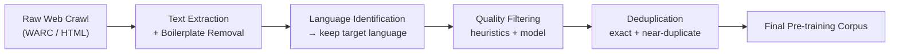
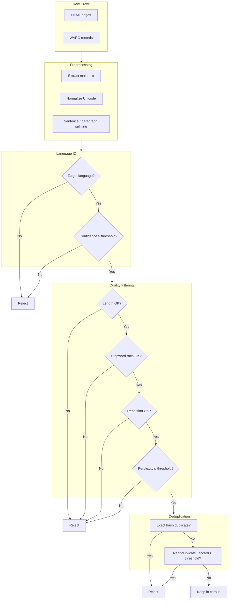
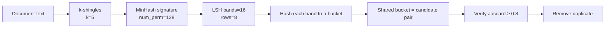
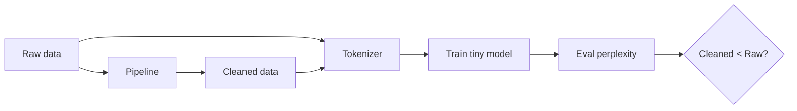

# Week 9 Instructor Notes: Data Engineering for LLMs

> **Scope:** This session covers the pre-training **data pipeline**: language identification, quality filtering, and deduplication. Students run three small lab scripts (`lab/01_language_id.py`, `lab/02_quality_filter.py`, `lab/03_dedup.py`) and see how raw crawl text is transformed into a training-ready corpus.

---

## Goals for the Session

1. **Motivate data quality as a first-class ML problem.**
   - LLMs are not trained on the internet; they are trained on a *processed subset* of the internet.
   - Students should leave the room able to argue why a smaller, cleaner corpus can outperform a larger, dirtier one.
2. **Walk through the canonical pre-training pipeline stages.**
   - Raw crawl → text extraction → language ID → quality filtering → deduplication → final corpus.
   - Understand what each stage removes, what it keeps, and what trade-off it introduces.
3. **Let students implement and inspect each filter.**
   - Run the three lab scripts on a synthetic corpus.
   - Trace specific documents through the pipeline and explain why they were kept or rejected.
4. **Connect cleaning to downstream model behavior.**
   - Perplexity on a held-out set is the cheapest validation signal.
   - Clean data reduces memorization, improves generalization, and lowers training cost.

---

## Why This Matters

Modern LLMs are trained on **trillions of tokens**. The quality of that text varies enormously: high-quality books and encyclopedia articles sit alongside spam, boilerplate, auto-generated product pages, adult content, hate speech, and duplicated templates.

**Real-world relevance:**

| Stakeholder | Why data engineering matters |
|-------------|------------------------------|
| **Model builder** | Data work is often the biggest practical lever for model quality. Architecture and compute get the headlines, but the training corpus determines what the model knows and how it behaves. |
| **Engineer** | Cleaning reduces training cost. Removing 30% of redundant or low-value data can save millions of GPU-hours at scale. |
| **Researcher** | Contaminated data can leak benchmark answers into the training set, invalidating research claims. |
| **Society** | Filtering choices encode values. Over-aggressive filters can erase dialects, minority languages, and non-mainstream viewpoints. |

A concrete example: the **C4** dataset (used to train T5) and **RefinedWeb** (used for Falcon) show that careful filtering of Common Crawl can rival curated corpora like Wikipedia. In other words, **data engineering scales knowledge; model architecture scales computation**.

---

## Suggested Timing (3 hours)

| Segment | Time | Activity | Instructor mode |
|---------|------|----------|-----------------|
| **Why data engineering** | 10 min | Mini-lecture + poll | Talk, ask questions |
| **Pipeline overview** | 15 min | Walk through stages and diagrams | Talk + board |
| **Language identification** | 20 min | Lecture + live run of `lab/01_language_id.py` | Demo |
| **Quality filtering** | 25 min | Lecture + live run of `lab/02_quality_filter.py` | Demo |
| **Break** | 10 min | — | — |
| **Deduplication** | 25 min | Lecture + live run of `lab/03_dedup.py` | Demo |
| **Lab time** | 40 min | Students run the pipeline and inspect outputs | Circulate |
| **Wrap-up / discussion** | 15 min | Quality vs. quantity, ethics, next week | Facilitate |

**Pacing tip:** The three demos should take ~70 minutes total. If you are running short, pre-generate the `raw.jsonl` file so `01_language_id.py` does not need to create it on the fly.

---

## Pre-Session Setup

1. Ensure Python 3.10+ and PyTorch are installed (the lab uses `torch` only in `02_quality_filter.py`).
2. Create the working directory `teaching/week09/data/` if it does not exist.
3. Run the three scripts once before class to confirm paths and outputs.
4. Optional: download a small real sample (e.g., a Dolma or C4 shard) for the advanced discussion.

---

## Lecture Outline

### 1. Why Data Engineering?

- **LLMs are trained on trillions of tokens; quality varies enormously.**
  - Common Crawl contains billions of pages. Many are navigation menus, error pages, legal disclaimers, or machine-generated SEO text.
  - A model trained on raw crawl will learn spelling, grammar, facts, *and* toxic or redundant patterns.
- **Garbage data hurts perplexity, alignment, and safety.**
  - Noisy text increases loss because the model must waste capacity memorizing boilerplate.
  - Toxic or biased data can surface later during generation or fine-tuning.
- **Data engineering is often the biggest practical lever for model quality.**
  - Doubling compute gives a predictable, modest gain. Replacing a bad corpus with a good one can give a larger, cheaper gain.
- **Data work is not neutral.**
  - Every threshold (confidence, perplexity, similarity) is a value judgment about what counts as "good" text.

#### Engagement question

> *"You have a fixed GPU budget. Would you rather train on 1 trillion noisy tokens or 300 billion carefully filtered tokens? Why?"*
>
> There is no universally correct answer, but the trade-off is real: quantity improves generalization, quality improves sample efficiency and stability. Most production systems do both.

---

### 2. Pipeline Stages

The canonical pre-training pipeline looks like this:



A more detailed version shows the *decision points* at each stage:



**Stage summary:**

| Stage | What it does | Typical output change | Risk |
|-------|--------------|----------------------|------|
| **Text extraction** | Strip HTML, ads, nav bars | Removes 30–50% of raw bytes | Loses main content if parser is bad |
| **Language ID** | Keep documents in target language(s) | Keeps 30–70% of documents | Misclassifies code-switching, short text |
| **Quality filtering** | Remove gibberish, spam, boilerplate | Keeps 40–80% of remaining docs | Removes valuable dialects or niche domains |
| **Deduplication** | Remove exact and near-duplicates | Removes 10–40% of remaining docs | False positives remove distinct documents |

---

### 3. Language Identification

- **Goal:** Assign a language label to each document and keep only the target language(s).
- **Production tool:** `fastText` `lid.176` is the classic tool.
  - Trained on Wikipedia in 176 languages.
  - Returns a language code **and a confidence score**.
- **Thresholding:** Consider keeping only documents above a confidence threshold (e.g., `≥ 0.8`).
  - Low-confidence predictions often indicate short text, code, or mixed languages.
- **Lab connection:** `lab/01_language_id.py` uses a **simple character-range heuristic** for teaching, not `fastText`.
  - This keeps the lab dependency-free.
  - In production, replace `detect_language_simple()` with `fasttext.load_model('lid.176.bin')`.

#### How the lab heuristic works

```python
# From lab/01_language_id.py
def detect_language_simple(text: str) -> str:
    text = text.strip()
    if not text:
        return "empty"

    cjk = sum(1 for c in text if "\u4e00" <= c <= "\u9fff")
    cyrillic = sum(1 for c in text if "\u0400" <= c <= "\u04ff")
    arabic = sum(1 for c in text if "\u0600" <= c <= "\u06ff")
    total = len(text)

    if cjk / total > 0.1:   return "zh"
    if cyrillic / total > 0.1: return "ru"
    if arabic / total > 0.1:   return "ar"
    return "en"
```

**Toy example:**

| Input text | Detected lang | Why |
|------------|---------------|-----|
| `"The quick brown fox jumps over the lazy dog."` | `en` | No CJK/Cyrillic/Arabic characters |
| `"快速的棕色狐狸跳过了懒狗。"` | `zh` | >10% characters in CJK range |
| `"Быстрая коричневая лисица прыгает через ленивую собаку."` | `ru` | >10% Cyrillic |
| `"asdf qwer zxcv 1234 !!!"` | `en` | ASCII falls through to default `en` |

**Check-for-understanding:** *The last row is labeled `en` but is clearly gibberish. Which later stage of the pipeline will catch it?* (Answer: quality filtering — though not the `alpha_ratio` rule, since every character here is still a letter, digit, or punctuation `alpha_ratio` treats as non-signal; this string actually has `alpha_ratio ≈ 0.70`, above the `0.5` reject threshold. It slips past the rule-based heuristics and would need the perplexity filter to catch it.)

---

### 4. Quality Filtering

Quality filters separate **high-signal documents** from **noise**. There are two families: rule-based heuristics and model-based scores.

#### 4.1 Rule-based heuristics

The lab computes three heuristic signals in `rule_based_score()`:

| Signal | Formula in lab | Intuition | Reject if |
|--------|----------------|-----------|-----------|
| **Alphabetic ratio** | `(alpha + whitespace) / len(text)` | How much of the document is real letters vs. symbols/numbers | `< 0.5` |
| **Repetition ratio** | `sum(len(r)+4 for repeated chars) / len(text)` | Fraction of text covered by repeated characters (`aaaaa`) | `> 0.2` |
| **Average word length** | `sum(len(w) for w in words) / n_words` | Words that are too short (spam) or too long (gibberish) | `< 2` or `> 15` |

The lab also enforces a **minimum length** (`len(text) < 20`) before computing these signals.

**Toy example:**

| Text | alpha_ratio | repeat_ratio | avg_word_len | Verdict |
|------|-------------|--------------|--------------|---------|
| `"The quick brown fox jumps over the lazy dog."` | ~0.98 | 0.0 | ~3.9 | Keep |
| `"asdf qwer zxcv 1234 !!!"` | ~0.70 | 0.0 | 3.8 | **Passes** rule-based filters (alpha_ratio 0.70 is above the 0.5 threshold); only the perplexity filter would catch this as gibberish |
| `"aaaaaa bbbbbb cccccc dddddd"` | 1.0 | ~0.74 | 6.0 | Reject (repeat_ratio > 0.2) |

#### 4.2 Model-based filtering

The lab uses a tiny random model as a **perplexity stand-in**. In production, you would train a small transformer on a high-quality reference corpus and reject documents whose perplexity under that model exceeds a threshold.

**Perplexity formula:**

For a document with token IDs `x₁, x₂, ..., xₙ`, perplexity is

```text
PPL = exp( -1/(n-1) * Σ log P(xᵢ | x₁...xᵢ₋₁) )
```

A **high perplexity** means the reference model is "surprised" by the text. If the reference model was trained on clean data, surprise usually indicates noise.

**Code from the lab:**

```python
def perplexity(text: str, model: TinyQualityModel, device: torch.device) -> float:
    ids = char_tokenize(text)                 # char-level for demo
    x = torch.tensor(ids[:-1], ...).unsqueeze(0)
    y = torch.tensor(ids[1:], ...).unsqueeze(0)
    with torch.no_grad():
        logits = model(x)
        loss = nn.functional.cross_entropy(logits.view(-1, logits.size(-1)), y.view(-1))
    return math.exp(loss.item())
```

The default threshold is `ppl_threshold = 100.0`. Because the model is random, this value is arbitrary in the lab; in production it is tuned on a held-out clean set.

#### 4.3 Rule-based vs. model-based quality filtering

| Criterion | Rule-based | Model-based (perplexity classifier) |
|-----------|------------|-------------------------------------|
| **Speed** | Very fast (regex + counters) | Slower (forward pass per document) |
| **Interpretability** | High: you know exactly why a doc was rejected | Lower: the model encodes opaque preferences |
| **Coverage** | Catches obvious noise (repetition, symbols) | Catches subtle low-quality text (spam, templates) |
| **Maintenance** | Need to add new rules for new failure modes | Need to retrain or update reference model |
| **Bias risk** | Can be explicit and audited | Can hide bias in the reference data |
| **Best used when** | First pass, high-volume filtering | Final pass or when quality examples are available |

**Teaching point:** Production pipelines usually combine both. Rules provide a cheap, auditable first cut; a perplexity classifier catches the harder cases.

---

### 5. Deduplication

Deduplication removes redundant documents. There are two regimes.

#### 5.1 Exact deduplication

- Hash the full document (e.g., with SHA-256 or MD5).
- If two hashes collide, keep one copy and discard the rest.
- **Pros:** Perfect precision, very fast.
- **Cons:** Misses near-duplicates (e.g., the same news article with different ads or timestamps).

#### 5.2 Near-deduplication with MinHash + LSH

The lab implements a minimal version in `lab/03_dedup.py`.

**Pipeline:**



**Step 1: Shingling.** Convert a document into a set of overlapping substrings of length `k`.

```python
# From lab/03_dedup.py
def shingle(text: str, k: int = 5) -> set[str]:
    return {text[i : i + k] for i in range(max(0, len(text) - k + 1))}
```

Example: `"hello world"` with `k=3` → `{"hel", "ell", "llo", "lo ", "o w", " wo", "wor", "orl", "rld"}`.

**Step 2: MinHash signature.** Replace each shingle set with a fixed-length vector of minimum hash values. The probability that two documents have the same MinHash value equals their **Jaccard similarity**.

**Step 3: LSH bucketing.** Split the signature into `bands`. Documents that share any band are candidate near-duplicates. The approximate relationship between `bands`, `rows`, and the similarity threshold is:

```text
threshold ≈ (1 / bands)^(1 / rows)
```

In the lab: `num_perm = 128`, `bands = 16`, so `rows = 128 / 16 = 8`, and `threshold ≈ (1/16)^(1/8) ≈ 0.71`. The lab verifies with a stricter `threshold = 0.8`.

**Step 4: Verification.** Recompute exact Jaccard similarity on candidate pairs and remove only those above the threshold.

```python
if jaccard_similarity(sh_i, sh_j) >= threshold:
    removed.add(candidates[j])
```

#### 5.3 Exact vs. near-deduplication

| Criterion | Exact deduplication | MinHash + LSH |
|-----------|---------------------|---------------|
| **What it catches** | byte-identical documents | documents with high Jaccard similarity |
| **False positives** | Essentially zero | Possible: two docs can share a band by chance |
| **False negatives** | High for templated web pages | Tunable via `num_perm`, `bands`, `threshold` |
| **Compute cost** | O(N) hashes | O(N * num_perm) + verification of candidates |
| **Memory cost** | One hash per document | Signature + buckets per document |
| **Best used** | Cheap first pass | Web crawl, where near-duplicates dominate |

**Why near-dedup matters for web text:** Web pages are rarely byte-identical. The same article appears on multiple domains with different headers, footers, ads, and comment sections. Near-deduplication catches these variants; exact deduplication does not.

---

### 6. Evaluation: Did Cleaning Help?

The cheapest way to validate a cleaned corpus is to train a small model on **raw vs. cleaned** data and compare **perplexity** on a held-out set.



**Perplexity interpretation:**

| Observation | Likely meaning |
|-------------|----------------|
| Cleaned corpus has **lower** perplexity | Cleaning removed hard-to-predict noise. Good sign. |
| Cleaned corpus has **higher** perplexity | You may have removed too much diverse text, or the eval set is contaminated in the raw data. |
| Raw corpus perplexity looks "too good" on a benchmark | Possible data contamination. Investigate overlap between train and eval. |

**Important caveat:** If the eval set itself appears in the raw crawl, the raw model will look artificially good. This is why contamination detection is a major topic in LLM evaluation.

---

## Algorithm Comparisons: Broader Design Choices

Although Week 9 focuses on the data pipeline, many design choices upstream and downstream affect what data you need and how you process it. The following tables give students a systems-level view.

### LayerNorm vs. RMSNorm

| Criterion | **LayerNorm** | **RMSNorm** |
|-----------|---------------|-------------|
| **Computation** | `x = (x - mean) / std; then affine` | `x = x / RMS(x); then affine` |
| **Mean centering?** | Yes | No |
| **Speed / memory** | Slightly heavier | Slightly lighter, popular in large decoder-only models |
| **Typical use** | BERT, GPT-2/3, vision transformers | LLaMA, Mistral, many modern LLMs |
| **When to choose** | Need stable training or use an encoder | Need every FLOP saved at billion-parameter scale |

### RoPE vs. Learned Absolute Positional Embeddings

| Criterion | **RoPE (Rotary Position Embedding)** | **Learned Absolute Embeddings** |
|-----------|--------------------------------------|---------------------------------|
| **Mechanism** | Rotates Q/K vectors by position angle | Adds a learned vector per position index |
| **Relativity** | Naturally encodes relative distances | Encodes absolute indices; relative must be inferred |
| **Length extrapolation** | Better (can be extended with scaling) | Poor beyond trained max length |
| **Parameters** | None extra | `max_seq_len * d_model` extra parameters |
| **Typical use** | LLaMA, PaLM, GPT-NeoX | Original GPT, BERT |

### DDP vs. FSDP

| Criterion | **DDP (DistributedDataParallel)** | **FSDP (FullyShardedDataParallel)** |
|-----------|-----------------------------------|-------------------------------------|
| **Model state** | Full model replica on every GPU | Parameters/gradients/optimizer states sharded across GPUs |
| **Communication** | All-reduce gradients each step | All-gather parameters, reduce-scatter gradients |
| **Memory per GPU** | Full model + activations | ~1/N of model state + activations |
| **Setup complexity** | Simpler | More complex (wrapping policy, mixed precision, etc.) |
| **Typical use** | Models that fit on one GPU | Large models that do not fit on one GPU |

### RLHF vs. RLVR

| Criterion | **RLHF (Reinforcement Learning from Human Feedback)** | **RLVR (RL with Verifiable Rewards)** |
|-----------|-------------------------------------------------------|---------------------------------------|
| **Reward source** | Learned reward model trained on human preference labels | Verifiable outcome (test pass, math correctness, compile success) |
| **Needs preference data?** | Yes | No |
| **Best suited for** | Style, helpfulness, open-ended generation | Code, math, reasoning with ground-truth answers |
| **Reward hacking risk** | Can exploit weaknesses of the reward model | Lower because reward is externally verified |
| **Examples** | InstructGPT, ChatGPT early versions | DeepSeek-R1, OpenAI o1-style reasoning training |

### BPE vs. SentencePiece

| Criterion | **BPE (Byte-Pair Encoding)** | **SentencePiece** |
|-----------|------------------------------|-------------------|
| **What it is** | A tokenization *algorithm* | A tokenization *library/framework* |
| **Training** | Starts from character or byte vocabulary, merges frequent pairs | Can train BPE or Unigram models on raw text |
| **Pre-tokenization** | Usually requires whitespace/punctuation splitting first | Language-agnostic; works directly on raw text |
| **Unknown tokens** | Rare if byte-level fallback is used | Uses `<unk>` or byte fallback depending on model |
| **Typical use** | GPT-2/3/4, Llama tokenizers (BPE algorithm) | T5, LLaMA-2, multilingual models (often via SentencePiece wrapper) |

**Key nuance:** SentencePiece is not a single algorithm; it is a toolkit that can train BPE or Unigram tokenizers. Many "SentencePiece" tokenizers in production are actually BPE under the hood.

---

## Common Misconceptions / Pitfalls

### Misconception 1: "More data always beats better data."

**Why it happens:** Scaling laws (Chinchilla) show that loss improves predictably with more data.

**The truth:** Once data is *very* noisy or duplicated, adding more of it can hurt more than help. A smaller, cleaner, diverse corpus often trains faster and generalizes better.

**How to avoid:** Always run a raw-vs-cleaned perplexity experiment at small scale before committing to a full training run.

### Misconception 2: "Deduplication only saves disk space."

**Why it happens:** People think of dedup as a storage optimization.

**The truth:** Near-duplicates also hurt generalization because the model can memorize repeated templates. Deduplication reduces memorization and benchmark contamination.

**How to avoid:** Treat deduplication as a quality step, not a storage step. Measure downstream perplexity, not just bytes removed.

### Misconception 3: "A perplexity filter keeps high-perplexity documents."

**Why it happens:** "High perplexity" sounds like "complex and valuable."

**The truth:** For a *quality-reference* model trained on clean text, high perplexity means the document is surprising / unlike clean text. That usually means low quality.

**How to avoid:** Be explicit about the reference model. The filter rejects documents where `ppl > threshold`.

### Misconception 4: "Exact deduplication is enough for web text."

**Why it happens:** Exact dedup is easy to implement and feels complete.

**The truth:** Web text is full of near-duplicates: the same article with different ads, legal disclaimers, or comment sections. Exact dedup misses almost all of these.

**How to avoid:** Use exact dedup as a cheap first pass, then MinHash + LSH for near-duplicates.

### Misconception 5: "Language ID is 100% accurate."

**Why it happens:** Demo tools like `fastText` are very good on clean Wikipedia text.

**The truth:** Short documents, code, math, and code-switching are hard. Models can also be over-confident on English-like spam.

**How to avoid:** Always use a confidence threshold and sample the borderline cases for manual review.

### Misconception 6: "Cleaning removes bias."

**Why it happens:** Intuitively, removing "bad" text should make the model fairer.

**The truth:** Filters can *amplify* bias if the definition of "quality" is trained on a dominant dialect, language, or demographic. For example, perplexity classifiers may flag African American Vernacular English as low quality if the reference corpus is mainstream news.

**How to avoid:** Audit removals by language, domain, and demographic features. Do not assume a lower loss means a fairer model.

---

## Live Demo Script

Run the pipeline live. Project the terminal and narrate each step.

### Demo 1: Language identification (`lab/01_language_id.py`)

1. Show the generated `raw.jsonl`:
   ```bash
   head -n 5 teaching/week09/data/raw.jsonl
   ```
2. Run the script:
   ```bash
   python teaching/week09/lab/01_language_id.py \
       --input teaching/week09/data/raw.jsonl \
       --output teaching/week09/data/en_only.jsonl \
       --target_lang en
   ```
3. **Talking points:**
   - Notice that the heuristic is brittle: the gibberish string `"asdf qwer zxcv 1234 !!!"` is labeled `en`.
   - Ask: *What will catch this later?* (Quality filter.)
   - Mention that production would use `fastText` with confidence scores.

### Demo 2: Quality filtering (`lab/02_quality_filter.py`)

1. Run the script:
   ```bash
   python teaching/week09/lab/02_quality_filter.py \
       --input teaching/week09/data/en_only.jsonl \
       --output teaching/week09/data/high_quality.jsonl \
       --ppl_threshold 100.0
   ```
2. **Talking points:**
   - Point at the `REJECTED` lines and map each rejection to a rule:
     - Too short? → `len(text) < 20`.
     - Low alpha ratio? → `alpha_ratio < 0.5`.
     - Repetitive? → `repeat_ratio > 0.2`.
     - High perplexity? → `ppl > 100.0`.
   - Show the `quality_metrics` field that is written to the output file.
3. **Experiment live:** Lower `--ppl_threshold` to `50.0` and show that more documents are rejected. Raise it to `500.0` and show that almost everything passes. Discuss how thresholds are tuned.

### Demo 3: Deduplication (`lab/03_dedup.py`)

1. Add a near-duplicate to the corpus live (optional) so students can see a duplicate cluster:
   ```bash
   echo '{"text":"The quick brown fox jumps over the lazy dog. Extra footer text."}' \
       >> teaching/week09/data/high_quality.jsonl
   ```
2. Run the script:
   ```bash
   python teaching/week09/lab/03_dedup.py \
       --input teaching/week09/data/high_quality.jsonl \
       --output teaching/week09/data/deduped.jsonl \
       --threshold 0.8
   ```
3. **Talking points:**
   - Explain `k=5`, `num_perm=128`, `bands=16`.
   - Show the relationship `rows = num_perm / bands = 8`.
   - Discuss false positives: two unrelated documents can collide in a bucket by chance; that is why we verify with exact Jaccard.

---

## Lab Instructions for Students

Students should work in pairs or individually for ~40 minutes.

### Step 1: Generate or inspect the corpus

```bash
python teaching/week09/lab/01_language_id.py --target_lang en
```

- Open `raw.jsonl` and `en_only.jsonl`.
- Count documents kept and rejected.
- Find one document that was rejected and explain why.

### Step 2: Tune quality filters

```bash
python teaching/week09/lab/02_quality_filter.py --ppl_threshold 100.0
```

- Try thresholds `50.0`, `100.0`, `200.0`.
- Record how many documents survive each threshold.
- Identify which rule rejects the most documents.

### Step 3: Explore deduplication parameters

```bash
python teaching/week09/lab/03_dedup.py --threshold 0.8
```

- Try `threshold 0.9` (stricter) and `threshold 0.5` (looser).
- Try adding intentional near-duplicates to the input and observe removal.
- Explain the trade-off: higher threshold → fewer false positives but more missed duplicates.

### Step 4: Build a mini report

Students should produce a short markdown report containing:

| Stage | Documents in | Documents out | Fraction removed | Main reason for removal |
|-------|--------------|---------------|------------------|-------------------------|
| Language ID | — | — | — | — |
| Quality filter | — | — | — | — |
| Deduplication | — | — | — | — |

- Two example documents that were removed, with explanations.
- One example document that survived all stages.
- Optional: train the Week 4 tiny model on raw vs. cleaned data and compare loss.

---

## Teaching Tips for the 3-Hour Session

### Engagement questions

- *"What is the most surprising thing you have seen on a web page that an LLM might train on?"*
- *"If a perplexity filter is trained on Wikipedia, what kinds of useful text might it accidentally remove?"*
- *"Why might two different news sites hosting the same AP article be bad for the model?"*

### Live-demo talking points

- **Make failure visible.** The lab deliberately uses a naive language detector. Use this to show why production needs a real model.
- **Show thresholds are choices, not truths.** Change `--ppl_threshold` live and let students predict the outcome.
- **Connect to scaling laws.** Mention that deduplication is one reason why "1 trillion tokens" on a datasheet is not the same as "1 trillion unique, clean tokens."

### Check-for-understanding moments

1. After language ID: *"Which document is misclassified, and what downstream filter saves us?"*
2. After quality filtering: *"If we set `ppl_threshold` to infinity, what fraction would the rule-based filters still remove?"*
3. After deduplication: *"If `num_perm` is too small, do we get more false positives or more false negatives?"* (Answer: both; the signature is less accurate, so Jaccard estimates are noisy.)

### Pacing tips

- Pre-generate `raw.jsonl` to avoid waiting for the synthetic corpus builder.
- If running behind schedule, skip the live parameter sweep of `02_quality_filter.py` and assign it as lab work.
- Reserve 5 minutes at the end for students to share one surprising removal.

---

## Discussion Prompts

- **Ethical risks of aggressive quality filtering:** What voices, dialects, or domains disappear? How would you audit this?
- **Validating a deduplication threshold:** How do you know `0.8` Jaccard is right? Would you sample candidate pairs for manual review?
- **Why near-deduplication is more important than exact for web text:** Can students give three real examples of near-duplicate web pages?
- **Quality vs. quantity trade-off:** At what point does removing data hurt more than noisy data helps? How would you decide empirically?
- **Contamination:** If a benchmark question appears in the training corpus, is the model "cheating"? How do you detect and prevent this?

---

## Troubleshooting

| Issue | Cause | Fix |
|-------|-------|-----|
| Language ID model missing | `fastText` `lid.176` not downloaded (if using production setup) | Download from the fastText website and point `--model` to it |
| Quality filter removes everything | Threshold too strict or input already very noisy | Relax `--ppl_threshold`, increase `len(text)` minimum, or inspect `alpha_ratio` |
| Quality filter keeps obvious garbage | `alpha_ratio` threshold too low or model is random in lab | Adjust thresholds; remember the lab model is random—use a real reference model in production |
| MinHash too slow | `num_perm` too large or too many candidate pairs | Reduce `num_perm` or increase `bands` (fewer rows per band) |
| MinHash misses duplicates | Shingle size too large or threshold too high | Reduce `k` or lower `--threshold` |
| MinHash has false positives | Shingle size too small or bands too numerous | Increase `k` or reduce `bands` |
| Cleaned data still has bad samples | Heuristic misses edge cases | Add targeted filters (e.g., blocklist, domain filter, porn/spam classifier) |
| PyTorch not installed | Missing dependency for `02_quality_filter.py` | `pip install torch` or use the course virtual environment |

---

## Homework / Follow-up

### Required

1. Run the full pipeline on a real sample from **Dolma**, **C4**, or **RefinedWeb** (download a small shard).
2. Ablate each filter one at a time and report the fraction of documents removed by each stage.
3. Write a one-page reflection on the **bias implications** of your chosen thresholds.

### Optional / Advanced

1. Replace `detect_language_simple()` in `lab/01_language_id.py` with `fastText` and compare accuracy on a multilingual sample.
2. Implement **exact deduplication** as a pre-processing step before `lab/03_dedup.py` and measure the speedup.
3. Train the Week 4 tiny model on `raw.jsonl` vs. `deduped.jsonl` and compare final perplexity.
4. Read the Data Engineering chapter of the course book (optional — not yet available in English) and note one concept not covered in class.

---

## Next Week Preview

**Week 10 begins alignment.** We will move from "what data to pre-train on" to "how to make the model follow instructions." The first alignment stage is **supervised fine-tuning (SFT)**, where a pre-trained model is trained on `(instruction, response)` pairs. We will also set up the vocabulary for reinforcement learning from human feedback (RLHF) and reinforcement learning with verifiable rewards (RLVR), which connect directly to the algorithm comparison tables above.
