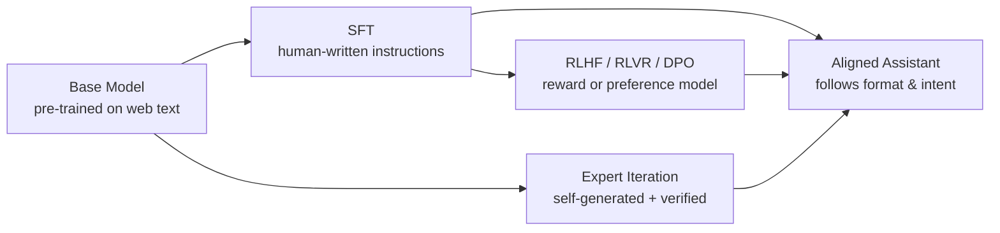
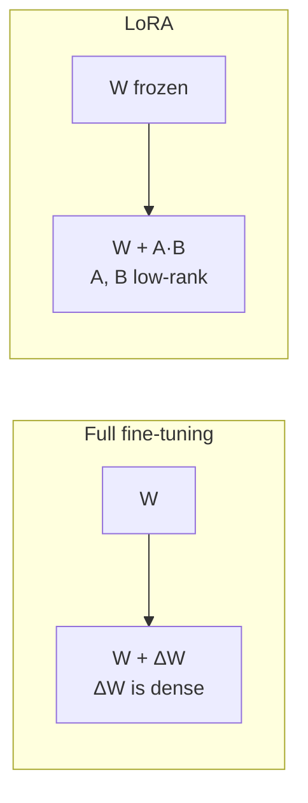
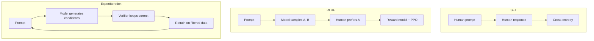
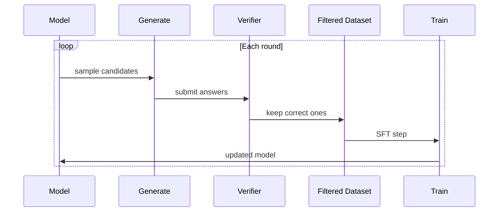

# Week 10 Instructor Notes — Alignment: SFT & Expert Iteration

## Goals for the Session

1. **Explain** why pre-trained base models must be **aligned** before they behave as useful assistants.
2. **Teach** **supervised fine-tuning (SFT)** as next-token prediction on formatted instruction data.
3. **Demonstrate** how **prompt templates**, **token masking**, and **decoding choices** shape SFT outcomes.
4. **Introduce** **expert iteration** (generate → verify → retrain) as a simple, reward-free form of self-improvement.
5. **Connect** every concept to the lab scripts so students can run, inspect, and modify the pipeline.

---

## Why This Matters

A base model trained on internet text is a **statistical autocomplete**, not an assistant. Ask it a question and it may:

- continue the question instead of answering it;
- answer in a style inappropriate for a user interface;
- hallucinate confidently because its objective is "predict likely tokens," not "produce true, helpful outputs."

**Alignment** reshapes the model's behavior without re-training from scratch. It is the stage that turns a raw language model into products such as ChatGPT, Claude, or open-source instruction-tuned models.

| Stage | What it does | Cost | Real-world example |
|-------|--------------|------|--------------------|
| **Pre-training** | Learns grammar, facts, reasoning patterns from unlabeled text | Very high (thousands of GPU hours) | `gpt2`, Llama base |
| **Supervised Fine-Tuning (SFT)** | Trains the model to follow instructions using human-written (prompt, response) pairs | Moderate (hours to days on curated data) | Alpaca, Vicuna |
| **Preference / RL alignment** | Further refines style, helpfulness, harmlessness using rewards or preferences | Moderate to high | RLHF, DPO, GRPO, RLVR |
| **Self-improvement** | Generates its own training data and filters by a verifier | Low per iteration | STaR, expert iteration, ReSTEM |

### Business and research relevance

- **Efficiency**: SFT is dramatically cheaper than pre-training and is the fastest way to specialize a model for a domain (legal, medical, coding).
- **Safety**: Alignment stages are where harmful request refusals, citation behavior, and tone constraints are encoded.
- **Quality over quantity**: SFT performance is usually limited by **data quality**, not compute. A few thousand excellent examples often beat millions of mediocre ones.
- **Verifiable domains**: Expert iteration shines where correctness can be checked automatically (math, code, formal proofs, structured extraction).

> **Talking point for class**: Ask students, "If a base model already 'knows' the capital of France from pre-training, why does it refuse to answer helpfully?" The answer is that the objective and formatting are wrong, not the knowledge.

---

## Suggested Timing (3 hours)

| Segment | Time | Activity | Instructor mode |
|---------|------|----------|-----------------|
| Alignment overview & why it matters | 20 min | Lecture + discussion | Interactive |
| SFT data formatting & loss masking | 15 min | Whiteboard + code walk-through | Demo |
| Live: `sft_demo.py` | 30 min | Run fine-tuning on `gpt2` | Live coding |
| Break | 10 min | — | — |
| Candidate generation & verifiers | 15 min | Lecture + toy example | Interactive |
| Live: `expert_iteration.py` | 25 min | Run one round, inspect results | Live coding |
| Evaluation & metrics | 15 min | `evaluate.py` + accuracy discussion | Demo |
| Lab time | 30 min | Students run / modify scripts | Hands-on |
| Wrap-up & homework | 10 min | Review + Q&A | Discussion |

**Total: 180 minutes.**

> **Teaching tip**: The live demos are CPU/MPS-friendly because they use `gpt2`, but they still take a few minutes. Start the first demo early, narrate while it runs, and use the waiting time to explain hyperparameters.

---

## Lecture Outline

### 1. Why Alignment?

#### 1.1 The pre-training objective is not the assistant objective

- A **causal language model** is trained to maximize:

  ```text
  P(x_t | x_1, x_2, ..., x_{t-1}; θ)
  ```

  over raw internet text.
- This makes it great at **continuation**, not necessarily at **question answering**.
- Example:

  | Input prompt | Base model behavior | Aligned behavior |
  |--------------|---------------------|------------------|
  | "Explain quantum computing" | May continue with "... is a field that many people ask about." | Gives a structured explanation |
  | "How do I bake bread?" | May list random ingredients without steps | Gives numbered steps |
  | "What is 12 + 7?" | May say "12 + 7 is a math problem" | Returns "19" |

#### 1.2 Three levers for changing behavior

1. **Change the data distribution** (SFT).
2. **Change the training objective** (RLHF, DPO, GRPO).
3. **Change the data source** (expert iteration / self-play).

All three reuse the same base model; they differ in **what is optimized** and **where the labels come from**.



#### 1.3 Alignment preserves vs. overwrites knowledge

- SFT mostly **reformats** knowledge; it does not usually teach large amounts of new facts.
- Too aggressive SFT can cause **catastrophic forgetting** of pre-trained capabilities.
- Mitigations: lower learning rate, fewer epochs, LoRA/parameter-efficient fine-tuning.

---

### 2. SFT Data Format

#### 2.1 From raw text to instruction pairs

- A typical SFT example is a dictionary:

  ```python
  {
      "instruction": "What is the capital of France?",
      "response": "Paris."
  }
  ```

- The lab wraps it with `INSTRUCTION_TEMPLATE`:

  ```python
  INSTRUCTION_TEMPLATE = "### Instruction:\n{}\n\n### Response:\n{}"
  ```

- Rendered example:

  ```text
  ### Instruction:
  What is the capital of France?

  ### Response:
  Paris.
  ```

#### 2.2 The importance of consistent delimiters

- The model learns to associate `### Response:` with the start of the answer.
- Inconsistent templates confuse the model: sometimes the answer follows a colon, sometimes a newline, sometimes a label.
- **Concrete rule**: pick one template and apply it at both training and inference time.

#### 2.3 Two ways to compute SFT loss

| Approach | Labels | What the model learns | Used in lab? |
|----------|--------|-----------------------|--------------|
| **Full-sequence loss** | `labels = input_ids` (all tokens) | Predict every token, including the prompt | **Yes** (`sft_demo.py`) |
| **Response-only loss** | Mask prompt tokens with `-100` | Predict only the response tokens | Exercise 10.2 |

**Full-sequence loss** in code:

```python
# sft_demo.py (simplified)
encoding = tokenizer(text, truncation=True, max_length=128,
                     padding="max_length", return_tensors="pt")
input_ids = encoding["input_ids"].squeeze(0)
return {
    "input_ids": input_ids,
    "labels": input_ids.clone(),          # train on prompt + response
    "attention_mask": encoding["attention_mask"].squeeze(0),
}
```

**Response-only loss** in code:

```python
prompt_text = "### Instruction:\nWhat is the capital of France?\n\n### Response:\n"
response_text = "Paris."
full = prompt_text + response_text
inputs = tokenizer(full, ...)
labels = inputs["input_ids"].clone()
prompt_len = len(tokenizer(prompt_text)["input_ids"])
labels[:, :prompt_len] = -100   # ignore prompt tokens
```

> **Check for understanding**: Ask, "Why might training on the prompt tokens hurt?" (Answer: it wastes capacity and can make the model overfit to surface features of the training prompts.)

---

### 3. SFT Training Loop

#### 3.1 Same optimizer, different data

- The underlying loss is still **cross-entropy next-token prediction**:

  ```text
  L = - Σ_t log P_θ(x_t | x_{<t})
  ```

- The only difference from pre-training is the **data distribution**.

#### 3.2 Hyperparameters that matter for SFT

| Hyperparameter | Typical SFT value | Pre-training value | Reason |
|----------------|-------------------|--------------------|--------|
| **Learning rate** | `1e-5` – `5e-5` | `1e-4` – `3e-4` | Avoid catastrophic forgetting |
| **Epochs** | 1 – 5 | 1 – 3 (over huge corpus) | Small curated dataset |
| **Batch size** | 8 – 128 | 512 – 4096 | Limited GPU memory / data |
| **Max length** | 512 – 2048 | 2048 – 8192 | Instruction answers are shorter |
| **Warmup** | Small or none | 1% of steps | Dataset is small |

The lab uses:

```python
learning_rate=5e-5
num_train_epochs=args.epochs   # default 1
per_device_train_batch_size=2
max_length=64
```

#### 3.3 Packing and padding

- The lab **pads every example to `max_length`** for simplicity.
- In production, examples are often **packed** end-to-end to reduce padding waste.
- Attention masks prevent the model from attending across unrelated examples when packed.

#### 3.4 Generation after SFT

- The lab uses **sampling** with `temperature=0.7`:

  ```python
  outputs = model.generate(
      **inputs,
      max_new_tokens=20,
      do_sample=True,
      temperature=0.7,
      pad_token_id=tokenizer.eos_token_id,
  )
  ```

- Setting `pad_token_id=tokenizer.eos_token_id` is required because `gpt2` has no explicit pad token.

---

### 4. Algorithm Comparisons

#### 4.1 Full-sequence loss vs. response-only loss

| Aspect | Full-sequence loss | Response-only loss |
|--------|--------------------|--------------------|
| **Pros** | Simpler to implement; acts as implicit regularization by also modeling the prompt | Focuses capacity on the answer; avoids overfitting to prompt wording; closer to assistant objective |
| **Cons** | Wastes compute on prompt tokens; may leak training-prompt style into responses | Requires accurate prompt-length masking; can destabilize if labels are misaligned |
| **Best for** | Quick prototypes, small datasets, base models with weak instruction priors | Production SFT, chat models, instruction-tuned datasets |
| **Use case** | `sft_demo.py` default | Exercise 10.2 |

#### 4.2 Full fine-tuning vs. LoRA vs prompt tuning

| Method | What changes | Trainable params (gpt2 ~124M) | Pros | Cons | Use case |
|--------|--------------|-------------------------------|------|------|----------|
| **Full fine-tuning** | All weights | ~124M | Maximum capacity; simplest code | High memory; risk of forgetting; large checkpoints | Small models, large domain shifts |
| **LoRA** | Low-rank adapter matrices injected into attention/MLP layers | ~0.1% – 1% | Tiny checkpoints; reduced forgetting; fast switching | Slightly less flexible; adds hyperparameters (`r`, `alpha`) | Production adapters, multi-task serving |
| **Prompt tuning** | Soft prompt embeddings only | <0.01% | Extremely cheap | Very low capacity; needs long soft prompts | Simple task adaptation, frozen API models |

**LoRA intuition**: instead of updating a weight matrix `W` to `W + ΔW`, learn `ΔW = A·B` where `A` is `d × r` and `B` is `r × d` with `r << d`.



#### 4.3 Alignment approaches: SFT vs RLHF vs RLVR vs Expert Iteration

| Approach | Signal | Needs human labels? | Key algorithm | Strengths | Weaknesses |
|----------|--------|---------------------|---------------|-----------|------------|
| **SFT** | Gold (prompt, response) pairs | Yes, for responses | Cross-entropy | Simple; strong baseline | Cannot exceed demonstration quality; expensive labels |
| **RLHF** | Pairwise preferences | Yes, for preferences | PPO + reward model | Captures nuanced human taste | Unstable; reward hacking; complex stack |
| **RLVR** | Verifiable reward (e.g., unit test) | No | PPO / REINFORCE | No human preference labels needed | Only works where reward is cheap and exact |
| **Expert Iteration (STaR)** | Self-generated + filtered by verifier | No | Generate → verify → SFT | Simple to implement; no policy-gradient math | Depends on verifier quality; may collapse |



#### 4.4 Exact-match verifier vs. learned reward model

| Verifier type | Cost | Correctness | When to use |
|---------------|------|-------------|-------------|
| **Exact match** | Free | Objective, but brittle | Math, code with unit tests, structured JSON |
| **Rule-based parser** | Low | Objective for known formats | Regex extraction, SQL validity, JSON schema |
| **Learned reward model** | High (training + inference) | Approximates human judgment | Style, helpfulness, open-ended quality |
| **Human rater** | Very high | Gold standard | Small evaluation sets, preference data |

The lab's `expert_iteration.py` uses exact match via `extract_number`:

```python
def extract_number(text: str) -> int | None:
    numbers = re.findall(r"-?\d+", text)
    if numbers:
        return int(numbers[-1])
    return None
```

#### 4.5 Greedy decoding vs. sampling vs. beam search for candidate generation

| Decoder | Behavior | Best for expert iteration? | Lab setting |
|---------|----------|---------------------------|-------------|
| **Greedy** | Always picks highest-probability token | Fast, deterministic; low diversity | Not used in lab |
| **Sampling (`temperature=0.7`)** | Stochastic; diverse candidates | **Yes** — generates varied attempts | **Used in lab** |
| **Beam search** | Keeps top-`k` partial sequences | Good for short, high-probability outputs | Not used in lab |

> **Teaching point**: Expert iteration needs **diverse wrong answers** sometimes, because the model cannot learn from mistakes it never makes. Sampling provides that diversity.

#### 4.6 BPE vs. SentencePiece (tokenizer background)

| Tokenizer | Training objective | Space handling | Common in | Relevance to SFT |
|-----------|--------------------|----------------|-----------|------------------|
| **BPE** | Merge most frequent pair | Treats space as part of token | GPT-2, GPT-3, Llama 2/3 | `gpt2` tokenizer used in lab |
| **SentencePiece** | Unigram language model | Encodes raw text without pre-tokenization | T5, Llama 1, multilingual models | Affects prompt boundary tokenization |

> **Practical note**: The lab sets `tokenizer.pad_token = tokenizer.eos_token` because BPE-based GPT-2 lacks a pad token. SentencePiece models usually have an explicit pad token.

---

### 5. Expert Iteration

#### 5.1 Core idea

1. Start with a base or SFT model.
2. For each training prompt, generate many candidate outputs.
3. **Verify** each candidate (exact match, unit test, rule).
4. Keep only the correct / high-quality outputs.
5. **Retrain** the model on that filtered "expert" data.
6. Repeat.

This is **self-improvement through bootstrapping**.

#### 5.2 Why it can work

- The model already samples correct answers some of the time.
- A verifier selects the good ones, turning them into supervised training data.
- Each round increases the probability of generating correct answers.

#### 5.3 Lab implementation walk-through

`expert_iteration.py`:

```python
def generate_candidates(model, tokenizer, prompts, device, n_candidates=5):
    correct_examples = []
    for prompt in prompts:
        for _ in range(n_candidates):
            response = generate_sample(...)
            predicted = extract_number(response)
            if predicted == prompt["answer"]:
                correct_examples.append({"instruction": ..., "response": ...})
                break
    return correct_examples
```

**Key detail**: it breaks after the **first** correct candidate, so each prompt contributes at most one positive example per round. This keeps the dataset small and clean.

#### 5.4 Iteration dynamics

| Round | Typical outcome | Caveat |
|-------|-----------------|--------|
| 0 (SFT model) | Gets some math right, many wrong | Verifier provides the curriculum |
| 1 | More correct candidates are generated | May overfit to exact verifier pattern |
| 2+ | Diminishing returns unless verifier is rich | **Collapse** if only one answer format is rewarded |

#### 5.5 Relationship to RL

- Expert iteration is **not** policy-gradient RL.
- It avoids value networks, advantage estimation, and reward-model training.
- It is sometimes called **Rejection Sampling Fine-Tuning (RFT)** or **STaR**.



---

### 6. Evaluation

#### 6.1 What `evaluate.py` measures

- Loads the fine-tuned model from `week10/outputs/sft_model`.
- Runs a short list of test prompts.
- For math questions, extracts the last integer and compares to the ground truth.
- Reports **math accuracy**.

```python
test_prompts = [
    ("Solve: 2 + 3", 5),
    ("Solve: 7 - 4", 3),
    ("Solve: 3 * 3", 9),
    ("What is the capital of France?", None),  # open-ended
]
```

#### 6.2 Evaluation pitfalls

| Pitfall | Why it happens | Fix |
|---------|----------------|-----|
| **Exact-match extraction fails** | Model says "The answer is five" but verifier expects `5` | Use more robust parsers or reward models |
| **Small test set** | Toy dataset cannot measure generalization | Add held-out prompts from the same distribution |
| **Format overfit** | Model memorizes "Paris." without understanding | Test with paraphrased prompts |

---

## Live Demo Script

### Demo 1 — `sft_demo.py` (30 min)

1. **Before running**, show the raw `gpt2` behavior:

   ```bash
   uv run python teaching/week10/lab/sft_demo.py --epochs 1 --batch_size 2
   ```

2. **Narrate the template rendering** by printing one example:

   ```python
   print(INSTRUCTION_TEMPLATE.format("What is the capital of France?", "Paris."))
   ```

3. **Show the loss curve** as `Trainer` prints it. Ask: "Why does loss drop so fast?" (Small dataset, pre-trained model already knows language.)

4. **Compare before/after samples** printed by the script:

   | Stage | Output for "What is the capital of France?" |
   |-------|---------------------------------------------|
   | Before | Often repeats or digresses |
   | After | Usually contains "Paris" near the response marker |

### Demo 2 — `expert_iteration.py` (25 min)

1. Run one round on top of the SFT checkpoint:

   ```bash
   uv run python teaching/week10/lab/expert_iteration.py --rounds 1 --epochs_per_round 3
   ```

2. Point out the verifier logic:

   ```python
   predicted = extract_number(response_text)
   if predicted == prompt["answer"]:
       correct_examples.append(...)
   ```

3. Show the round summary: `Collected 5/8 correct responses`.

4. Ask students: "What would happen if we changed the verifier to accept any number?" (Answer: quality collapses because the signal is wrong.)

### Demo 3 — `evaluate.py` (15 min)

1. Run:

   ```bash
   uv run python teaching/week10/lab/evaluate.py --model_dir week10/outputs/ei_model
   ```

2. Walk through the accuracy calculation:

   ```text
   correct = count(predicted == answer)
   accuracy = correct / total_math
   ```

3. Discuss the open-ended question (capital of France) and why it cannot use exact-match scoring.

---

## Lab Instructions for Students

### Setup

1. Ensure dependencies are installed:

   ```bash
   uv sync
   ```

2. Verify `transformers` and `torch` import cleanly:

   ```bash
   uv run python -c "import transformers, torch; print(transformers.__version__, torch.__version__)"
   ```

### Exercise sequence

1. **Run `sft_demo.py`**:

   ```bash
   uv run python teaching/week10/lab/sft_demo.py --epochs 3 --batch_size 2 --max_length 64
   ```

2. **Inspect outputs** before and after SFT. Write down three differences.

3. **Run `expert_iteration.py`**:

   ```bash
   uv run python teaching/week10/lab/expert_iteration.py --rounds 2 --epochs_per_round 3
   ```

4. **Run `evaluate.py`** on both checkpoints and compare accuracy.

### Things to try

- Change the template delimiters and observe whether the model still learns the format.
- Increase `--epochs` and watch for overfitting on the tiny dataset.
- Replace the toy math prompts with harder arithmetic.
- Modify `extract_number` to be more robust (e.g., handle spelled-out numbers).

---

## Discussion Prompts

### During lecture

1. **Why does SFT often use a lower learning rate than pre-training?**
   - Answer: We want to preserve general knowledge while nudging behavior. A high LR can overwrite pre-trained representations.

2. **What are the risks of training only on positive examples?**
   - Answer: The model never sees what it should avoid doing; it can overfit to narrow answer formats; it may become overconfident.

3. **How would you design a verifier for a coding task?**
   - Answer: Run unit tests, check syntax with `ast.parse`, check output formatting, compare against reference solutions.

### Check-for-understanding moments

| Moment | Question | Expected answer |
|--------|----------|-----------------|
| After SFT intro | What changes between pre-training and SFT? | The data distribution and hyperparameters, not the loss function. |
| After loss masking | Why mask prompt tokens? | So the model is trained to generate answers, not memorize prompts. |
| After expert iteration | Why sample instead of greedy decode? | To produce diverse candidates; some will be correct. |
| After evaluation | Why is exact match brittle? | Because wording, punctuation, and units vary. |

### Engagement questions

- "You have 1,000 instruction examples. Should you do 10 epochs or 1 epoch? Why?"
- "Your SFT model answers correctly but in a rude tone. Which alignment stage fixes this?"
- "A verifier that always gives reward 1.0 is worse than no verifier. Why?"

---

## Common Misconceptions / Pitfalls

### Pitfall 1: "SFT teaches the model new facts"

- **Why it happens**: Students see the model answering domain questions after SFT and assume it learned new knowledge.
- **Reality**: SFT mostly elicits existing knowledge and formats it. New facts usually require continued pre-training or retrieval augmentation.
- **How to avoid**: Show base-model responses that already contain the fact but are poorly formatted.

### Pitfall 2: "More epochs always help"

- **Why it happens**: Pre-training scales with more compute; students generalize that intuition.
- **Reality**: Small SFT datasets overfit quickly. The toy dataset in the lab can be memorized in a handful of steps.
- **How to avoid**: Monitor validation loss and use early stopping.

### Pitfall 3: "Full-sequence loss and response-only loss are equivalent"

- **Why it happens**: Both use cross-entropy on the same concatenated text.
- **Reality**: Masking changes the gradient magnitude and what the model optimizes. Full-sequence loss can make the model better at modeling prompts, which is not the assistant objective.
- **How to avoid**: Implement Exercise 10.2 and compare outputs side by side.

### Pitfall 4: "A verifier can be anything that gives high scores"

- **Why it happens**: It is tempting to write a lenient check.
- **Reality**: A weak verifier creates a weak training signal. The model will exploit the cheapest path to a high score.
- **How to avoid**: Make the verifier as close to the true objective as possible; start with exact match and only relax when necessary.

### Pitfall 5: "Expert iteration replaces SFT"

- **Why it happens**: Both are data-generation strategies.
- **Reality**: Expert iteration is usually applied **after** a decent SFT model exists. Without a reasonable starting policy, no candidate may pass the verifier.
- **How to avoid**: Run `expert_iteration.py` without running `sft_demo.py` first and observe the failure.

### Pitfall 6: "Setting `pad_token_id = eos_token_id` is harmless"

- **Why it happens**: It is a common workaround for missing pad tokens.
- **Reality**: It can cause the model to accidentally terminate generation early during batch inference because the EOS id is also treated as padding.
- **How to avoid**: For single-sequence generation it is fine; for batched generation use left padding and a separate pad token if possible.

---

## Teaching Tips

### For the 3-hour session

1. **Use the waiting time**. While `sft_demo.py` trains, ask students to predict what the output will look like.
2. **Live edit the template**. Change `### Response:` to `Answer:` mid-demo and show that the model fails to generalize if training and inference templates mismatch.
3. **Visualize the loss**. Copy the printed loss values into a quick ASCII plot or spreadsheet.
4. **Run a negative example**. Deliberately use a bad verifier in `expert_iteration.py` (e.g., accept any answer) to demonstrate collapse.
5. **Pair students** during lab time so they compare outputs and catch each other's template mistakes.

### Engagement tactics

| Time | Tactic |
|------|--------|
| 0:00 | Start with a ChatGPT vs. base-model comparison poll |
| 0:40 | Ask students to predict before/after outputs |
| 1:10 | Break — let models keep training in background |
| 1:30 | "Find the bug": show a broken verifier and ask what will go wrong |
| 2:30 | Lab time: circulate and ask each pair one question |
| 2:50 | Exit ticket: one thing learned, one thing still unclear |

### Check-for-understanding script

- "Thumbs up if you think full-sequence loss trains on prompt tokens."
- "Thumbs down if you think expert iteration uses policy gradients."
- "Raise your hand if you can name one domain where exact-match verification works."

---

## Troubleshooting

| Issue | Cause | Fix |
|-------|-------|-----|
| `transformers` not installed | Missing dependency | `uv sync` |
| Model download slow | Hugging Face hub connectivity | Use `HF_ENDPOINT` mirror, cache locally, or pre-download |
| OOM / long CPU time | `gpt2` still has 124M parameters on CPU | Use MPS/CUDA if available; reduce `--max_length` or `--batch_size` |
| Generated text ignores prompt | Model not fine-tuned enough or template mismatch | Train more epochs; ensure inference uses the same template as training |
| `Model directory not found` in expert iteration | `sft_demo.py` not run first | Run SFT demo to create `week10/outputs/sft_model` |
| All candidates rejected | Starting model too weak or verifier too strict | Warm-start with more SFT epochs; relax verifier gradually |
| Exact-match accuracy is 0% | `extract_number` picks wrong number or model spells answers | Improve verifier; add spelled-number handling |
| Training loss is already very low at step 1 | Dataset is tiny and model is pre-trained | This is expected; focus on generation quality, not loss magnitude |

---

## Homework / Follow-up

### Required

1. **Exercise 10.2**: Modify `sft_demo.py` to compute **response-only loss**. Compare train loss and generated outputs to the full-sequence version.
2. **Exercise 10.3**: Design a verifier for JSON formatting. Adapt `expert_iteration.py` to generate valid JSON objects and retrain.
3. **Exercise 10.4**: Add a train/validation split. Plot loss curves and identify when overfitting begins.

### Optional / stretch

4. **Exercise 10.5**: Install `peft` and rewrite SFT with **LoRA**. Report the number of trainable parameters and compare output quality.
5. **Read ahead**: Week 11 covers **GRPO** and reinforcement learning with verifiable rewards.
6. **Paper**: Read "STaR: Self-Taught Reasoner" (Zelikman et al., 2022) for the research origin of expert iteration.

### Project idea

Build a tiny "math tutor" pipeline:

1. SFT `gpt2` on a mix of math and trivia instructions.
2. Run 3 rounds of expert iteration with a Python `eval()` verifier for arithmetic.
3. Evaluate on 20 held-out problems and report accuracy per round.

---

## Next Week Preview

**Week 11 — GRPO and Reinforcement Learning with Verifiable Rewards**

- From rejection sampling to policy-gradient optimization.
- Group Relative Policy Optimization (GRPO): no value model needed.
- Reward shaping for verifiable tasks (math, code, formal reasoning).
- Connecting RLVR to the expert-iteration verifier concepts from this week.

> **Bridge sentence for students**: "This week we generated good answers and filtered them. Next week we will directly optimize the probability of those good answers using reinforcement learning."
