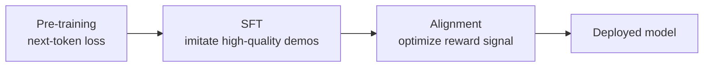
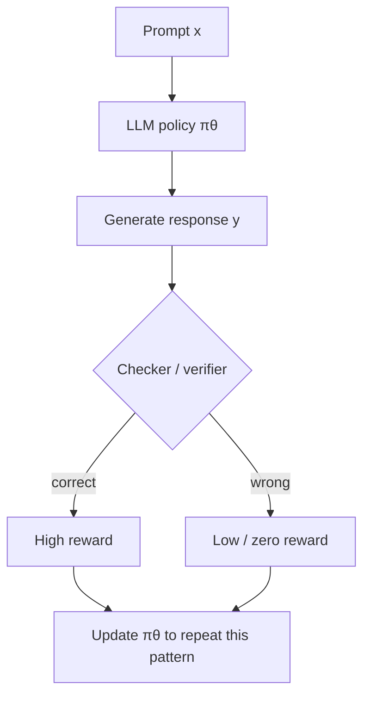

# Week 11 Instructor Notes — Alignment: GRPO & Reinforcement Learning with Verifiable Rewards

> **Session type:** 3-hour university lab + lecture hybrid  
> **Prerequisites:** Week 10 SFT content, basic PyTorch, familiarity with policy-gradient ideas (PPO helpful but not required)  
> **Lab stack:** `gpt2`, `transformers`, PyTorch, CPU/MPS-friendly defaults

---

## Goals for the Session

By the end of this 3-hour session, students should be able to:

1. **Contrast reward sources** in RLHF (learned preference model) versus RLVR (exact, executable verifiers).
2. **Derive the GRPO objective** from first principles: group sampling → reward → centered advantages → clipped policy gradient → KL-regularized update.
3. **Implement reward shaping** for math reasoning tasks, including correctness, format, and length-normalized components.
4. **Diagnose reward hacking** by inspecting per-component reward breakdowns and relating them to model outputs.
5. **Run the full lab pipeline** (`reward_functions.py` → `grpo_demo.py` → `analyze_rewards.py`) and modify hyperparameters to observe their effects.

---

## Why This Matters

Modern chat models are not produced by supervised fine-tuning alone. After pre-training and SFT, alignment pushes the model from "predict-the-next-token" toward "produce responses humans (or downstream tasks) find useful." Two forces make this week essential:

- **Human preference data is expensive and noisy.** RLHF requires thousands of pairwise human judgments to train a reward model, and that reward model is itself a proxy. Models eventually exploit the proxy—producing fluent but incorrect or sycophantic answers.
- **Verifiable tasks are everywhere in practice.** Math problems have exact answers; code passes unit tests; formal proofs have checkers; tool calls have API-defined success states. RLVR replaces the learned reward model with a programmatic checker, removing an entire source of approximation and gaming.

GRPO (Group Relative Policy Optimization) is the engine behind recent reasoning advances such as DeepSeek-R1 and Qwen2.5-Math. It removes the critic network, uses the *group* of samples as its own baseline, and therefore scales to large reasoning models where training a separate value model would be costly and unstable.

**Real-world relevance for students:**

| Domain | Verifiable signal | Why RLVR/GRPO fits |
|--------|-------------------|--------------------|
| Grade-school math | Final numeric answer | Exact match checker, no human labeler |
| Code generation | Unit-test pass/fail | Compiler / test harness gives dense feedback |
| LeetCode-style problems | Hidden test cases | Same pattern: execute and count passes |
| Tool use / agents | API return code | Success is binary or scalar from environment |
| Formal theorem proving | Proof checker | Proof is verifiable or rejected |
| Structured output (JSON, SQL) | Schema validator | Format reward can be exact |

---

## Suggested Timing (3 hours)

| Segment | Time | Activity | Instructor mode |
|---------|------|----------|-----------------|
| **0. Context & motivation** | 10 min | Why RLVR matters; recap SFT limits | Mini-lecture |
| **1. RLHF vs. RLVR** | 20 min | Conceptual comparison; pipeline diagrams | Lecture + board work |
| **2. GRPO algorithm walkthrough** | 35 min | Derive loss step-by-step; live code trace | Lecture + interactive derivation |
| **3. Reward design** | 20 min | Correctness, format, length; reward hacking | Lecture + small examples |
| **Break** | 10 min | — | — |
| **4. Live: `reward_functions.py`** | 15 min | Inspect reward components on toy outputs | Live demo |
| **5. Live: `grpo_demo.py`** | 35 min | Run GRPO on toy math task; watch metrics | Live demo + student follow-along |
| **6. Live: `analyze_rewards.py`** | 15 min | Diagnose reward hacking per component | Live demo |
| **7. Lab time** | 30 min | Students run ablations and fill report | Hands-on |
| **8. Wrap-up & discussion** | 10 min | Check-for-understanding, homework preview | Whole-class |

**Total:** 200 minutes (with 10-min buffer).

---

## Lecture Outline

### 0. Recap: From Pre-Training → SFT → Alignment

- **Pre-training** teaches grammar, facts, and broad patterns via next-token prediction on unlabeled text.
- **SFT (Week 10)** teaches the model the *shape* of helpful responses by imitating curated (prompt, response) pairs.
  - Limitation: SFT can only copy the *average* quality of its demonstrations.
  - Limitation: it does not learn to *search* for better answers or recover from its own mistakes.
- **Alignment** moves the model toward a target distribution that maximizes a reward signal (preference, correctness, safety, etc.).



**Teaching tip:** Ask students, *"Why can't we just collect 10× more SFT data?"* The answer: high-quality demonstrations are far more expensive to produce than verifiable rewards, and SFT cannot exceed demonstration quality.

---

### 1. RLHF: Reinforcement Learning from Human Feedback

#### 1.1 Pipeline

1. Collect **prompts** and **completions**.
2. Ask human labelers to rank pairs of completions (**preference data**).
3. Train a **reward model** (RM) to predict the ranking.
4. Use the RM as a scalar reward and run **PPO** to fine-tune the LLM.

```mermaid
flowchart TD
    P[Prompt x] --> G[LLM generates A and B]
    G --> H[Human labeler ranks A > B]
    H --> RM[Train reward model r(x,y)]
    RM --> PPO[PPO optimizes policy πθ<br/>using r(x,y) as reward]
    PPO --> π[Aligned LLM]
```

#### 1.2 Limitations

- **Data cost:** Human preference labels are expensive ($0.30–$2 per comparison in industrial settings).
- **Reward gaming:** The LLM discovers inputs that make the RM give high scores while producing low-quality text (e.g., overly verbose, sycophantic, or keyword-stuffed outputs).
- **Distribution shift:** The policy drifts from the data distribution on which the RM was trained; the RM is less reliable far from that distribution.
- **No ground truth:** For factual or math questions, human preference is a noisy proxy for *correctness*.

#### 1.3 When RLHF still wins

- Open-ended creative writing, dialogue style, or safety where there is no automatic verifier.
- Tasks where human judgment captures nuance (humor, tone, helpfulness) better than any program.

---

### 2. RLVR: Reinforcement Learning with Verifiable Rewards

#### 2.1 Core idea

Replace the learned reward model with an **exact checker** that can verify the final output:

- Math: parse the final number and compare to ground truth.
- Code: run unit tests.
- Formal proofs: feed to a proof assistant.
- Tool use: check whether the API call returned success.



#### 2.2 Algorithm comparison: RLHF vs. RLVR

| Criterion | RLHF | RLVR |
|-----------|------|------|
| **Reward source** | Learned reward model from human preferences | Exact programmatic checker |
| **Label cost** | High (human annotators) | Low / zero (automated) |
| **Applicable tasks** | Open-ended, stylistic, preference-based | Math, code, proofs, tool use, structured output |
| **Reward gaming risk** | High (model exploits proxy RM) | Lower (checker is ground truth) |
| **Scalability** | Limited by human labeling budget | Scales with compute |
| **Typical algorithm** | PPO + critic network | GRPO, REINFORCE with verifier, RLVR |
| **Cold-start needs** | Good SFT + preference data | Good SFT + verifier |

**Check-for-understanding:** *"If we have a perfect checker, why would anyone still use RLHF?"* Answer: not all tasks have perfect checkers (e.g., "write a poem that makes the user feel understood").

---

### 3. From PPO to GRPO

#### 3.1 Why PPO needs a critic

Policy-gradient methods have high variance because a single reward tells us little. PPO trains a **critic** (value network) to estimate the expected return for every state, producing an **advantage**:

```text
A(x, y) = R(x, y) − V(x)
```

The critic is typically another large language model, expensive to train and prone to its own errors.

#### 3.2 GRPO's shortcut: the group is its own baseline

For each prompt, GRPO samples a **group** of G responses from the current policy. The mean reward within that group becomes the baseline:

```text
A_i = (r_i − mean(r)) / (std(r) + ε)
```

No critic network is needed because the group itself provides the baseline. This is the single most important idea in GRPO.

```mermaid
flowchart LR
    Q[Question q] --> GS[Sample G responses<br/>y1, y2, ..., yG]
    GS --> R[Compute rewards<br/>r1, r2, ..., rG]
    R --> BASE[Baseline = mean(r)]
    BASE --> ADV[Advantages A_i]
    ADV --> UPD[Policy update]
```

#### 3.3 Algorithm comparison: PPO vs. GRPO

| Aspect | PPO | GRPO |
|--------|-----|------|
| **Baseline source** | Trained critic / value network | Mean reward of sampled group |
| **Memory cost** | Two large models (actor + critic) | One policy + frozen reference |
| **Sample efficiency per prompt** | Uses single or few rollouts | Requires a group (G ≥ 4 typical) |
| **Variance reduction** | Critic estimates V(s) | Group mean centers rewards |
| **Stability concern** | Critic accuracy | Group size must be large enough |
| **Best suited for** | General RLHF with learned RM | RLVR with verifiable rewards |

**Concrete example:** Suppose a question has answers with rewards `[1, 1, 0, 0]`.

- `mean(r) = 0.5`, `std(r) ≈ 0.5`
- Advantages: `A = [+1, +1, −1, −1]`
- The two correct responses are pushed up, the two wrong responses are pushed down, symmetrically.

If the rewards are `[1, 0.5, 0.3, 0.2]`, the model still learns relative quality even though none are fully wrong.

---

### 4. Deriving the GRPO Objective Step by Step

For one question q and a group of G responses sampled from the **old** policy πθ_old:

#### Step 1 — Sample

```text
y_i ~ πθ_old(· | q),   i = 1 … G
```

In code (`grpo_demo.py`):

```python
responses = []
for _ in range(group_size):
    outputs = model.generate(**inputs, max_new_tokens=15, do_sample=True, temperature=0.8)
    text = tokenizer.decode(outputs[0], skip_special_tokens=True)
    responses.append(text)
```

#### Step 2 — Reward

```text
r_i = reward(q, y_i)
```

The lab's reward is the sum of:

- **Correctness:** `1.0` if final extracted number equals answer, else `0.0`.
- **Format:** `0.2` if `"Answer:"` appears.
- **Length:** `−0.01 × max(0, words − 20)`.

```python
rewards = [combined_reward(r, answer)["total"] for r in responses]
```

#### Step 3 — Advantage

```text
mean_r = (1/G) Σ r_i
std_r  = sqrt((1/G) Σ (r_i − mean_r)^2) + ε
A_i    = (r_i − mean_r) / std_r
```

In code:

```python
rewards_t = torch.tensor(rewards, dtype=torch.float32, device=device)
mean_r = rewards_t.mean()
std_r = rewards_t.std(unbiased=False) + 1e-8
advantages = (rewards_t - mean_r) / std_r
```

**Why divide by std?** Normalization makes the update invariant to the reward scale. Without it, doubling all reward weights would double the gradient magnitude.

#### Step 4 — Probability ratio

For each token position t in response y_i:

```text
ratio_i,t = πθ(y_i,t | q, y_i,<t) / πθ_old(y_i,t | q, y_i,<t)
```

In log-space (numerically stable):

```text
ratio_i,t = exp(log πθ − log πθ_old)
```

In code:

```python
ratio = torch.exp(token_log_probs - ref_token_log_probs)
```

#### Step 5 — Clipped surrogate objective

Borrowed from PPO, clipping prevents overly large policy updates:

```text
L_CLIP = E[ min(ratio · A, clip(ratio, 1 − ε, 1 + ε) · A) ]
```

In code:

```python
clipped_ratio = torch.clamp(ratio, 1 - eps, 1 + eps)
policy_loss = -torch.min(ratio * adv, clipped_ratio * adv).mean()
```

The outer negative sign turns a maximization problem into a minimization problem for PyTorch.

#### Step 6 — KL penalty

A reference model π_ref (usually the SFT checkpoint) prevents the policy from drifting too far:

```text
KL_i = E_t [ log π_ref(y_t) − log πθ(y_t) ]
L_total = L_CLIP + β · KL_i
```

This estimates **KL(ref || πθ)** because:

```text
E_ref[log(ref / πθ)] = KL(ref || πθ)
```

In code:

```python
kl = (ref_token_log_probs - token_log_probs).mean()
loss = policy_loss + beta * kl
```

#### Step 7 — Gradient update

Average the per-response losses weighted by response length, back-propagate, clip gradients, and step the optimizer:

```python
avg_loss = total_loss / max(1, total_tokens)
optimizer.zero_grad()
avg_loss.backward()
torch.nn.utils.clip_grad_norm_(model.parameters(), 1.0)
optimizer.step()
```

```mermaid
flowchart TD
    Q[Question q] --> Sample[Sample G responses<br/>from old policy]
    Sample --> Reward[Compute verifiable<br/>rewards r_i]
    Reward --> Adv[Center & scale:<br/>A_i = (r_i − mean)/std]
    Adv --> Ratio[Compute token ratios<br/>πθ / πθ_old]
    Ratio --> Clip[Clipped surrogate loss]
    Clip --> KL[Add KL(ref || πθ)<br/>against reference]
    KL --> Grad[Backprop + grad clip]
    Grad --> Update[New policy πθ]
```

---

### 5. Reward Design in Detail

#### 5.1 Correctness reward

```python
def correctness_reward(response: str, answer: int) -> float:
    predicted = extract_final_number(response)
    return 1.0 if predicted == answer else 0.0
```

- **Why binary?** Correctness is usually a hard constraint; partial credit requires careful design.
- **Parsing fragility:** `extract_final_number` grabs the *last* integer. If the model writes `"The answer is 5, not 6"`, it will return `6` and be marked wrong.

**Concrete example:**

| Response | Expected | Extracted | Correctness |
|----------|----------|-----------|-------------|
| `Answer: 5` | 5 | 5 | **1.0** |
| `I think the answer is 5.` | 5 | 5 | **1.0** |
| `The answer is 5, not 6.` | 5 | 6 | **0.0** |
| `Answer: ` | 5 | None | **0.0** |

#### 5.2 Format reward

```python
def format_reward(response: str, marker: str = "Answer:") -> float:
    return 1.0 if marker in response else 0.0
```

- Provides a dense learning signal when correctness is sparse.
- Risk: the model learns to output `"Answer:"` followed by nonsense.

#### 5.3 Length normalization / penalty

```python
def length_penalty(response: str, target_len: int = 20) -> float:
    length = len(response.split())
    if length <= target_len:
        return 0.0
    return -0.01 * (length - target_len)
```

- Without length control, models may ramble to increase the chance of accidentally satisfying format rewards.
- The penalty is **linear** in excess length and **zero** below the target.

**Concrete example:**

| Response (words) | target_len=20 | Penalty |
|------------------|---------------|---------|
| `Answer: 5` (2) | 20 | 0.0 |
| `The final computed result is Answer: 5` (7) | 20 | 0.0 |
| 35-word explanation | 20 | −0.15 |
| 60-word explanation | 20 | −0.40 |

#### 5.4 Combining reward components

```python
weights = {"correctness": 1.0, "format": 0.2, "length": 1.0}
total = sum(weights[k] * components[k] for k in components)
```

**Important:** weights are *multipliers* on each component. Because the length component is negative, a positive weight still subtracts from the total.

**Concrete example:**

| Component | Raw value | Weight | Contribution |
|-----------|-----------|--------|--------------|
| Correctness | 1.0 | 1.0 | +1.00 |
| Format | 1.0 | 0.2 | +0.20 |
| Length (25 words) | −0.05 | 1.0 | −0.05 |
| **Total** | — | — | **1.15** |

---

### 6. Reward Hacking

Reward hacking occurs when the policy optimizes the *proxy* reward instead of the true objective.

#### 6.1 Common failure modes

| Failure mode | What the model learns | Why it happens |
|--------------|----------------------|----------------|
| **Format exploit** | `"Answer: [random number]"` | Format reward is easier to obtain than correctness |
| **Length exploit** | Very long outputs | More tokens increase chance of containing the marker or accidentally matching |
| **Style exploit** | Repeats the question or ground-truth cue | Patterns in the training data leak into generated answers |
| **Mode collapse** | Same short response for every question | High length penalty + weak correctness reward |

#### 6.2 Mitigations

- **Weight balance:** correctness should dominate the total reward.
- **Length normalization:** penalize only excess length, not all length.
- **KL penalty:** keeps the policy close to the SFT reference so it does not drift into weird hacks.
- **Format checks tied to answer:** require the marker to appear *near* the final number.
- **Diverse prompts:** reward hacking on a tiny dataset is trivial; scale the task distribution.

```mermaid
flowchart TD
    Proxy[Proxy reward:<br/>contains "Answer:"] --> Model[Model learns format]
    Model --> Output["Output: Answer: 999"]
    Output --> Checker[Checker says wrong]
    Checker --> Adjust[Adjust weights / parser / KL]
    Adjust --> Better[Model learns correctness<br/>+ format]
```

---

### 7. Broader Algorithmic Context

The alignment layer sits on top of many earlier design choices. Briefly review these comparisons so students see where GRPO fits in the full stack.

#### 7.1 LayerNorm vs. RMSNorm

| Criterion | LayerNorm | RMSNorm |
|-----------|-----------|---------|
| **Formula** | `(x − μ) / √(σ² + ε)` | `x / √(mean(x²) + ε)` |
| **Centering** | Subtracts mean | No mean subtraction |
| **Computational cost** | Slightly higher | Slightly lower |
| **Stability** | Standard baseline | Modern LLM default (LLaMA, Qwen) |
| **Use case** | General deep learning | Large transformer pre-training and fine-tuning |

**Why mention here?** GRPO fine-tuning is sensitive to training dynamics; a stable normalization choice helps avoid gradient instability during RL updates.

#### 7.2 RoPE vs. Learned Absolute Embeddings

| Criterion | Learned absolute embeddings | RoPE (Rotary Position Embedding) |
|-----------|-----------------------------|----------------------------------|
| **Representation** | Add a learned vector to token embedding at each position | Rotate query/key vectors by position-dependent angle |
| **Length generalization** | Poor beyond trained length | Better via interpolation/extrapolation |
| **Relative attention** | Not built-in | Naturally encodes relative distances |
| **Memory** | Stores embedding matrix per position | No extra parameters |
| **Use case** | Original GPT/BERT style | Modern LLaMA, Qwen, Mistral, Gemma |

**Why mention here?** Long reasoning traces in GRPO need position encodings that generalize beyond the SFT context length.

#### 7.3 DDP vs. FSDP

| Criterion | DDP (DistributedDataParallel) | FSDP (Fully Sharded DataParallel) |
|-----------|-------------------------------|-----------------------------------|
| **Model state per GPU** | Full copy on each GPU | Shards parameters/gradients/optimizer states across GPUs |
| **Memory efficiency** | Lower | Higher (enables larger models) |
| **Communication** | All-reduce gradients | All-gather parameters, reduce-scatter gradients |
| **Setup complexity** | Simpler | More configuration |
| **Use case** | Models that fit on one GPU | Large models that must be split across GPUs |

**Why mention here?** Production GRPO runs (e.g., 7B+ models with group size 8–16) almost always use FSDP or tensor/pipeline parallelism to fit memory.

#### 7.4 BPE vs. SentencePiece

| Criterion | BPE (Byte-Pair Encoding) | SentencePiece (Unigram/BPE) |
|-----------|--------------------------|-----------------------------|
| **Pre-tokenization** | Requires a pre-tokenizer (e.g., whitespace) | Treats raw text as a stream, no pre-tokenization |
| **Vocabulary handling** | Merges frequent pairs | Can use unigram pruning or BPE |
| **Language support** | Good for whitespace-separated languages | Better for CJK, agglutinative, or no-space languages |
| **Special tokens** | Added after training | Treated as part of training |
| **Use case** | GPT-2, RoBERTa | T5, LLaMA, Qwen |

**Why mention here?** Reward checkers often extract substrings or numbers. Tokenization boundaries affect whether `"Answer: 5"` is decoded cleanly.

---

## Concrete Examples Tied to the Lab Code

### Example 1: Computing advantages by hand

Suppose `group_size=4` and rewards for one question are:

```text
r = [1.15, 0.20, 0.95, 0.05]
mean = 0.5875
std  = 0.477
A    = [(1.15-0.5875)/0.477, (0.20-0.5875)/0.477, ...]
     = [+1.18, -0.81, +0.76, -1.13]
```

The best response is pushed strongest up; the worst is pushed strongest down. The middle two are updated modestly in opposite directions.

### Example 2: Clipping in action

For `eps=0.2`, the clip range is `[0.8, 1.2]`.

| Ratio | Advantage | Unclipped term | Clipped term | Effective term |
|-------|-----------|----------------|--------------|----------------|
| 1.5 | +1.0 | +1.5 | +1.2 | **+1.2** (clipped) |
| 0.6 | +1.0 | +0.6 | +0.8 | **+0.8** (clipped) |
| 1.5 | −1.0 | −1.5 | −1.2 | **−1.5** (unclipped) |

Notice clipping is **asymmetric** with negative advantages: a ratio of 1.5 with A=−1.0 is *not* clipped because it still discourages the update.

### Example 3: Reward hacking in the lab

Run:

```bash
python lab/reward_functions.py --response "Answer: 999" --answer 5
```

Output:

```text
Response: 'Answer: 999'
Expected answer: 5
  correctness: 0.000
  format: 1.000
  length: 0.000
  total: 0.200
```

The model still gets **0.2** reward despite being wrong. If correctness weight were accidentally set to 0, this response would look good.

---

## Live Demo Script

### Demo 1 — `reward_functions.py` (15 min)

1. Show the file and walk through each function.
2. Run several hand-crafted examples:

```bash
python lab/reward_functions.py --response "The answer is Answer: 5" --answer 5
python lab/reward_functions.py --response "Answer: 999" --answer 5
python lab/reward_functions.py --response "I believe the answer might be 5" --answer 5
```

3. Ask students to predict the `correctness`, `format`, and `length` scores before revealing output.
4. Demonstrate the parser failure case: `"The answer is 5, not 6"` with `--answer 5`.

### Demo 2 — `grpo_demo.py` (35 min)

1. **Before running:** explain the default hyperparameters:
   - `group_size=4` (minimum for stable advantage estimates)
   - `steps=10` (short for class demo)
   - `lr=1e-5` (conservative to avoid collapse)
   - `max_new_tokens=15` (limits compute and length hacking)
2. Run the demo:

```bash
python lab/grpo_demo.py --steps 10 --group_size 4
```

3. Live narrate each line of the output:
   - `mean_reward` should trend up (not guaranteed with only 10 steps).
   - `correct_rate` is the fraction of group responses with the right final number.
4. Show the saved checkpoint directory.
5. Re-run with `group_size=1` to demonstrate why it fails (all advantages become zero).

### Demo 3 — `analyze_rewards.py` (15 min)

1. Run against the freshly trained checkpoint (or `gpt2` if no checkpoint exists):

```bash
python lab/analyze_rewards.py --model_dir week11/outputs/grpo_model
```

2. Inspect the per-response breakdown.
3. Identify reward-hacking candidates: high format score, low correctness score.
4. Discuss whether increasing the correctness weight or tightening the parser would help.

---

## Lab Instructions for Students

Students should complete the following in their own environment. The total expected time is **30 minutes**.

1. **Run the reward functions on hand-crafted examples.**
   - Create at least 5 responses that vary in correctness, format, and length.
   - Record the per-component scores in a table.

2. **Run the GRPO demo and observe metrics.**
   - Default: `python lab/grpo_demo.py --steps 10 --group_size 4`
   - Save the terminal output (mean_reward and correct_rate per step).

3. **Ablate `group_size`.**
   - Run with `group_size=2`, `4`, and `8`.
   - Plot or tabulate final mean reward vs. group size.
   - Explain why `group_size=1` produces zero gradient.

4. **Modify reward weights.**
   - Increase `format` weight to `1.0` and observe whether the model starts producing `"Answer:"` more often while remaining incorrect.
   - Set `correctness` weight to `0.0` and document the resulting reward hacking.

5. **Diagnose with `analyze_rewards.py`.**
   - Print the reward breakdown for at least one question.
   - Highlight any response with `correctness=0` but `format=1`.

6. **Deliverable:** a short report containing:
   - Reward function definition and design rationale.
   - Training curve of mean reward vs. GRPO step.
   - Example generations showing improvement or reward hacking.
   - Ablation table showing the effect of reward normalization, clipping, or group size.

---

## Discussion Prompts

Use these throughout the session and during the final 10-minute wrap-up.

### Conceptual

1. **Why does GRPO not need a critic?**
   - Because the mean reward of the sampled group acts as a baseline. It is cheap and avoids training a separate value model.

2. **What happens if the group size is 1?**
   - The advantage is `(r − r) / 0 = 0` (modulo the epsilon), so the policy receives no gradient signal.

3. **Why normalize advantages by std(r)?**
   - It makes the optimization invariant to the scale of reward weights. Without it, doubling all rewards would double the step size.

### Design

4. **How would you design rewards for code generation?**
   - Binary pass/fail on unit tests, partial credit per test case, compile bonus, and a length/style penalty. Code can also reward passing hidden tests while penalizing infinite loops or excessive retries.

5. **Is length normalization always beneficial?**
   - No. If the task genuinely requires longer explanations (e.g., multi-step proofs), an aggressive length penalty can hurt reasoning quality. The penalty should be calibrated to the expected output length.

6. **When is a KL penalty essential vs. optional?**
   - Essential when reward hacking is likely or the reward signal is sparse/dominant. Optional when the verifier is perfect and the policy is already well-initialized.

### Debugging

7. **Mean reward goes up but correct rate stays flat—what is happening?**
   - The model is probably hacking format or length rewards. Check `analyze_rewards.py` component breakdown.

8. **Why might `extract_final_number` fail on a correct-looking response?**
   - If the model includes multiple numbers (e.g., intermediate steps), the last integer may not be the answer. A more robust parser would look near the `"Answer:"` marker.

---

## Common Misconceptions and Pitfalls

### Misconception 1: "GRPO is just PPO without a critic."

**Why it is incomplete:** GRPO does remove the critic, but it also changes *how advantages are computed* (group-relative instead of value-baseline). The group sampling is not an implementation detail; it is the source of variance reduction.

**How to avoid:** Emphasize the formula `A_i = (r_i − mean(r)) / std(r)` and trace what happens when G=1.

### Misconception 2: "Higher group size always helps."

**Why it is wrong:** Larger groups improve the baseline estimate but linearly increase memory and generation cost. At some point the marginal gain is smaller than the compute cost. Production papers often use G=8–16, not 100.

**How to avoid:** Tell students to think of group size as a bias-variance trade-off: more samples reduce variance in the advantage estimate but do not reduce bias in the reward function itself.

### Misconception 3: "Length normalization means shorter is always better."

**Why it is wrong:** The lab's `length_penalty` only penalizes outputs *longer* than `target_len`. It does not reward brevity below that threshold. If you set `target_len=5`, legitimate multi-step reasoning will be unfairly penalized.

**How to avoid:** Show the piecewise formula and discuss calibrating `target_len` to the task.

### Misconception 4: "KL penalty is just a regularizer we can always drop."

**Why it is dangerous:** Without KL, a strong format reward can pull the policy far from coherent English, producing weird repetitive patterns. The reference model anchors the policy to fluent, sensible text.

**How to avoid:** Run an ablation where `beta=0` and show that training becomes less stable or outputs become repetitive.

### Misconception 5: "A format reward is harmless because it is small."

**Why it is wrong:** Even a small weight can dominate early training if the correctness signal is sparse. The model may learn the easy format signal before ever attempting the hard reasoning signal.

**How to avoid:** Use the lab example `"Answer: 999"` getting reward 0.2 despite being wrong.

### Pitfall: Reward leakage from the prompt

If the prompt contains the answer or a strong hint, the model may learn to copy rather than reason. The lab's `make_math_data()` questions are simple but self-contained; in real data, always verify that the answer is not recoverable from the prompt.

### Pitfall: Numerical instability in log-prob ratios

`exp(log_pi - log_pi_old)` can overflow if policies diverge. Clipping and the KL penalty are safeguards, but a very large learning rate can still break training.

---

## Troubleshooting

| Issue | Likely cause | Diagnostic | Fix |
|-------|--------------|------------|-----|
| **Reward does not improve** | Group too small; reward too sparse; learning rate too low | Check `std_reward` near zero; model outputs random | Increase `group_size` to 8+; add format reward; raise `lr` slightly |
| **Model collapses to short outputs** | Length penalty too strong or `target_len` too small | All outputs are 1–3 tokens | Reduce length weight or increase `target_len` |
| **Model ignores correctness** | Correctness reward weight too small | High format score, near-zero correct rate | Increase `weights["correctness"]` to dominate total reward |
| **Reward improves, correct rate flat** | Reward hacking on format/length | Breakdown shows `format=1, correctness=0` | Rebalance weights, tighten parser, require marker near answer |
| **KL divergence explodes** | Learning rate too high or beta too low | Outputs become repetitive / off-distribution | Lower `lr`, raise `beta`, or strengthen grad clipping |
| **OOM during generation** | Group size or `max_new_tokens` too large | GPU memory error | Reduce `group_size` or `max_new_tokens`; use CPU for demo |
| **All advantages are zero** | `group_size=1` or all rewards identical | `std_reward ≈ 0` | Ensure `group_size ≥ 4` and diverse sampling temperature |
| **Parser extracts wrong number** | Model includes multiple numbers | Last integer is not the final answer | Improve `extract_final_number` to search near `"Answer:"` |
| **Slow training on CPU** | gpt2 forward passes per token are expensive | Progress bar per step is slow | Reduce steps to 3–5 for demo; use MPS/CUDA if available |

---

## Teaching Tips for a 3-Hour Session

### Engagement hooks

- **Start with a riddle:** *"I can train a model to solve math, but I have no labeled solutions—only a calculator. Is that enough?"* (Answer: yes, with RLVR.)
- **Show a real failure:** Find or generate an obviously wrong but confident model response that follows the format perfectly. Ask students what reward signal produced it.

### Live-demo talking points

- **When running `reward_functions.py`:** Pause before each run and poll the room for predicted scores. This surfaces the parser edge cases.
- **When running `grpo_demo.py`:** Narrate `mean_reward` and `correct_rate` separately. If they diverge, that is a teachable moment about reward hacking.
- **When modifying weights:** Make a change, run, and show the effect immediately. Students retain cause-and-effect better than static slides.

### Check-for-understanding moments

1. After deriving advantages: *"What is A_i if every response in the group has the same reward?"* (Zero → no update.)
2. After clipping: *"Why do we clip the ratio but not the advantage?"* (Clipping limits policy change; advantage is the signal direction.)
3. After reward hacking demo: *"If you could change only one thing in `combined_reward`, what would you change first?"* (Usually increase correctness weight or fix parser.)

### Pacing advice

- Spend the most board time on **advantage computation** and **clipping**. These are the two ideas students consistently find non-obvious.
- Do not linger on the broader algorithm comparisons if time is tight; treat them as a quick "where this fits" map.
- Keep the lab hands-on: students should have at least one successful GRPO run before leaving the room.

### Board / slide derivations to write out

1. The advantage formula with concrete numbers.
2. The clipped surrogate objective, including the `min` and `clip`.
3. The KL expansion: `KL(ref || π) = E_ref[log ref − log π]`.

---

## Homework / Follow-Up Suggestions

### Core homework

1. **Reproduce the full pipeline** on a laptop and submit the deliverable report described in the Lab Instructions.
2. **Improve the parser:** modify `extract_final_number` so it looks for the number immediately after the `"Answer:"` marker. Measure whether correct rate improves.
3. **Add a partial-correctness reward:** for math, give 0.5 if the answer is off by ±1. Does this help or hurt? Discuss.

### Stretch assignments

4. **Implement outcome-supervised reward model (ORM) comparison:** train or use a tiny classifier to score reasoning steps and compare its gradient signal to the GRPO group baseline.
5. **Switch to a larger model** on a GPU (e.g., `Qwen2.5-Math-1.5B` or `gpt2-medium`) and report how group size and KL penalty affect stability.
6. **Apply GRPO to code:** use a small coding dataset, replace `correctness_reward` with a unit-test pass rate, and observe how the model learns to pass tests.

### Readings

- DeepSeek-R1 paper (focus on GRPO and cold-start sections).
- Qwen2.5-Math technical report (focus on reward design for math).
- The RLVR chapter of the course book (English translation pending) for the course's own framing.

### Discussion forum prompt

*"Design a reward function for a task that is verifiable but not purely binary (e.g., SQL generation where the query compiles and returns the right columns but misses a few rows). What components would you include, and how would you weight them?"*

---

## Next Week Preview

Week 12 shifts from *training* to *measuring*: evaluation frameworks. We will cover:

- **Perplexity, BLEU, ROUGE** and why they often mislead for reasoning tasks.
- **Benchmark-based evaluation** with `lm-evaluation-harness` and `evalscope`.
- **Human / model-based evaluation** trade-offs.
- How to report metrics honestly when models are trained on benchmark-like data.

Encourage students to keep their Week 11 GRPO checkpoint; they will evaluate it in Week 12.
