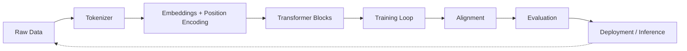
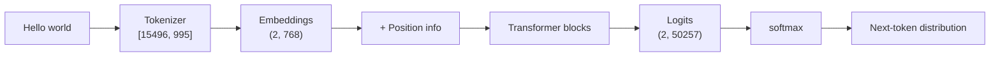
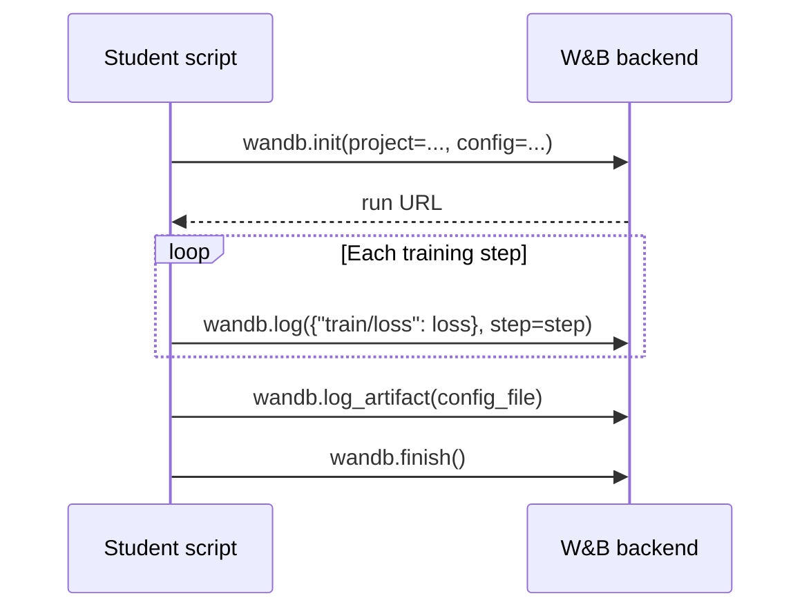
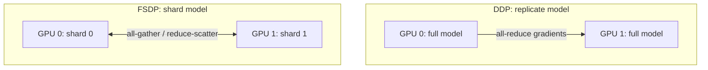
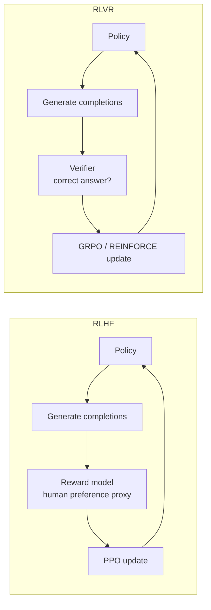
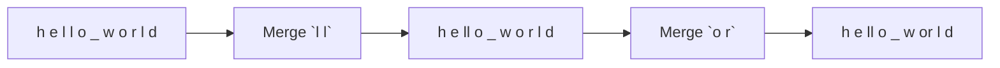

# Week 1 Instructor Notes — Course Introduction & Experiment Tracking

> **Session type**: Lecture + live demo + hands-on lab  
> **Duration**: 3 hours  
> **Required materials**: projector, working `uv` environment, W&B account, `lab/setup_check.py`, `lab/wandb_demo.py`  
> **Prerequisites (assumed)**: Python, basic PyTorch, linear algebra, probability

---

## Goals for the Session

1. **Motivate the course**
   - Convey *why* building an LLM from scratch is worth the effort when high-level APIs already exist.
   - Map the full stack of decisions hidden behind a one-line `model.generate()` call.
   - Set expectations: this course is about depth, debugging, and reproducibility, not just API fluency.

2. **Ensure a working environment**
   - Every student must leave the room with a passing `lab/setup_check.py` run.
   - Confirm Python >= 3.12, `torch`, `numpy`, `tqdm`, and a compute backend (CUDA, MPS, or CPU fallback).
   - Resolve common setup failures *in class* so Week 2 is not derailed.

3. **Introduce reproducible ML workflows**
   - Pin dependencies with `uv` and a lockfile.
   - Track code state with Git.
   - Fix random seeds and log configurations so experiments are comparable.

4. **Teach experiment tracking with Weights & Biases (W&B)**
   - Distinguish **run**, **config**, **metrics**, **artifacts**, and **project**.
   - Demonstrate live logging and dashboard interpretation.
   - Practice the pattern every later assignment will use: initialize → log config → train → log metrics → save artifacts → finish.

5. **Preview the semester's key algorithmic trade-offs**
   - Introduce, at a high level, the design choices that reappear in later weeks: normalization, position encoding, distributed training, alignment, and tokenization.
   - Emphasize that these are *previews*; deep implementation comes later.

---

## Suggested Timing (3 hours)

| Segment | Time | Activity | Instructor tip |
|---------|------|----------|----------------|
| Welcome & course overview | 20 min | Lecture + Q&A | Start with a one-sentence definition of an LLM, then show what the course will build. |
| Repo walkthrough | 15 min | Show `docs/`, `coursework/`, `teaching/` | Point to the exact files students will edit each week. |
| Environment setup lab | 30 min | Students run `lab/setup_check.py` | Circulate; fix one failure publicly so everyone learns the fix. |
| Break | 10 min | — | — |
| Reproducibility & W&B concepts | 20 min | Lecture | Use the live dashboard, not just slides. |
| Live demo: `wandb_demo.py` | 15 min | Run, narrate, show dashboard | Pause at each `wandb.*` call and explain the contract. |
| Student W&B lab | 35 min | Students run demo + extension exercise | Encourage students who finish early to help neighbors. |
| Wrap-up, comparisons, preview | 15 min | Share dashboards, preview Week 2, collect deliverables | End with a one-question exit ticket. |

**Total**: 180 minutes.

---

## Lecture Outline

### 1. Why Build from Scratch?

**Opening question for the room**: *"If I can call `pipeline("text-generation", model="gpt2")` in three lines, why spend twelve weeks implementing the same thing?"*

Valid answers to collect from students:

- **APIs hide failure modes.** When generation is repetitive, biased, or slow, the wrapper tells you almost nothing about *where* the problem lives.
- **Optimization requires understanding.** Changing batch size, precision, or distributed strategy without knowing memory and compute trade-offs wastes money.
- **Research requires modification.** New architectures (e.g., Mamba, Diff Transformer, MoE) require editing the model, not just swapping a checkpoint.
- **Alignment requires control.** Safety interventions often happen at the data, loss, or sampling level, not the API level.

**The full stack we will touch**



Each block is a *design decision*. This course makes every decision explicit.

---

### 2. Course Roadmap

Show the 12-week schedule from [`syllabus.md`](../syllabus.md). Emphasize the pacing:

| Phase | Weeks | Theme | What students build |
|-------|-------|-------|---------------------|
| Foundations | 1–4 | Environment, tokenization, Transformer architecture, training | A working mini-GPT |
| Systems & scale | 5–7 | GPU kernels, profiling, distributed training | Fast multi-GPU training code |
| Scaling & data | 8–9 | Scaling laws, data filtering, deduplication | A clean pre-training corpus |
| Alignment | 10–11 | SFT, expert iteration, GRPO/RLVR | An instruction-tuned model |
| Evaluation | 12 | Benchmarks, inference optimization | An evaluation report |

**Check-for-understanding**: Ask students to name *one* skill they expect to gain in each phase.

---

### 3. The Modern LLM Pipeline (with a Concrete Example)

Walk through a single forward pass for the toy input `"Hello world"`.

| Stage | Concrete object | Shape / example |
|-------|-----------------|-----------------|
| Raw text | `"Hello world"` | string |
| Tokens | `[15496, 995]` (GPT-2 BPE) | list of `int` |
| Token embeddings | `E[token]` | `(2, d_model)` |
| Position information | RoPE angles or learned position vectors | `(2, d_model)` |
| Hidden states | output of Transformer blocks | `(2, d_model)` |
| Logits | `W_vocab @ hidden_state` | `(2, vocab_size)` |
| Next-token distribution | `softmax(logits[-1])` | `(vocab_size,)` |



This is the same pipeline the students will implement in Assignments 1 and 2.

---

### 4. Reproducibility: More Than Just a Seed

**Core principle**: A reproducible experiment is one another person can re-run and obtain the same measurable result.

Four pillars:

1. **Pinned software**
   - Use `uv` (or `pip` with a lockfile) to pin transitive dependencies.
   - Commit `uv.lock`/`pnpm-lock.yaml` to version control.

2. **Pinned code**
   - Every run should record the Git commit hash.
   - Uncommitted changes should be logged or forbidden during final runs.

3. **Pinned randomness**
   - Set Python, NumPy, PyTorch, and CUDA seeds.
   - Still note that some GPU ops are non-deterministic by default.

4. **Pinned configuration**
   - Hyperparameters live in a file or dataclass, not scattered in code.
   - Log the full config before training starts.

**Concrete snippet** (show on screen; later weeks use this pattern):

```python
import random
import numpy as np
import torch

def set_seed(seed: int) -> None:
    random.seed(seed)
    np.random.default_rng(seed)
    torch.manual_seed(seed)
    torch.cuda.manual_seed_all(seed)
    # deterministic flags can be set when full determinism is required
```

**Misconception alert**: *"Setting the seed guarantees identical results."* Not always. CuDNN benchmark mode, data-loader shuffling, and floating-point reductions can still introduce small differences. Reproducibility is about *controlled* variation, not always bit-for-bit identity.

---

### 5. W&B Concepts and Data Model

A **W&B run** is a single execution of an experiment. It is the atomic unit of tracking.

| Concept | What it stores | Example from `wandb_demo.py` |
|---------|----------------|------------------------------|
| **Run** | One execution | `wandb.init(project="diy-llm-week1-demo", ...)` |
| **Config** | Hyperparameters & metadata | `learning_rate`, `batch_size`, `seed` |
| **Metrics** | Time-series scalars | `train/loss`, `train/learning_rate` |
| **Artifacts** | Files: models, configs, datasets | JSON config logged as `demo-config` |
| **Project** | A workspace comparing many runs | `diy-llm-week1-demo` |

**How W&B fits into the training loop**



**Why log to a central service instead of local files?**

- Multiple team members can compare runs without copying files.
- Hyperparameter sweeps can run in parallel and aggregate automatically.
- Artifacts are versioned; you can trace which model came from which config.
- Dashboards persist after the laptop is closed or the VM is terminated.

---

### 6. Preview of Key Algorithmic Trade-Offs

> These topics are covered in depth in later weeks. The goal here is to give students a *map* of the design space and the vocabulary to read papers.

#### 6.1 LayerNorm vs RMSNorm

**LayerNorm** (Ba et al., 2016):

```
LayerNorm(x) = (x - mean(x)) / sqrt(var(x) + ε) * γ + β
```

**RMSNorm** (Zhang & Sennrich, 2019):

```
RMSNorm(x) = x / RMS(x) * γ,   where RMS(x) = sqrt(mean(x^2) + ε)
```

| Criterion | **LayerNorm** | **RMSNorm** |
|-----------|---------------|-------------|
| Statistics used | mean and variance | root-mean-square only |
| Learnable params | `γ` and `β` | `γ` only |
| FLOPs | slightly higher | slightly lower |
| Mean-centering | yes | no (assumes pre-centering or argues it is unnecessary) |
| Common in | original Transformer, BERT, GPT-2 | LLaMA, Gemma, many modern LLMs |
| Use when | you want maximum stability and re-centering flexibility | you want fewer params and slightly faster training/inference |

**Concrete example**: for `x = [1.0, -1.0, 2.0]` and `ε = 1e-6`:

- mean = 0.667, var ≈ 1.556 → LayerNorm rescales around zero.
- RMS = sqrt((1 + 1 + 4) / 3) ≈ 1.414 → RMSNorm divides by 1.414.

---

#### 6.2 RoPE vs Learned Positional Embeddings

**Learned absolute embeddings** add a trainable vector for each position:

```python
x = token_embed(tok_ids) + pos_embed(pos_ids)
```

**RoPE (Rotary Position Embedding)** rotates pairs of dimensions in Q and K by an angle that depends on position:

```
RoPE(q_m, k_n, m - n) = <R(Θ, m) q_m, R(Θ, n) k_n>
```

The dot product naturally encodes relative distance `m - n`.

| Criterion | **Learned embeddings** | **RoPE** |
|-----------|------------------------|----------|
| Parameters | `max_seq_len × d_model` | none (angles are fixed) |
| Length generalization | poor beyond `max_seq_len` | strong (can extrapolate) |
| Relative position bias | none unless added | built into attention scores |
| Interference with packing | needs careful padding/attention masks | works cleanly with attention masks |
| Common in | original Transformer, GPT, BERT | LLaMA, Mistral, Qwen, modern LLMs |
| Use when | sequence length is fixed and simplicity matters | you want length extrapolation and relative bias |

**Concrete example**: For a 2D subspace with base angle `θ`, position `m` applies a rotation matrix

```
R_m = [[cos(mθ), -sin(mθ)],
       [sin(mθ),  cos(mθ)]]
```

So the attention score between positions 1 and 3 depends on the relative angle `2θ`, not absolute positions.

---

#### 6.3 DDP vs FSDP

**DDP (DistributedDataParallel)** replicates the full model on every GPU and synchronizes gradients.

**FSDP (FullyShardedDataParallel)** shards parameters, gradients, and optimizer states across GPUs, gathering them only when needed.



| Criterion | **DDP** | **FSDP** |
|-----------|---------|----------|
| Memory per GPU | full model + optimizer + gradients | fraction of model/optimizer/grads |
| Communication | all-reduce once per layer | all-gather + reduce-scatter per layer |
| Max model size | limited by single-GPU memory | scales to hundreds of GPUs |
| Code change | `nn.parallel.DistributedDataParallel(model)` | `FSDP.wrap(...)` or auto-wrap policy |
| Use when | model fits in one GPU (≤~12 GB for 1B params in fp16) | model exceeds single-GPU memory |

**Concrete numbers**: A 7 B parameter model in fp32 needs ~28 GB just for parameters; AdamW needs another ~56 GB for optimizer states. DDP cannot train this on a single 80 GB A100, but FSDP can by sharding across multiple GPUs.

---

#### 6.4 RLHF vs RLVR

**RLHF (Reinforcement Learning from Human Feedback)** trains a reward model from human preference comparisons, then optimizes policy against that reward model with PPO.

**RLVR (Reinforcement Learning with Verifiable Rewards)** skips the learned reward model and uses a verifier: e.g., math answer correctness, code unit-test pass rate, or a formal checker.



| Criterion | **RLHF** | **RLVR** |
|-----------|----------|----------|
| Reward source | learned reward model from human labels | deterministic or programmatic verifier |
| Labeling cost | expensive human preference collection | cheap if verifier exists |
| Reward hacking risk | moderate (model can exploit reward model) | lower (verifier is ground truth) |
| Applicable tasks | open-ended chat, style, helpfulness | math, coding, logic, structured output |
| Typical algorithm | PPO | GRPO, REINFORCE++, expert iteration |
| Use when | no automatic correctness oracle exists | a cheap, reliable verifier exists |

**Concrete example**: For a math problem `"2 + 3 * 4 = ?"`, RLVR gives reward 1 if the generated answer is `14`, 0 otherwise. RLHF would instead ask humans *"Which of these two explanations is better?"* and train a reward model to predict that preference.

---

#### 6.5 BPE vs SentencePiece

**BPE (Byte-Pair Encoding)** starts with a character vocabulary and iteratively merges the most frequent adjacent pair.

**SentencePiece** treats the raw text (including spaces) as a stream of Unicode characters and learns a subword vocabulary, usually with an underlying unigram language model or BPE objective.



| Criterion | **BPE** | **SentencePiece** |
|-----------|---------|-------------------|
| Pre-tokenization | usually required (splits on spaces/punctuation) | none; trained on raw text with `_` for spaces |
| Space handling | explicit token or whitespace normalization | `_` prefix marks beginning of word |
| Language agnostic | less so (depends on pre-tokenizer) | more so (no language-specific pre-tokenizer) |
| Decoding | trivial: concatenate subwords | replace `_` with space |
| Common in | GPT-2/GPT-4 (`tiktoken`), RoBERTa | T5, LLaMA, Mistral |
| Use when | you control the pre-tokenization pipeline and want fast training | you need a language-agnostic tokenizer or no pre-tokenization |

**Concrete example**: BPE might encode `"hello world"` as `["hello", " world"]` after pre-tokenization. SentencePiece might encode it as `["_hello", "_world"]` directly from raw bytes.

---

## Why This Matters

Experiment tracking and reproducibility are not bureaucratic overhead; they are the infrastructure that makes everything else in the course possible.

- **Cost**: A single training run for a 1 B parameter model can cost hundreds of dollars. Re-running because the config was lost is wasteful.
- **Debugging**: When loss spikes, the first question is *"What changed?"* Without tracked configs and committed code, you cannot answer.
- **Collaboration**: Research and engineering are team sports. W&B projects give everyone the same source of truth.
- **Science**: Scaling laws, ablations, and paper results require comparing runs under controlled conditions. You cannot do that from scattered log files.
- **Industry practice**: Every production ML team uses experiment tracking. Teaching it in Week 1 makes students interview-ready.

---

## Live Demo Script

### Before class

1. Run `uv sync` and `source .venv/bin/activate`.
2. Run `wandb login` if not already authenticated.
3. Delete any stale W&B runs in the demo project to keep the dashboard clean.

### Demo steps

#### 1. Open `lab/setup_check.py` (5 min)

- Read the docstring aloud.
- Explain each check:
  - `check_python()` enforces the version gate.
  - `check_packages()` confirms the core imports.
  - `check_torch_backend()` distinguishes CUDA, MPS, and CPU.
- Run it. Celebrate the green checks.

**Talking point**: *"Notice the script does not fail on CPU. That is intentional: weeks 1–2 and 12 demos run on laptops, but weeks 3–11 need a GPU."*

#### 2. Open `lab/wandb_demo.py` and narrate each section (10 min)

| Section | Code to show | What to say |
|---------|--------------|-------------|
| Imports | `import wandb` etc. | W&B is just another Python library; no special service setup beyond `wandb login`. |
| Config | `make_config()` | This dict becomes the source of truth. Later weeks will load it from a JSON/YAML file. |
| Init | `wandb.init(...)` | This creates the run, registers the config, and prints a URL. Share that URL immediately. |
| Training loop | `train_demo()` | Show the fake loss formula `2.0 * exp(-0.03 * step)` so students see structure even without real gradients. |
| Logging | `wandb.log({...}, step=step)` | Explain key naming: `train/loss`, `train/loss_smooth`, `train/learning_rate`. The slash creates grouped charts. |
| Artifact | `log_artifact()` | This saves the config file to W&B storage, versioned and tied to the run. |
| Finish | `wandb.finish()` | Closes the run and flushes buffers. Skipping this can leave runs "running" in the UI. |

#### 3. Run the demo and show the dashboard live (5 min)

1. Execute `python lab/wandb_demo.py`.
2. Copy the run URL into the browser (or display it on the projector).
3. Point out:
   - **Overview tab**: config panel on the left.
   - **Workspace charts**: `train/loss` and `train/learning_rate`.
   - **Artifacts tab**: `demo-config` of type `config`.
4. Optionally create a second run with a different learning rate to demonstrate comparison.

---

## Lab Instructions for Students

### Step 0: Activate the environment

```bash
uv sync
source .venv/bin/activate
```

**Expected outcome**: The prompt shows `(.venv)` and `python --version` returns 3.12 or higher.

### Step 1: Authenticate with W&B

```bash
wandb login
```

Paste your API key when prompted. This is stored once in `~/.netrc` (or W&B's config directory).

### Step 2: Run the environment check

```bash
python teaching/week01/lab/setup_check.py
```

**Expected output (example with CUDA)**:

```
============================================================
Diy-LLM Teaching Environment Check
============================================================
Platform: macOS-15.0-arm64-arm-64bit
Processor: arm
Python version: 3.12.4
✅ Python version OK
  numpy: 1.26.4
  torch: 2.3.1
  tqdm: 4.66.4
✅ Core packages imported
✅ Apple MPS backend available
   MPS matmul smoke test OK (result shape: torch.Size([100, 100]))
============================================================
All checks passed. You are ready for Week 1!
```

If a check fails, follow the troubleshooting table below.

### Step 3: Run the W&B demo

```bash
python teaching/week01/lab/wandb_demo.py
```

**Expected outcome**:

- Terminal prints `W&B run URL: https://wandb.ai/...`.
- The run completes in a few seconds.
- Opening the URL shows three charts and one artifact.

### Step 4: Verify the deliverable

Open the run URL and confirm:

- [ ] Config panel shows `learning_rate`, `batch_size`, `epochs`, `model_dim`, `seed`.
- [ ] `train/loss` is plotted for 100 steps and trends downward.
- [ ] `train/learning_rate` decreases linearly.
- [ ] Artifacts tab contains `demo-config` of type `config`.

### Step 5: Extension (time permitting)

Choose one:

1. **Compare two learning rates**: copy `wandb_demo.py` to `exercises/wandb_compare.py`, run `1e-3` and `1e-2` back-to-back, and compare curves.
2. **Log a custom metric**: add a simulated gradient norm or validation accuracy.
3. **Log a histogram**: every 10 steps, log `wandb.Histogram(rng.normal(size=1000))`.

---

## Discussion Prompts

Use these during lecture, demo pauses, or the wrap-up.

1. **APIs vs from scratch**: *"What is the last bug or limitation you hit with a high-level API? Where did you wish you understood the internals?"*
2. **Reproducibility**: *"Name three things you would need to give a colleague so they can reproduce your training run."* (Expected: code commit, config, environment, seeds, data.)
3. **W&B naming**: *"Why might `train/loss` be a better metric name than `loss`?"* (Answer: grouping by phase; later you will have `val/loss`, `test/loss`.)
4. **Artifact vs metric**: *"When would you log a model checkpoint as an artifact instead of a scalar?"*
5. **Design choices**: *"For a chatbot that must handle very long documents, would you prefer learned positional embeddings or RoPE? Why?"*
6. **Alignment**: *"For training a model to solve grade-school math, would RLHF or RLVR be more appropriate? Why?"*

---

## Common Misconceptions / Pitfalls

### Pitfall 1: "Setting the seed makes everything deterministic."

**Why it happens**: Students are taught that seeds control randomness, so they assume bitwise identical outputs.

**The truth**: PyTorch CUDA operations, data loaders with multiple workers, and certain optimized reductions are not guaranteed deterministic. Seeds remove *uncontrolled* randomness; they do not guarantee identity across backends.

**How to avoid**: Log seeds *and* environment versions. Treat two runs as comparable when their configs match, not when every float is identical.

### Pitfall 2: Logging metrics every single step

**Why it happens**: More data feels safer.

**The truth**: Logging every step slows the training loop and creates noisy, unreadable charts. W&B buffers logs, but serialization still costs time.

**How to avoid**: Log every 10–100 steps, or every N seconds. The demo logs every step only because 100 steps is trivial.

### Pitfall 3: Forgetting `wandb.finish()`

**Why it happens**: In notebooks or long scripts, the process may not exit cleanly.

**The truth**: Unfinished runs stay "running" in the W&B UI and can consume logging quota.

**How to avoid**: Use `try / finally` or a context manager:

```python
with wandb.init(project="diy-llm-week1-demo", config=config) as run:
    train_demo(config)
    log_artifact(config)
```

### Pitfall 4: Mixing environments across machines

**Why it happens**: Students install packages ad hoc on a laptop, then move to a cloud GPU with a different PyTorch build.

**The truth**: `torch` compiled for CUDA 11.8 behaves differently from CUDA 12.1 or a CPU build. Bugs and performance can diverge.

**How to avoid**: Always use the same `uv.lock` file and commit it. Re-run `uv sync` on every new machine.

### Pitfall 5: Treating experiment tracking as "only for metrics"

**Why it happens**: Many tutorials show only loss curves.

**The truth**: The most important things to track are often *config* and *artifacts*. A loss spike is only debuggable if you know what code, data, and hyperparameters produced it.

**How to avoid**: Log the Git commit, full config, and final checkpoint on every run.

### Pitfall 6: Assuming BPE always produces interpretable words

**Why it happens**: The name "Byte-Pair Encoding" sounds like it merges words.

**The truth**: BPE merges frequent character pairs, which can produce subwords like `"ed"`, `"ing"`, or even partial UTF-8 bytes. The output is determined by frequency, not linguistics.

**How to avoid**: Always inspect the vocabulary. Next week students will build a tokenizer and see this firsthand.

---

## Homework / Follow-up

### Required (submit before next session)

1. **Environment check screenshot** showing `setup_check.py` passes.
2. **W&B run link or screenshot** showing:
   - at least two hyperparameters in the config panel,
   - a scalar metric plotted over 100 steps,
   - one artifact.
3. **Reproducibility checklist** (`exercises/reproducibility_checklist.md`) with at least:
   - how to recreate the environment,
   - how to set random seeds,
   - what to log to W&B,
   - how to save and name checkpoints.

### Recommended (time permitting)

1. Compare two learning rates using `exercises/wandb_compare.py` and write two sentences on which converged faster and why.
2. Add a custom metric (gradient norm, validation accuracy, or histogram) and submit the run link.
3. Read [`docs/en/前言.md`](../../docs/en/前言.md) (Preface) and one W&B documentation page on artifacts.

### Stretch (for advanced students)

- Implement a tiny deterministic "training" loop in plain Python that logs to W&B without PyTorch, to prove you understand the API contract.
- Set up a Git pre-commit hook that records the current commit hash into every W&B config.

---

## Troubleshooting

| Issue | Cause | Fix |
|-------|-------|-----|
| `wandb: ERROR Error while calling W&B API` | No internet or API key missing | Run `wandb login` and check connectivity. |
| `ModuleNotFoundError: No module named 'wandb'` | Environment not activated or `uv sync` not run | `uv sync` then `source .venv/bin/activate`. |
| CUDA not available | GPU driver missing or PyTorch CPU build installed | Reinstall torch with the correct CUDA index, e.g., `uv pip install torch --index-url https://download.pytorch.org/whl/cu121`. |
| `setup_check.py` crashes with `Python < 3.12` | System Python is too old | Use `uv python install 3.12` or point `uv` to a 3.12 interpreter. |
| `wandb_demo.py` prints `W&B run URL: None` | `wandb` is offline or `WANDB_MODE=offline` | Set `WANDB_MODE=online` or check network. |
| Loss curve is flat or inverted | This is a synthetic demo; no real training happens | Verify you are looking at `train/loss` and not `train/learning_rate`. |
| Artifact does not appear | `log_artifact` called after `wandb.finish()` | Ensure `wandb.finish()` is the last W&B call. |
| Multi-worker data-loader nondeterminism | Workers re-seed differently across runs | Set `worker_init_fn` and `generator` seeds explicitly (covered in Week 3). |

---

## Next Week Preview

**Week 2: Tokenization & Byte-Pair Encoding**

- Students will implement a BPE tokenizer from scratch.
- Key concepts: pre-tokenization, merges, vocabulary construction, encoding/decoding, edge cases (Unicode, spaces, numbers).
- Deliverable: a trained BPE tokenizer with a small vocabulary, applied to a sample corpus.
- Suggested prep: review string operations in Python and read `docs/en/chapter2/` if available.

---

## Appendix: Quick Reference — W&B Calls Used This Week

| Call | Purpose | Common mistake |
|------|---------|----------------|
| `wandb.init(project=..., config=...)` | Start a run and attach config | Forgetting to pass `config` so it is not searchable later. |
| `wandb.log({"metric": value}, step=step)` | Log a time-series scalar | Logging with non-monotonic `step` values. |
| `wandb.Artifact(name=..., type=...)` | Declare a versioned file bundle | Using non-descriptive artifact names. |
| `artifact.add_file(path)` | Attach a local file | Passing a directory instead of a file (use `add_dir`). |
| `wandb.log_artifact(artifact)` | Upload the artifact | Calling after `wandb.finish()`. |
| `wandb.finish()` | Flush and close the run | Omitting it in scripts that do not exit cleanly. |

