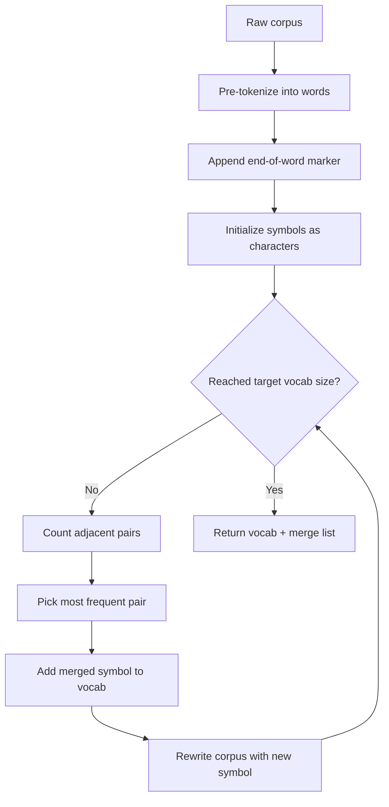

# Week 2 Instructor Notes — Tokenization

> **Scope reminder:** This session is about *tokenization*, the boundary between free-form text and the discrete symbols a language model actually sees. All comparisons, examples, and pitfalls below are tokenizer-specific. Later weeks cover Transformer architecture (LayerNorm, RoPE, attention), distributed training (DDP/FSDP), and alignment (RLHF/RLVR).

## Goals for the Session

By the end of the 3-hour block students should be able to:

1. **Motivate tokenization** as the unavoidable first preprocessing step of every LLM pipeline.
2. **Explain the BPE algorithm** in their own words, including initialization, pair counting, greedy merging, and encoding/decoding.
3. **Trace a from-scratch implementation** line-by-line and see how algorithmic choices map to code.
4. **Train a production-grade tokenizer** with Hugging Face `tokenizers`, configure pre-tokenizers, special tokens, and vocabulary size.
5. **Inspect and critique** a learned vocabulary: identify merge rules, special tokens, language bias, and failure modes.
6. **Compare tokenizer families** (BPE, WordPiece, SentencePiece/Unigram, byte-level BPE) and know when each is preferred.

---

## Suggested Timing (3 hours)

| Segment | Time | Activity | Instructor mode |
|---------|------|----------|-----------------|
| Why tokenization matters | 15 min | Lecture + live examples on the projector | Mostly talk, occasional `python` one-liners |
| BPE algorithm walkthrough | 25 min | Whiteboard / slides + hand-trace the toy corpus | Interactive, call on students for next merge |
| Break | 10 min | — | — |
| Live code: `bpe_from_scratch.py` | 25 min | Walk through pure-Python implementation | Project code, run cell-by-cell or line-by-line |
| Live code: `train_hf_tokenizer.py` | 20 min | Train a tokenizer on a small corpus | Live run, show progress bar, inspect saved files |
| Lab: train & inspect | 50 min | Students run labs and exercises | Roam, debug, ask "What did you find?" |
| Wrap-up & share-outs | 15 min | Interesting merges / vocab insights | Students show one weird token each |

**Pacing tip:** The first 75 minutes are instructor-heavy. After the break, shift to "you drive, I narrate." The lab block is intentionally long so students can experiment, break things, and recover.

---

## Why This Matters

Language models are functions over **discrete symbol sequences**. Before any embedding, attention, or transformer block runs, raw text must become a sequence of integers. That conversion is not a solved detail — it is a design decision that shapes:

- **Vocabulary size and memory.** Every token has an embedding row and a softmax output row. A 100k vocabulary on a 4k hidden dimension is ~800 MB of parameters just for the input/output matrices.
- **Sequence length and attention cost.** Attention is quadratic (or near-quadratic) in the number of tokens. A tokenizer that needs 50% more tokens for the same text directly increases compute.
- **Multilingual fairness.** An English-heavy tokenizer can represent English in fewer tokens than Chinese, Arabic, or Python code, which silently biases downstream capabilities.
- **Reversibility and special-character handling.** Spaces, tabs, newlines, emojis, and math symbols must be represented unambiguously or the model receives corrupted training signals.
- **Downstream task behavior.** Code completion, tool use, and chain-of-thought prompting all rely on the tokenizer representing punctuation, indentation, and delimiters cleanly.

**Real-world example:** OpenAI's `cl100k_base` (GPT-4) and `o200k_base` tokenizers use byte-level BPE with carefully chosen regular-expression pre-tokenizers. A single English sentence might cost 10–20 tokens, while the same information in some non-Latin scripts can cost 2–3× more. This is why tokenizer audits are now part of responsible LLM deployment.

---

## Lecture Outline

### 1. Why Tokenize?

- **Discrete vs. continuous inputs.** Neural networks consume tensors. Text is a sequence of variable-length Unicode strings. Tokenization bridges the gap.
- **The vocabulary trade-off.**
  - *Too small* (e.g., characters or bytes): sequences become very long; long-range dependencies are harder to learn.
  - *Too large* (e.g., whole words): the vocabulary explodes, rare words become `<|unk|>`, and morphology is wasted.
  - *Subword* is the sweet spot: frequent words stay whole, rare words decompose into meaningful pieces.
- **What a tokenizer does.**
  1. **Normalize** the raw string (Unicode normalization, lowercasing, stripping).
  2. **Pre-tokenize** into candidate units (words, Byte-Pair Encoding boundaries).
  3. **Apply** the learned segmentation algorithm (BPE, WordPiece, Unigram, etc.).
  4. **Map** each piece to an integer ID.
  5. **Decode** IDs back to text, usually by concatenating pieces (not always perfectly reversible).

**Engagement question:** *"If we used raw Unicode code points as tokens, how many tokens would a 100-character English paragraph need? How many if we used words? What goes wrong in each case?"*

### 2. BPE Intuition and Algorithm

BPE is a **greedy, data-driven compression algorithm** that learns which adjacent symbol pairs appear together most often.

#### 2.1 Training algorithm

1. **Initialize** the vocabulary from the corpus.
   - Split text into words (pre-tokenization).
   - Append an **end-of-word** marker, e.g. `</w>`, to each word.
   - Start with every character/byte as a separate symbol.
2. **Count** all adjacent symbol pairs in the current vocabulary, weighted by word frequency.
3. **Merge** the most frequent pair into a new symbol.
4. **Repeat** until the desired vocabulary size is reached or no pairs remain.

#### 2.2 Encoding algorithm

Given a new word:

1. Split it into the initial alphabet plus the end-of-word marker.
2. Apply the learned merges **in the exact order they were learned**.
3. At each step, scan left-to-right and greedily merge the current target pair.

#### 2.3 Why "greedy" matters

BPE is **not globally optimal**. Once a merge is chosen, it is never undone. A pair that is frequent early may block a better segmentation later. This is a feature (simple, fast) and a limitation (sub-optimal segmentations exist).

**Concrete example from `bpe_from_scratch.py`:**

```text
Corpus:
  low lower lowest
  new newer newest
  wide wider widest

Initial tokens per word (end_of_word = "</w>"):
  l o w </w>
  l o w e r </w>
  l o w e s t </w>
  ...

Merge #1: ('e', 'r') -> 'er' (freq 3)
Merge #2: ('er', '</w>') -> 'er</w>' (freq 3)
Merge #3: ('e', 's') -> 'es' (freq 3)
Merge #4: ('es', 't') -> 'est' (freq 3)
Merge #5: ('est', '</w>') -> 'est</w>' (freq 3)
Merge #6: ('l', 'o') -> 'lo' (freq 6)
Merge #7: ('lo', 'w') -> 'low' (freq 6)
Merge #8: ('n', 'e') -> 'ne' (freq 3)
Merge #9: ('ne', 'w') -> 'new' (freq 3)
Merge #10: ('w', '</w>') -> 'w</w>' (freq 6)
```

After these merges, `"lowest"` might be encoded as `['low', 'est</w>']` depending on merge priorities — run the script to see the exact result.

**Mermaid diagram of the BPE training loop:**



### 3. From BPE to Modern Tokenizers

- **Byte-level BPE (GPT-2 / GPT-4 / `tokenizers`).**
  - Start with the 256 UTF-8 bytes as the initial alphabet.
  - Never produces an `<|unk|>` token for any Unicode text.
  - Learns to merge multi-byte Unicode sequences into character chunks.
- **WordPiece (BERT, DistilBERT).**
  - Similar output to BPE but uses a different training objective: maximize likelihood of the training data given the vocabulary.
  - Starts from a large vocabulary and prunes, rather than growing from small.
- **SentencePiece / Unigram (T5, ALBERT, many multilingual models).**
  - Treats the raw string as a sequence of subword pieces from the start (no whitespace pre-tokenizer required).
  - Uses a unigram language model and EM algorithm to find the most probable segmentation.
  - Can represent spaces explicitly with `▁` (U+2581), making it very clean for multilingual and code models.
- **Tiktoken (OpenAI).**
  - A fast BPE *runtime* written in Rust. It loads a pre-trained merge table and vocabulary; it does not train new tokenizers.
  - Uses a regex pre-tokenizer to keep certain categories (e.g., numbers, English words) from being broken prematurely.

### 4. Design Decisions When Building a Tokenizer

#### 4.1 Vocabulary size

| Size | Typical use | Pros | Cons |
|------|-------------|------|------|
| 1k–4k | Tiny models, demos | Small embedding matrix | Very long sequences, poor morphology |
| 8k–32k | Standard research models | Good trade-off | Still English-centric if trained on English |
| 50k–100k | Production LLMs | Short sequences for in-distribution text | Large matrices, slower softmax, more memory |
| 200k+ | Multilingual / code specialists | Fewer tokens for rare languages | Risk of overfitting rare tokens, heavy memory |

#### 4.2 Pre-tokenizer

The pre-tokenizer decides where BPE is *allowed* to merge. Common choices:

| Pre-tokenizer | Behavior | Best for |
|---------------|----------|----------|
| **Whitespace** | Splits on spaces and punctuation (`lab/train_hf_tokenizer.py` default) | Simple demos, English text |
| **ByteLevel** | Splits on regex classes but preserves spaces as `Ġ` | GPT-2 style, code, spaces matter |
| **Metaspace** | Replaces spaces with `▁` then runs BPE | SentencePiece style, multilingual |
| **Whitespace + Punctuation** | Keeps punctuation as separate initial tokens | General NLP, parse-heavy tasks |

#### 4.3 Special tokens

Special tokens are **control symbols**, not learned from data:

| Token | Role | Must be added |
|-------|------|---------------|
| `<|endoftext|>` | End of sequence / document separator | Before training |
| `<|pad|>` | Pad short sequences to a fixed batch length | Before training |
| `<|unk|>` | Fallback for out-of-vocabulary bytes/tokens | Usually configured in the model |

**Critical point from `train_hf_tokenizer.py`:** the special tokens are passed to `BpeTrainer(special_tokens=[...])` *before* training. Adding them afterward is possible but changes ID assignments and breaks saved checkpoints.

#### 4.4 Normalization

- **Unicode normalization:** NFC, NFD, NFKC, NFKD. NFKC is common for LLMs because it canonicalizes compatibility characters (e.g., full-width digits → ASCII digits).
- **Lowercasing:** Helpful for monolingual English but destroys case information needed for named entities and many code tasks.
- **Stripping / collapsing whitespace:** Often done, but be careful — Python code cares about indentation.

---

## Algorithm Comparisons

### BPE vs. WordPiece vs. Unigram vs. Byte-Level BPE

| Dimension | **BPE** (Byte-Pair Encoding) | **WordPiece** | **Unigram** (SentencePiece) | **Byte-Level BPE** |
|-----------|------------------------------|---------------|------------------------------|--------------------|
| **Training objective** | Greedy merge of most frequent pair | Maximize data likelihood under vocab | Start with large vocab, prune to maximize likelihood | Same as BPE, but initial alphabet = 256 bytes |
| **Initial symbols** | Characters or bytes | Small subwords | Large candidate set | 256 UTF-8 bytes |
| **Direction** | Grows vocabulary | Grows, then prunes | Shrinks vocabulary | Grows vocabulary |
| **End-of-word marker** | Common (`</w>`) | Rare | Uses `▁` for word start | Uses `Ġ` for space |
| **Unknown tokens** | Possible if not byte-level | Possible | Rare if character coverage is good | None for any valid UTF-8 |
| **Encoding** | Greedy left-to-right merges | Greedy left-to-right | Viterbi-best segmentation | Same as BPE |
| **Speed** | Fast | Fast | Slower (EM iterations) | Fast |
| **Pros** | Simple, fast, interpretable merges | Often better morphological splits | Handles multilingual/no-space scripts natively | Universal coverage, no `<|unk|>` |
| **Cons** | Sub-optimal (greedy); English-centric pre-tokenizers | Less widely used for new LLMs | Slower to train; spaces encoded as `▁` can confuse students | Long sequences for non-Latin scripts |
| **Typical use** | GPT-2/4, Llama, Mistral, `tokenizers` | BERT family | T5, ALBERT, Japanese/Korean LLMs | GPT-2/4, many open-weight models |

### Pre-tokenizer comparison for this week's labs

| Pre-tokenizer | `train_hf_tokenizer.py` setting | Effect on merges | Pitfall |
|---------------|----------------------------------|------------------|---------|
| `Whitespace()` | Default in lab | Merges never cross word boundaries | Punctuation attached to words can create duplicate tokens (`dog,` vs `dog`) |
| `WhitespaceSplit()` | Alternative | Even simpler; treats punctuation as part of words | Worse for punctuation-heavy text |
| `ByteLevel()` | Recommended for production | Adds `Ġ` marker for spaces, allows byte fallback | Students must remember `Ġ` is not a typo |

---

## Concrete Examples

### Example 1: What the tokenizer sees

```python
text = "Hello, world!"
# After whitespace pre-tokenization:
# ["Hello,", "world!"]
# BPE might segment:
# ["Hel", "lo", ",", "world", "!"]  # depends on learned merges
```

### Example 2: Vocabulary size and embedding memory

For a model with hidden size `d_model = 4096` and float16 parameters:

| Vocabulary size | Input embeddings (MB) | Output logits (MB) | Total (MB) |
|-----------------|-----------------------|--------------------|------------|
| 1,000 | 7.8 | 7.8 | 15.6 |
| 10,000 | 78 | 78 | 156 |
| 50,000 | 390 | 390 | 780 |
| 100,000 | 780 | 780 | 1,560 |

Formula: `vocab_size × d_model × 2 bytes / 1024²`.

### Example 3: Greedy merge order matters

```text
Merges learned:
  1. ('a', 'b') -> 'ab'
  2. ('b', 'c') -> 'bc'

Word: "abc"

After merge 1 only:
  "ab", "c"

After merge 1 then 2:
  Step 1: "ab", "c"  (no 'b','c' adjacent anymore)
  Final: "ab", "c"

If the order were reversed:
  Step 1: "a", "bc"
  Final: "a", "bc"
```

**Teaching point:** BPE encoding is deterministic *only because* the merge order is fixed. The same pair learned at different steps can yield different segmentations.

### Example 4: Non-Latin script bias

`inspect_tokenizer.py` includes:

```python
sample_texts = [
    "the quick brown fox jumps over the lazy dog",
    "Hello, world!",
    "Mathematics: 1 + 2 = 3",
    "你好世界",  # Chinese
    "🐋 whales are large marine mammals",
]
```

With a tokenizer trained on English-only data, expect:

| Text | Likely #tokens | Why |
|------|----------------|-----|
| English sentence | ~10–12 | Many frequent words are whole tokens |
| Chinese | 4–8 per character | Each Hanzi likely falls back to bytes or rare subwords |
| Emoji | 1–4 | UTF-8 multi-byte sequence; trained on English sees whale emoji rarely |

Run `inspect_tokenizer.py` to verify the exact counts.

---

## Live Demo Script

### Demo A — `lab/bpe_from_scratch.py`

1. **Open the file.** Emphasize that this is intentionally slow so every step is visible.
2. **Trace `get_stats`.** Show that pair counts are weighted by word frequency.
3. **Trace `merge_vocab`.** Show the left-to-right scan; explain why only non-overlapping occurrences merge in one pass.
4. **Run the script.** Read the merge list aloud:
   - "First we merge `('e','r')` because `er` appears in `lower`, `newer`, and `widest`... wait, check the corpus." — let students correct you.
5. **Encode `"lowest"` live.** Change the example in `main()` and re-run. Ask: *"Why isn't it one token?"*

### Demo B — `lab/train_hf_tokenizer.py`

1. **Open the file.** Walk through the pipeline:
   ```mermaid
   flowchart LR
       A[build_corpus] --> B[Tokenizer\(BPE\)]
       B --> C[pre_tokenizer = Whitespace]
       C --> D[BpeTrainer]
       D --> E[tokenizer.train]
       E --> F[Save tokenizer.json + metadata.json]
   ```
2. **Run the script.** Point at the progress bar. Ask: *"What does `min_frequency=2` do?"* (Answer: a pair must appear at least twice before it can become a merge.)
3. **Inspect saved files.** Show `my_tokenizer/tokenizer.json` (large JSON) and `metadata.json` (human-readable summary).
4. **Experiment live:** change `vocab_size` to 200 and rerun. Show how the tokenizer breaks words into characters.

### Demo C — `lab/inspect_tokenizer.py`

1. **Run `analyze()`.** Point out special tokens and the longest tokens.
2. **Run `compare_texts()`.** Pause on the Chinese and emoji rows.
3. **Decode a custom token sequence.** Take the IDs for `"the happy dog runs quickly"`, modify one ID, and decode to show how token substitution corrupts text.

---

## Lab Instructions for Students

### Setup

1. Activate the course environment:
   ```bash
   # From the assignment or teaching directory
   uv sync
   source .venv/bin/activate
   ```
2. Verify `tokenizers` is available:
   ```bash
   python -c "import tokenizers; print(tokenizers.__version__)"
   ```

### Step 1 — Trace the algorithm by hand (15 min)

```bash
python teaching/week02/lab/bpe_from_scratch.py
```

- Before running, predict the first three merges.
- After running, write down the final encoding of `"newest"` and `"widest"`.
- **Check:** does `encode("lowest")` return `['low', 'est</w>']`? If not, why not?

### Step 2 — Train a real tokenizer (20 min)

```bash
python teaching/week02/lab/train_hf_tokenizer.py
```

- The script creates `week02/data/my_tokenizer/`.
- Open `tokenizer.json` and find the IDs for `<|pad|>`, `<|endoftext|>`, and `<|unk|>`.
- Open `metadata.json` and confirm the vocabulary size.

### Step 3 — Inspect and compare (15 min)

```bash
python teaching/week02/lab/inspect_tokenizer.py
```

- Record the token count for each sample text.
- Find the 5 longest tokens in the vocabulary. Are they meaningful words or accidental concatenations?
- Decode a sequence in reverse order (e.g., take IDs `[3,2,1]` if those are valid IDs). Why does it look strange?

### Step 4 — Exercises (variable)

See `teaching/week02/exercises/README.md`. Typical tasks:

- Train with `vocab_size=500`, `2000`, and `5000` and plot tokens-per-sentence vs. vocabulary size.
- Add a real text file (news article, source code, song lyrics) as the corpus and compare merges.
- Design a tiny corpus that causes a misleading merge (e.g., `"th the then"` to show `th` dominance).

---

## Common Misconceptions / Pitfalls

### Pitfall 1: "BPE is optimal"

**Why it happens:** The algorithm always picks the *most frequent* pair, which feels optimal.

**The truth:** BPE is **greedy**. It never revisits earlier decisions. A merge that is locally best can prevent globally better segmentations later.

**How to avoid:** Emphasize the greedy left-to-right scan. Show the `"abc"` example above.

### Pitfall 2: "Special tokens are learned from data"

**Why it happens:** Students see `<|endoftext|>` in the vocabulary and assume the model "figured out" it was special.

**The truth:** Special tokens are injected before training and assigned IDs. They are never produced by merges.

**How to avoid:** In `train_hf_tokenizer.py`, point at `special_tokens=["<|pad|>", "<|endoftext|>", "<|unk|>"]` and show these IDs are at the beginning of `tokenizer.json`.

### Pitfall 3: "Decoding is always reversible"

**Why it happens:** Encoding text → IDs and decoding IDs → text look like inverse operations.

**The truth:** Decoding usually **concatenates** pieces. Spaces and normalization can make the round-trip lossy.

**Example:**
```python
# With Whitespace pre-tokenizer, "dog," and "dog" may map to different IDs.
# Decoding "dog," + "runs" gives "dog,runs" (no space).
```

**How to avoid:** Run `inspect_tokenizer.py` and compare input vs. decoded output for `"Hello, world!"`.

### Pitfall 4: "Tokenizer behavior is language-independent"

**Why it happens:** English examples dominate textbooks.

**The truth:** Tokenizers inherit the statistics of their training corpus. An English tokenizer will produce long, byte-fallback sequences for Chinese or code.

**How to avoid:** Always include a non-English sample in the inspection script. Ask students to predict which text will cost the most tokens.

### Pitfall 5: "`<|unk|>` is gone in modern tokenizers"

**Why it happens:** Byte-level BPE can represent any UTF-8 string, so there is no byte it cannot encode.

**The truth:** It is true that byte-level BPE has no `<|unk|>` for *bytes*, but `<|unk|>` may still be used as a special sentinel or for out-of-vocabulary *special* strings.

**How to avoid:** Distinguish "no unknown bytes" from "no unknown tokens."

### Pitfall 6: "Changing the pre-tokenizer doesn't matter once BPE is trained"

**Why it happens:** Students think the merge table alone determines behavior.

**The truth:** The pre-tokenizer runs **before** the merge table at inference. A mismatch between training and inference pre-tokenizers silently corrupts every encoding.

**How to avoid:** Show in `train_hf_tokenizer.py` that `tokenizer.pre_tokenizer = Whitespace()` is saved and reloaded.

---

## Teaching Tips for the 3-Hour Session

### Engagement questions

1. *"How would you represent the word 'unhappiness' as tokens if your vocabulary only has 1,000 entries?"*
2. *"Why might a medical chatbot fail on patient names written in Chinese?"*
3. *"If you trained a tokenizer only on Twitter, what tokens would it learn that a textbook tokenizer wouldn't?"*
4. *"What happens to token count if you double vocabulary size? Is it always worth it?"*

### Live-demo talking points

- **Slow down at the first merge.** Ask the room to vote on which pair will be merged first in `bpe_from_scratch.py`.
- **Show the `</w>` marker explicitly.** Many students miss that it is part of the token.
- **Count parameters live.** Use the embedding memory formula above and project a small spreadsheet.
- **Corrupt a tokenizer live.** Delete `<|endoftext|>` from `special_tokens`, retrain, and show the model has no document-boundary signal.

### Check-for-understanding moments

| Time | Question | Expected answer |
|------|----------|-----------------|
| 20 min | "What does `</w>` do?" | Marks the end of a word so BPE can learn word-final patterns |
| 45 min | "Why is BPE greedy?" | It merges the most frequent pair and never reconsiders |
| 75 min | "What does `min_frequency=2` prevent?" | Rare pairs from becoming merge rules |
| 110 min | "Why does Chinese cost more tokens?" | Not in the training corpus; falls back to bytes/subwords |
| 140 min | "What breaks if you change the pre-tokenizer after training?" | Inference/training mismatch |

### Managing the lab block

- **First 10 minutes:** make sure everyone has run `bpe_from_scratch.py` successfully.
- **Middle 20 minutes:** encourage experiments with vocabulary size; this is where the most learning happens.
- **Final 10 minutes:** ask volunteers to share the weirdest token they found.

---

## Discussion Prompts

- What happens if you increase vocab size from 1k to 50k? Does the number of tokens per sentence drop linearly? Where are the diminishing returns?
- Why might a tokenizer produce different numbers of tokens for English vs. Chinese? Is this a bug or a consequence of the training data?
- What are the failure modes of BPE on code or math? Consider indentation, variable names, and operator sequences.
- How does the choice of pre-tokenizer affect the representation of hashtags (`#AI`) or URLs (`https://...`)?
- If you were building a tokenizer for a low-resource language, what corpus decisions would you make?
- Should `<|unk|>` exist in a byte-level tokenizer? What role, if any, should it play?

---

## Troubleshooting

| Issue | Cause | Fix |
|-------|-------|-----|
| `ModuleNotFoundError: No module named 'tokenizers'` | Missing dependency or wrong environment | Run `uv sync` and/or activate the virtual environment |
| Vocabulary is much smaller than requested | `vocab_size` too high for the corpus; not enough unique pairs | Lower `vocab_size` or increase corpus diversity |
| Vocabulary is too small and breaks words into characters | `vocab_size` too low or `min_frequency` too high | Increase `vocab_size` to ≥1,000 and/or lower `min_frequency` |
| `<|endoftext|>` not recognized | Special token not added before training | Add it to `BpeTrainer(special_tokens=[...])` |
| Decoding produces gibberish | Wrong tokenizer loaded or vocab size mismatch | Check the path and retrain if IDs shifted |
| Chinese/emoji encode to many tokens | English-only training corpus | Expected behavior; train on multilingual data to improve |
| `bpe_from_scratch.py` stops before `num_merges` | Corpus has no more adjacent pairs | Expected on tiny corpora; add more text |
| `encode()` returns different tokens than expected | Merge order is different than predicted | Remember merges are applied in learned order, left-to-right, non-overlapping |
| Saved tokenizer cannot be loaded | `tokenizer.json` corrupted or path wrong | Re-run `train_hf_tokenizer.py` and check `Path` |

---

## Homework / Follow-up

### Required follow-up

1. **Deliverable from `README.md`:** Train a BPE tokenizer to `week02/exercises/my_tokenizer/` with vocabulary size between 1,000 and 10,000. Submit the directory plus a one-page analysis covering:
   - Vocabulary size chosen and why.
   - Three interesting merges learned and why they make sense.
   - Number of tokens required for a sample sentence of your choice.

2. **Trace by hand:** On paper, run BPE for 5 merges on the corpus:
   ```text
   aa ab ba bb
   aa ab
   ```
   Show the initial symbol tuples, the pair counts, each merge, and the final encoding of `"ab"`.

### Optional extensions

1. **Train on real data.** Replace the synthetic corpus in `train_hf_tokenizer.py` with a chapter from Project Gutenberg or a Python source file. Compare vocabulary statistics.
2. **Switch pre-tokenizers.** Change `Whitespace()` to `ByteLevel()` in `train_hf_tokenizer.py` and re-run `inspect_tokenizer.py`. How do the token counts change for English vs. Chinese vs. emoji?
3. **Implement `decode`.** `bpe_from_scratch.py` has `encode` but not `decode`. Add a `decode(tokens, merges)` function and verify round-trip on the toy corpus.
4. **Read a real merge table.** Download a small public tokenizer (e.g., `gpt2` from Hugging Face) and inspect its `vocab.json` and `merges.txt`. Identify the first 10 merges.
5. **Multilingual audit.** Use `inspect_tokenizer.py` with 3–5 languages you read or speak. Tabulate tokens per character for each. Reflect on fairness implications.

### Reading for next week

- `docs/en/chapter3/chapter3_模型架构.md` — Transformer architecture overview.
- Review matrix multiplication and softmax, because Week 3 implements embeddings, positional encodings, and attention from scratch.

---

## Next Week Preview

**Week 3: Transformer Architecture — Embeddings, Positions, and Attention.**

We move from discrete tokens to continuous vectors. Students will:

- Implement **token embeddings** and **positional encodings** (including sinusoidal and **RoPE** comparisons).
- Code **scaled dot-product attention** and **multi-head attention**.
- Stack layers into a small Transformer block.
- See how the tokenizer's output IDs become the model's first input tensor.

**Connection to this week:** The vocabulary size chosen today becomes the `vocab_size` dimension of the input embedding matrix in Week 3. A poor tokenizer choice today directly becomes a larger, slower, or more biased model tomorrow.
