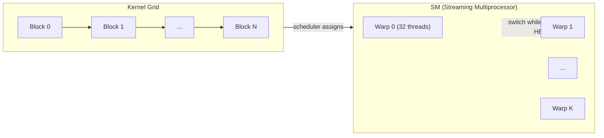
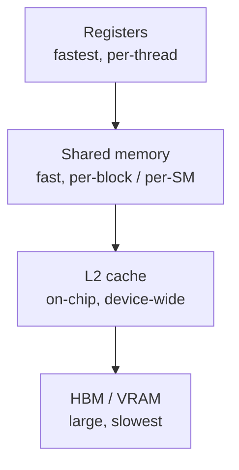
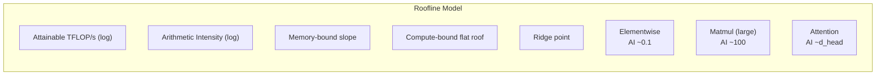
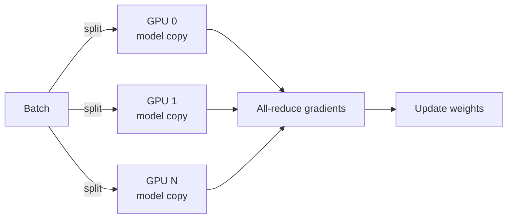
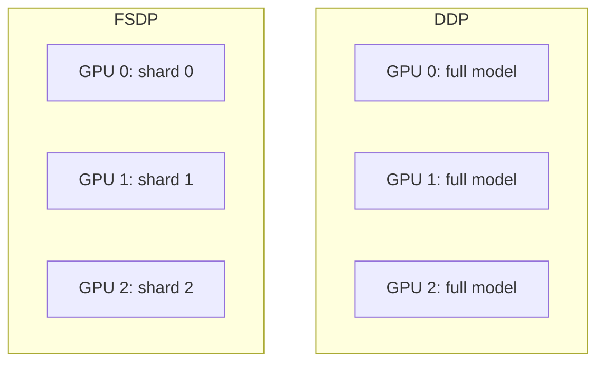
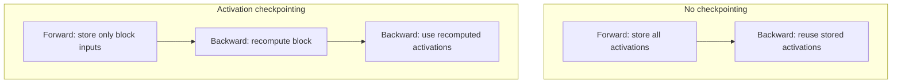

# Week 5 Instructor Notes — GPU Architecture, Profiling & the Roofline Model

> **Week 5 theme:** *From “it runs” to “why is it fast or slow?”*  
> Students have built a modern decoder-only Transformer in Week 4 (`week04/lab/model.py`). This week they put it under a microscope: they profile it, estimate its arithmetic intensity, and learn to reason about GPUs as throughput machines with a very specific memory/compute trade-off.

---

## Goals for the Session

By the end of the 3-hour block students should be able to:

1. **Explain why GPUs dominate LLM training**
   - Contrast latency-oriented CPU cores with throughput-oriented GPU **Streaming Multiprocessors (SMs)**.
   - Articulate why “more FLOPs” does not automatically mean “faster” if memory bandwidth is the bottleneck.

2. **Map code to the GPU execution model**
   - Define **kernel, grid, block, warp, thread, occupancy**.
   - Describe how the hardware hides latency by switching between warps.

3. **Navigate the GPU memory hierarchy**
   - Order registers → shared memory → L2 → HBM by size, latency and bandwidth.
   - Explain which levels are programmer-visible and which are hardware-managed.

4. **Profile a PyTorch model like a systems engineer**
   - Run `profile_model.py`, read the `key_averages()` table, and identify the dominant operators.
   - Distinguish CPU time from CUDA time and understand why synchronization matters.

5. **Use the roofline model to classify bottlenecks**
   - Compute **arithmetic intensity** (`FLOPs / byte`).
   - Plot the roofline and mark representative operations.
   - Decide whether a workload is **memory-bound** or **compute-bound**.

6. **Estimate Transformer memory pressure**
   - Break activation memory into per-layer contributions.
   - Quantify the savings (and recomputation cost) of **activation checkpointing**.

7. **Connect architecture choices to hardware cost**
   - Understand why modern LMs use **RMSNorm**, **RoPE**, and **SwiGLU**.
   - Compare distributed training strategies (**DDP vs. FSDP**) and know when each applies.

---

## Why This Matters

Training frontier LLMs costs millions of dollars in GPU time. A single hardware-aware decision — using a fused kernel, switching from FP32 to BF16, or applying activation checkpointing — can change whether a model fits on one GPU or needs an entire pod. This week teaches the **vocabulary and tooling** behind those decisions.

| Real-world decision | What you need from this week |
|---------------------|------------------------------|
| “Should we use FlashAttention?” | Is attention memory-bound or compute-bound on *our* GPU? |
| “Why is GPU utilization only 30%?” | Profile: is it small kernels, data loading, or a memory-bound op? |
| “Can we increase batch size?” | Memory estimate + roofline: larger batches raise arithmetic intensity. |
| “FP16 or BF16?” | Affects peak compute, memory traffic, and numerical stability. |
| “Do we need FSDP?” | Model-state memory vs. activation memory, communication cost. |

**Key takeaway for students:**  
> *Optimization without profiling is astrology.* The roofline model and the PyTorch profiler turn guesses into numbers.

---

## Suggested Timing (3 hours)

| Segment | Time | Activity | Learning objective |
|---------|------|----------|--------------------|
| **Lecture part 1: Why GPUs?** | 25 min | GPU execution model + memory hierarchy | Students can draw the hardware stack. |
| **Lecture part 2: Roofline & arithmetic intensity** | 25 min | Derive formulas; preview `roofline.py` | Students can classify a workload. |
| **Live demo** | 20 min | Run `profile_model.py`, read tables | Students see profiling in action. |
| **Break** | 10 min | — | — |
| **Lecture part 3: Design choices & distributed training** | 20 min | RMSNorm/RoPE/SwiGLU, DDP/FSDP | Students connect Week 4 code to hardware. |
| **Lab time** | 55 min | Students run all three scripts + exercises | Students produce a profiling report. |
| **Wrap-up + discussion** | 15 min | Discussion prompts + next-week teaser | Solidify concepts and set up Week 6. |

*Tip:* If the room has no CUDA GPUs, run the demo on the instructor machine and share screenshots/screen-cast. The scripts accept `--device cpu` so students can still check syntax and understand the code path.

---

## Lecture Outline

### 1. Why GPUs?

GPUs are not “faster CPUs.” They are a different kind of computer optimized for a different problem.

- **CPU: latency-oriented**
  - A few large, complex cores.
  - Huge branch predictors, deep caches, out-of-order execution.
  - Great for sequential, irregular code (parsers, databases, OS kernels).

- **GPU: throughput-oriented**
  - Thousands of simple, in-order cores grouped into **Streaming Multiprocessors (SMs)**.
  - All threads in a **warp** (32 threads) execute the same instruction on different data — **SIMT** (Single Instruction, Multiple Threads).
  - Great for dense, regular parallelism: matrix multiplication, convolutions, attention.

- **The LLM connection**
  - A training step is mostly large batched matrix multiplications.
  - The same operation is applied to millions of tokens/weights — ideal for SIMD/SIMT.

| Machine | Cores / SMs | Threads in flight | Designed for |
|---------|-------------|-------------------|--------------|
| Typical server CPU | 32–96 cores | ~100s | Low latency, irregular control flow |
| NVIDIA A100 SXM | 108 SMs | ~10,000s | High throughput, regular data parallelism |
| NVIDIA RTX 4090 | 128 SMs | ~10,000s | Same paradigm, smaller memory |

**Engagement question:** *“If a CPU has a 5 GHz clock and a GPU has a 1.5 GHz clock, why can the GPU still win on LLM training?”*  
Answer: throughput from massive parallelism, not single-thread clock speed.

---

### 2. GPU Execution Model

When PyTorch calls `matmul`, it launches a **kernel**. That kernel is organized as a grid of **blocks**, each block containing many **threads**.

```text
Grid  ──────────────────────────────────────
│ Block(0,0) │ Block(0,1) │ ... │ Block(0,N) │
└────────────┴────────────┴─────┴────────────┘
  │ Thread 0  │ Thread 1  │ ... │ Thread T  │
  └───────────┴───────────┴─────┴───────────┘
        ↓ grouped into Warps of 32
```

- **Thread**: one scalar lane of execution.
- **Warp**: 32 threads that execute in lockstep on the same instruction. Branch divergence inside a warp serializes paths.
- **Block**: a set of threads that run on the same SM and can share **shared memory**.
- **SM (Streaming Multiprocessor)**: the hardware unit that schedules and executes warps.
- **Occupancy**: ratio of active warps on an SM to the maximum supported. Higher occupancy helps hide memory latency.

**Latency hiding:** when a warp waits for data from HBM, the SM switches to another ready warp. If you have enough warps, the compute units stay busy.



**Concrete example:**  
A matrix multiplication kernel might use a 16×16 thread block (256 threads = 8 warps). Each warp computes one row/column tile of the output matrix. If one warp stalls on a memory load, the SM executes another warp.

---

### 3. Memory Hierarchy

GPU memory is a pyramid. The closer to the compute units, the faster and smaller it is.



| Level | Scope | Typical size (A100) | Latency | Bandwidth | Who manages? |
|-------|-------|---------------------|---------|-----------|--------------|
| **Registers** | Per-thread | ~256 KB per SM total | ~1 cycle | ~10 TB/s | Compiler / CUDA |
| **Shared memory** | Per-block / SM | 164 KB configurable per SM | ~20–30 cycles | ~19 TB/s | Programmer / kernel |
| **L2 cache** | Device-wide | 40 MB | Hundreds of cycles | ~4 TB/s | Hardware |
| **HBM** | Device-wide | 40–80 GB | Microseconds | ~2 TB/s (A100) | Hardware / driver |

**Why this matters for Transformers:**

- Model weights live in HBM.
- During forward/backward, activations and weights stream through HBM.
- For many operations the **memory bandwidth**, not the compute peak, limits speed.
- Operations that touch every element once (elementwise activations, softmax, layer-norm) are almost always **memory-bound**.

**Concrete example:**

```python
import torch

x = torch.randn(2**20, device='cuda')
y = x * 2.0          # elementwise multiply
```

- FLOPs: 1 per element.
- Bytes moved: read `x` (4 bytes) + write `y` (4 bytes) = 8 bytes per element.
- Arithmetic intensity: `1 / 8 = 0.125 FLOPs/byte`.
- On an A100 (peak 312 TFLOP/s, bandwidth 2 TB/s), the memory roof is `0.125 × 2e12 = 250e9 FLOP/s = 0.25 TFLOP/s`. The kernel will hit the flat memory roof, not the compute peak.

---

### 4. Transformer Arithmetic and the Roofline Model

The **roofline model** plots the maximum attainable performance for a given **arithmetic intensity**.

**Formula:**

```text
Attainable FLOP/s = min(peak_compute_FLOP/s, arithmetic_intensity × memory_bandwidth_B/s)
```

**Arithmetic intensity (AI):**

```text
AI = FLOPs executed / bytes of memory traffic
```

**Ridge point:**

```text
I_ridge = peak_compute / memory_bandwidth
```

- Left of the ridge (`AI < I_ridge`): performance limited by **memory bandwidth**.
- Right of the ridge (`AI > I_ridge`): performance limited by **peak compute**.



*The actual plot is produced by `lab/roofline.py` with matplotlib; the diagram above is the conceptual shape.*

#### 4.1 Matmul arithmetic intensity

For `C = A @ B` where all matrices are `n × n`:

```text
FLOPs  = 2 n^3
Bytes  = 12 n^2   (read A, read B, write C, FP32)
AI     = (2 n^3) / (12 n^2) = n / 6
```

| Matrix size | AI (FP32) | Region on A100 roofline (`I_ridge ≈ 0.16`) |
|-------------|-----------|---------------------------------------------|
| `n = 256`   | 42.7      | Compute-bound |
| `n = 1024`  | 170.7     | Compute-bound |
| `n = 4096`  | 682.7     | Compute-bound, but only if the matmul is large enough to saturate the tensor cores |

#### 4.2 Attention arithmetic intensity

The script `lab/roofline.py` estimates standard (materialized) attention:

```text
FLOPs  ≈ 4 × batch × num_heads × seq_len^2 × d_head
Bytes  ≈ bytes_per_param × (3·batch·seq·d_model + 2·batch·heads·seq^2 + batch·seq·d_model)
AI     = FLOPs / Bytes
```

Using the script defaults for `attention (seq=512)`:

```text
batch = 2, seq_len = 512, d_model = 512, num_heads = 8
→ d_head = 64
→ FLOPs  ≈ 4 × 2 × 8 × 512^2 × 64  ≈ 1.07 × 10^9
→ Bytes  ≈ 2.10 × 10^7
→ AI     ≈ 51.2 FLOPs/byte
```

With the default A100 roofline (`peak_compute = 312`, `bandwidth = 2000`):

```text
I_ridge = 312 / 2000 = 0.156
AI = 51.2  >  0.156  → compute-bound
```

**Important nuance:**  
The lab’s estimate is a simplified “FLOPs over memory traffic” model. In practice, unfused attention has many small kernel launches and repeated HBM round-trips, so the *effective* AI can be much lower. That is exactly why **FlashAttention** (Week 6) matters: it reorders the computation to reduce HBM traffic.

---

### 5. Profiling with PyTorch

The PyTorch Profiler records how much time each operator spends on CPU and CUDA.

`lab/profile_model.py` wraps forward and backward passes in `record_function` contexts:

```python
from torch.profiler import ProfilerActivity, profile, record_function, tensorboard_trace_handler

with profile(
    activities=[ProfilerActivity.CPU, ProfilerActivity.CUDA],
    record_shapes=True,
    on_trace_ready=tensorboard_trace_handler("week05/profiling_logs"),
) as prof:
    with record_function("model_forward"):
        logits = model(x)
    with record_function("model_backward"):
        loss = F.cross_entropy(logits.view(-1, vocab_size), y.view(-1))
        loss.backward()
    torch.cuda.synchronize()
    prof.step()
```

Key output commands:

```python
print(prof.key_averages().table(sort_by="cuda_time_total", row_limit=10))
```

**What the table shows:**

| Column | Meaning |
|--------|---------|
| `Name` | PyTorch operator or CUDA kernel |
| `Self CPU total` | Time spent in this op, excluding children |
| `CPU total` | Time including children |
| `CUDA total` | GPU time attributed to this op |
| `# of Calls` | How many times it launched |

**Typical top operators for the Week 4 model:**

| Rank | Operator / kernel | Why it is expensive |
|------|-------------------|---------------------|
| 1 | `aten::mm` / `cutlass` GEMM | Most layers are matrix multiplications. |
| 2 | `aten::bmm` | Batch matrix multiplications inside attention. |
| 3 | `aten::_softmax` | Attention softmax over `seq_len`. |
| 4 | `aten::addmm` / bias-add fused | Linear layers. |
| 5 | `aten::pow`, `aten::rsqrt` | RMSNorm backward. |

**Teaching point:**  
The profiler tells you *where time is spent*, not *why*. Use the roofline model to explain *why* an operator is expensive.

---

### 6. Modern Transformer Design Choices (and Their Hardware Impact)

The Week 4 model (`week04/lab/model.py`) uses several choices that are now standard in Llama/Qwen-style LMs. Each has a hardware motivation.

#### 6.1 RMSNorm vs. LayerNorm

Both normalize inputs to stabilize training, but RMSNorm is cheaper.

**RMSNorm formula:**

```text
RMSNorm(x) = x / sqrt(mean(x^2) + eps) * g
```

**LayerNorm formula:**

```text
LayerNorm(x) = (x - mean(x)) / sqrt(var(x) + eps) * g + b
```

```python
# RMSNorm as implemented in week04/lab/model.py
norm = x * torch.rsqrt(x.pow(2).mean(dim=-1, keepdim=True) + self.eps)
return self.weight * norm
```

| Aspect | **LayerNorm** | **RMSNorm** |
|--------|---------------|-------------|
| Statistics needed | mean + variance | RMS only |
| Parameters | `g` + `b` | `g` only |
| Fused-kernel friendliness | Good | Slightly better (fewer reductions) |
| Use when | You need a learned offset (`b`) | You want maximum speed and simplicity |
| Typical homes | Original Transformer, BERT | Llama, Qwen, modern LLaMA-family models |

**Pros / Cons / Use-cases:**

| Method | Pros | Cons | Best use-case |
|--------|------|------|---------------|
| **LayerNorm** | Stable; learned bias can help convergence | Slightly more compute and memory; two statistics | Encoder-only models, research where stability matters most |
| **RMSNorm** | Fewer HBM round-trips; fewer parameters; empirically works well in LLMs | No learned bias; assumes zero-mean inputs are acceptable | Decoder-only LLMs at scale (Llama, Qwen, Mistral) |

#### 6.2 RoPE vs. Learned Positional Embeddings

The Week 4 model uses **Rotary Position Embedding (RoPE)** instead of adding a learned positional embedding matrix.

**Learned absolute embeddings:**

```python
# Conceptual only — not in the lab model
tok_emb  = embedding(tok_ids)          # (batch, seq, d_model)
pos_emb  = pos_embedding(pos_ids)      # (batch, seq, d_model)
x        = tok_emb + pos_emb
```

**RoPE:** rotates pairs of dimensions in Q and K by a frequency that depends on position:

```python
# From week04/lab/model.py, simplified
rotated0 = x0 * cos - x1 * sin
rotated1 = x0 * sin + x1 * cos
```

RoPE encodes position into the *angle* between query and key vectors, so the dot-product naturally respects relative distance.

| Aspect | **Learned absolute** | **RoPE** |
|--------|----------------------|----------|
| Parameters | `max_seq_len × d_model` extra | None (computed from positions) |
| Extrapolation | Poor beyond `max_seq_len` | Better, especially with rescaling (NTK, YaRN) |
| Relative-position awareness | None built-in | Built into the QK dot product |
| Use-case | Early Transformers, BERT, GPT-2 | Modern LLMs (Llama, Qwen, PaLM) |

| Method | Pros | Cons | Best use-case |
|--------|------|------|---------------|
| **Learned absolute** | Simple to implement and reason about | Fixed context length; extra parameters; no relative bias | Models with fixed, short contexts; pedagogical code |
| **RoPE** | No extra params; better length extrapolation; compatible with grouped-query attention | Slightly more complex implementation; needs even `d_head` | Production decoder-only LLMs; long-context models |

#### 6.3 SwiGLU Feed-Forward Network

The Week 4 FFN uses **SwiGLU**:

```python
# week04/lab/model.py
return self.w3(self.dropout(F.silu(self.w1(x)) * self.w2(x)))
```

SwiGLU uses three matrices (`w1`, `w2`, `w3`) and a gating mechanism. It has been shown to improve quality per FLOP over the older ReLU/GeLU FFN. The hardware cost is roughly two matrix multiplications plus elementwise gating.

| FFN variant | Formula | Hardware note |
|-------------|---------|---------------|
| ReLU | `W2(ReLU(W1 x))` | 2 matmuls; cheap activation. |
| GeLU | `W2(GeLU(W1 x))` | 2 matmuls; smooth activation. |
| SwiGLU | `W3(SiLU(W1 x) ⊙ W2 x)` | 3 matmuls but better quality; hidden dim scaled to ~8/3 `d_model` to keep params comparable. |

---

### 7. Distributed Training at Scale

As models grow, one GPU is not enough. The two most common PyTorch strategies are **DDP** and **FSDP**.

#### 7.1 Data Parallelism (DDP)

- Replicate the full model on every GPU.
- Each GPU processes a different batch slice.
- After backward, average gradients via **all-reduce**.



#### 7.2 Fully Sharded Data Parallelism (FSDP)

- Shard **parameters, gradients, and optimizer states** across GPUs.
- All-gather parameters for forward, reduce-scatter gradients for backward.
- Allows training much larger models on the same hardware.



| Aspect | **DDP** | **FSDP** |
|--------|---------|----------|
| Model state per GPU | Full copy | Shard |
| Maximum model size | Fits in single-GPU memory | Fits in aggregate GPU memory |
| Communication pattern | All-reduce gradients | All-gather params + reduce-scatter grads |
| Communication volume | `2 × model_size` per step | `3 × model_size` per step (naïve) |
| Use-case | ≤ 7B params on 8×A100 | 7B–100B+ params |

| Method | Pros | Cons | Best use-case |
|--------|------|------|---------------|
| **DDP** | Simple; low communication overhead per byte; works with any optimizer | Cannot train models larger than one GPU | 1B–7B models on multi-GPU nodes |
| **FSDP** | Trains huge models; can offload to CPU/NVMe | More communication; harder to debug; needs careful wrapping | 7B–100B+ models; memory-constrained clusters |

**Teaching point:**  
> DDP saves time; FSDP saves memory. Use DDP when the model fits on one GPU and you want faster training. Use FSDP when the model does not fit.

---

### 8. Memory/Compute Trade-offs: Activation Checkpointing

During backpropagation, gradients need the activations from the forward pass. Storing everything costs a lot of HBM. **Activation checkpointing** stores only the inputs to each Transformer block and recomputes the intermediate activations during the backward pass.



**Trade-off:**

| Mode | Memory | Compute | Use when |
|------|--------|---------|----------|
| No checkpointing | High | Baseline | Model fits in memory |
| Activation checkpointing | ~40–50% lower | ~+20–30% forward time | Model does not fit or you want larger batch/sequence |

`lab/memory_analysis.py` prints a rough 60% memory reduction when `--checkpointing` is passed. That estimate is intentionally conservative; real savings depend on how many layers are checkpointed and which activations are recomputed.

---

### 9. Broader Context: Alignment and Tokenization

These topics are covered more deeply in later weeks, but they are part of the same hardware-aware design space.

#### 9.1 RLHF vs. RLVR

| Aspect | **RLHF (Reinforcement Learning from Human Feedback)** | **RLVR (Reinforcement Learning with Verifiable Rewards)** |
|--------|-------------------------------------------------------|-----------------------------------------------------------|
| Reward signal | Learned reward model trained on human preferences | Rule-based or executable verifier (e.g., math checker, unit test) |
| Stability | PPO can be unstable; reward hacking common | Usually more stable because reward is deterministic |
| Data cost | Expensive human preference labels | Cheap if verifier exists |
| Use-case | Chat style, helpfulness, harmlessness | Math, code, formal reasoning |

| Method | Pros | Cons | Best use-case |
|--------|------|------|---------------|
| **RLHF** | Captures nuanced human preferences | Needs reward model + human data; PPO complexity; reward hacking | General-purpose chat alignment |
| **RLVR** | No reward model; exact reward; easy to scale | Only works when a verifier exists; may overfit to verifiable tasks | Math, coding, structured outputs |

#### 9.2 BPE vs. SentencePiece

| Aspect | **BPE (Byte-Pair Encoding)** | **SentencePiece** |
|--------|------------------------------|-------------------|
| Pretokenization | Usually language-specific (e.g., regex for English) | Language-agnostic; treats text as raw Unicode |
| Vocab building | Greedy merge of most frequent pairs | Unigram or BPE; normalizes whitespace with `▁` marker |
| Multilingual | Can struggle with space-less scripts | Works well across scripts |
| Use-case | GPT-2, RoBERTa | T5, LLaMA, Qwen |

| Method | Pros | Cons | Best use-case |
|--------|------|------|---------------|
| **BPE** | Simple; interpretable merges; widely supported | Needs pretokenization; can produce fragmented non-Latin tokens | English-centric LMs; educational tokenizers |
| **SentencePiece** | No space assumptions; reversible; multilingual | Slightly more complex; `▁` markers can confuse beginners | Multilingual LLMs; production systems |

---

## Algorithm Comparisons

The following tables consolidate the comparisons above for quick reference during class.

### Normalization

| Method | Parameters | Statistics | Speed | Best for |
|--------|------------|------------|-------|----------|
| **LayerNorm** | `g`, `b` | mean + variance | Fast | Stability-first encoders |
| **RMSNorm** | `g` only | RMS only | Faster | Decoder LLMs at scale |

### Position Encoding

| Method | Extra params | Length extrapolation | Relative bias | Best for |
|--------|--------------|----------------------|---------------|----------|
| **Learned absolute** | `max_seq × d_model` | Poor | No | Short, fixed contexts |
| **RoPE** | 0 | Good | Yes (via angle) | Modern decoder LLMs |

### Distributed Strategy

| Method | Model state per GPU | Comm. pattern | Max model size | Best for |
|--------|---------------------|---------------|----------------|----------|
| **DDP** | Full copy | All-reduce | One GPU | 1B–7B models |
| **FSDP** | Shard | All-gather + reduce-scatter | Aggregate GPU memory | 7B–100B+ |

### Alignment

| Method | Reward source | Stability | Scalability | Best for |
|--------|---------------|-----------|-------------|----------|
| **RLHF** | Learned RM | Medium | Costly human labels | General chat |
| **RLVR** | Verifier | High | Cheap if verifier exists | Math/code |

### Tokenization

| Method | Pretokenization | Multilingual | Reversibility | Best for |
|--------|-----------------|--------------|---------------|----------|
| **BPE** | Language-specific | Weaker | Good | English-centric |
| **SentencePiece** | None required | Strong | Good | Multilingual |

---

## Concrete Examples

### Example 1: Elementwise operation on the roofline

Operation: `y = x * 2.0` with FP32 on an A100.

```text
FLOPs per element = 1
Bytes per element = read(4) + write(4) = 8
AI                = 1 / 8 = 0.125
Memory roof       = 0.125 × 2000 GB/s = 250 GFLOP/s
Peak compute      = 312 TFLOP/s
Attainable        = min(312e12, 250e9) = 250e9 FLOP/s
```

The kernel runs on the sloped part of the roofline: **memory-bound**.

### Example 2: Large matmul on the roofline

Operation: `A @ B` where `A, B` are `4096 × 4096` FP32.

```text
FLOPs = 2 × 4096^3 ≈ 1.37 × 10^11
Bytes = 3 × 4096^2 × 4 ≈ 2.01 × 10^8
AI    = 1.37e11 / 2.01e8 ≈ 683
```

Since `683 >> 0.156`, the matmul is **compute-bound** and can approach the peak TFLOP/s roof.

### Example 3: Attention arithmetic intensity using lab defaults

```text
batch = 2, seq_len = 512, d_model = 512, num_heads = 8, d_head = 64
FLOPs  = 4 × 2 × 8 × 512^2 × 64 ≈ 1.07 × 10^9
Bytes  = 2 × (3·2·512·512 + 2·2·8·512^2 + 2·512·512) ≈ 2.10 × 10^7
AI     ≈ 51.2
I_ridge = 312 / 2000 = 0.156
```

`AI > I_ridge` → on paper, compute-bound. In practice, unfused attention has lower *effective* AI, which is why kernel fusion matters.

### Example 4: Activation memory with `memory_analysis.py`

Default invocation:

```bash
python lab/memory_analysis.py --batch 2 --seq_len 512 --d_model 512 \
  --num_layers 6 --vocab_size 10000
```

The script reports approximately:

```text
Per layer: ~24.1 MB
Total:     ~183.2 MB (0.17 GiB)
Parameter memory (float32): ~83.4 MB
Parameter memory (bf16):    ~41.7 MB
```

With `--checkpointing`:

```text
Total: ~73.3 MB (saved ~60%)
Trade-off: extra forward recomputation during backward pass
```

*Note:* the parameter estimate in `memory_analysis.py` assumes `d_ff = 4 × d_model`, whereas the Week 4 model uses a SwiGLU-style `d_ff ≈ 8/3 × d_model`. Use this as a class discussion point: memory estimates are always approximations; check against the actual model definition.

### Example 5: Reading a profiler table

```text
-------------------------  ------------  ------------  ------------  -------------
                       Name    Self CPU %      CPU total    CUDA total    # of Calls
-------------------------  ------------  ------------  ------------  -------------
                 aten::mm         5.2%        12.3 ms       145.2 ms          48
                aten::bmm         4.1%         8.7 ms        62.1 ms          24
            aten::_softmax        1.8%         4.1 ms        28.4 ms          12
       cudaLaunchKernel_v2         6.5%        15.2 ms           --         192
-------------------------  ------------  ------------  ------------  -------------
```

Interpretation:

- `aten::mm` dominates GPU time — large GEMMs are the workhorse.
- `cudaLaunchKernel_v2` CPU time is high — many small kernel launches. This is a hint that fusing operations (e.g., bias-add, activation) could help.
- If `CUDA total` is much smaller than `CPU total`, the CPU may be the bottleneck (data loading, Python overhead).

---

## Common Misconceptions and Pitfalls

| Misconception | Why it is wrong | How to avoid it |
|---------------|-----------------|-----------------|
| **“More FLOPs always means slower.”** | A memory-bound kernel can have few FLOPs but still be slow because it waits for HBM. Time depends on FLOPs, AI, and bandwidth. | Use the roofline model to classify the bottleneck. |
| **“CPU profiling tells me GPU performance.”** | The CPU may launch kernels asynchronously; CPU time ≠ GPU time. | Always include `ProfilerActivity.CUDA` and call `torch.cuda.synchronize()` before measuring. |
| **“Peak TFLOP/s is a realistic training speed.”** | Peak numbers assume perfect tensor-core utilization, no memory stalls, and no Python overhead. Real training often achieves 30–60% of peak. | Compare measured TFLOP/s to the roofline, not to the datasheet. |
| **“Activation checkpointing is free memory.”** | It trades memory for extra forward recomputation. Total training time increases. | Only checkpoint when memory is the limiting factor. |
| **“Increasing batch size always helps.”** | Larger batches raise arithmetic intensity, but they also increase activation memory. Eventually you OOM. | Roofline says “good”; memory analysis says “limit.” Balance both. |
| **“DDP and FSDP are interchangeable.”** | DDP replicates the full model; FSDP shards it. They solve different problems. | Use DDP when the model fits on one GPU; FSDP when it does not. |
| **“Shared memory is managed automatically.”** | Shared memory is programmer-managed in CUDA; PyTorch kernels use it internally but users rarely tune it directly. | Know it exists; leave low-level tuning to kernel authors unless you write Triton/CUDA. |
| **“RoPE makes position embeddings unnecessary.”** | RoPE is still a position encoding; it just bakes position into the rotation rather than adding a vector. | Emphasize that Q and K are rotated, not that position is “removed.” |

---

## Teaching Tips for a 3-Hour Session

### Engagement questions

1. *“You have two GPUs: one with 2× the compute peak, the other with 2× the memory bandwidth. Your model is attention-heavy. Which upgrade helps more?”*  
   → It depends on arithmetic intensity; attention may be memory-bound on the first GPU.

2. *“Why does a CPU run `y = x * 2` faster per element than a GPU for a tiny tensor, but the GPU wins for a huge one?”*  
   → Fixed launch overhead vs. amortized throughput.

3. *“If activation checkpointing saves 60% memory but costs 30% more compute, when is it worth it?”*  
   → When the alternative is OOM or a much smaller batch size.

### Live-demo talking points

- Run `python lab/profile_model.py --seq_len 128 --d_model 256` first so the output fits on screen.
- Point at `aten::mm` and ask: *“Is this memory-bound or compute-bound?”* Then run `roofline.py` to show the ridge point.
- Deliberately run without `torch.cuda.synchronize()` conceptually, then show that the lab code does synchronize — otherwise GPU times are attributed to the wrong step.
- Change `--seq_len` from 128 to 512 in `roofline.py` and watch the attention point move (mostly along the compute roof for this simplified model).

### Check-for-understanding moments

| Time | Prompt | Expected answer |
|------|--------|-----------------|
| After memory hierarchy | “Order these from fastest to slowest: HBM, registers, L2, shared memory.” | Registers → shared → L2 → HBM |
| After roofline | “A kernel has AI = 0.05 on an A100. What limits it?” | Memory bandwidth |
| After profiling | “CUDA total is 50 ms, CPU total is 200 ms. What does that suggest?” | CPU overhead; possibly data loading or Python |
| After checkpointing | “Why does checkpointing save memory?” | It stores fewer activations; recomputes them later |

### Board work

- Draw the roofline on the board with two axes and a ridge point.
- Place sticky notes for “elementwise,” “matmul,” and “attention (seq=512).”
- Ask students to move them as you change `seq_len` or batch size.

---

## Live Demo Script

1. **Show the model**
   ```bash
   cat ../week04/lab/model.py | head -40
   ```
   Highlight RMSNorm, RoPE, and SwiGLU. Connect back to the comparison tables.

2. **Profile the model**
   ```bash
   python lab/profile_model.py --device cuda --seq_len 128 --d_model 256 --batch_size 2
   ```
   - Identify the top 3 operators by CUDA time.
   - Ask students why `aten::mm` is at the top.
   - Show the saved trace path `week05/profiling_logs/` for TensorBoard.

3. **Plot the roofline**
   ```bash
   python lab/roofline.py --peak_compute 312 --bandwidth 2000 --output week05/roofline_a100.png
   ```
   - Explain the ridge point.
   - Read the printed table: which operations are memory-bound vs. compute-bound?

4. **Re-run with a consumer GPU spec**
   ```bash
   python lab/roofline.py --peak_compute 82.6 --bandwidth 1008 --output week05/roofline_4090.png
   ```
   - Compare how the ridge point moves and which operations change sides.

5. **Estimate memory**
   ```bash
   python lab/memory_analysis.py --batch 2 --seq_len 512 --d_model 512 --num_layers 6 --vocab_size 10000
   python lab/memory_analysis.py --batch 2 --seq_len 512 --d_model 512 --num_layers 6 --vocab_size 10000 --checkpointing
   ```
   - Show per-layer and total activation memory.
   - Discuss the 60% savings estimate and the recomputation trade-off.

---

## Lab Instructions for Students

1. **Environment check**
   ```bash
   python - <<'PY'
   import torch
   print(torch.__version__)
   print("CUDA available:", torch.cuda.is_available())
   if torch.cuda.is_available():
       print("Device:", torch.cuda.get_device_name(0))
   PY
   ```

2. **Run the profiler**
   ```bash
   python lab/profile_model.py --device cuda --seq_len 128 --d_model 256
   ```
   - Record the top 5 operators by CUDA total time.
   - Note the number of calls for each.

3. **Plot your GPU roofline**
   ```bash
   python lab/roofline.py --peak_compute <your_peak> --bandwidth <your_bw>
   ```
   - Mark attention at `seq_len = 128, 512, 2048`.
   - Determine which side of the ridge each falls on.

4. **Analyze memory**
   ```bash
   python lab/memory_analysis.py --batch 2 --seq_len 512 --d_model 512 --num_layers 6 --vocab_size 10000
   python lab/memory_analysis.py ... --checkpointing
   ```
   - Compare total activation memory with and without checkpointing.
   - Compare activation memory to parameter memory (FP32 vs. BF16).

5. **Complete the exercises** in `exercises/README.md`.

6. **CPU/MPS fallback:** If no CUDA GPU is available, run with `--device cpu` to verify code paths, then interpret sample CUDA outputs provided by the instructor.

---

## Discussion Prompts

1. **Hardware comparison:** For an NVIDIA RTX 4090 vs. an A100, which has higher bandwidth? Higher compute? How does that change the roofline ridge point? Which card benefits more from increasing batch size?

2. **Batch size and utilization:** Why does increasing batch size often improve GPU utilization? What does it do to arithmetic intensity and to activation memory?

3. **Attention bottleneck:** The lab’s simplified attention model says attention is compute-bound at `seq_len = 512`. Why do practitioners still complain that attention is a memory-bandwidth problem? (Hint: think about kernel fusion, the attention matrix, and the `O(n^2)` memory cost.)

4. **Checkpointing trade-off:** When is activation checkpointing worth the extra compute? Can you think of a case where it would *not* help?

5. **Design choices:** The Week 4 model uses RMSNorm and RoPE. If you switched to LayerNorm and learned positional embeddings, which lab numbers would change? Would profiling time change noticeably?

---

## Troubleshooting

| Issue | Cause | Fix |
|-------|-------|-----|
| Profiler output shows no CUDA columns | CUDA not available or `ProfilerActivity.CUDA` not added | Run on GPU; check `torch.cuda.is_available()` |
| `torch.profiler` import error | PyTorch < 2.0 | Upgrade to `torch >= 2.0` |
| Roofline peak looks too low / too high | Wrong GPU specs | Update `--peak_compute` and `--bandwidth` to match your card |
| Out of memory during profiling | Profiler overhead + large batch | Reduce `--batch_size` or `--seq_len` |
| Trace viewer (TensorBoard) empty | Wrong log directory | Point TensorBoard at `week05/profiling_logs/` |
| `ModuleNotFoundError` for `model` | `week04/lab` not on `sys.path` | Run `profile_model.py` from its own directory; it adds the path automatically |
| CPU run is very slow but gives no GPU data | Expected on CPU | Use for syntax checks only; meaningful profiling needs CUDA |

---

## Homework / Follow-up

1. **Reproduce the roofline for your own GPU.**  
   Find the FP16/BF16 peak compute and memory bandwidth from the manufacturer specs and run `roofline.py`.

2. **Vary one knob at a time.**  
   Fix `d_model = 512`, `num_layers = 6`, and sweep `seq_len ∈ {64, 128, 256, 512, 1024, 2048}`. Plot attention arithmetic intensity vs. `seq_len`. Where does it plateau?

3. **Profile with gradient accumulation.**  
   Modify `profile_model.py` to accumulate gradients over 4 micro-batches. How does the operator mix change?

4. **Read ahead.**  
   Skim `docs/en/chapter6/chapter6_第六章GPU和GPU相关的优化.md` and note one optimization technique you want to understand better.

5. **Compare precision.**  
   Run `profile_model.py` with `torch.set_default_dtype(torch.bfloat16)` vs. `float32`. How do time and memory change? Why?

6. **(Stretch) FSDP on two GPUs.**  
   If you have access to two GPUs, wrap the Week 4 model in `torch.distributed.fsdp.FullyShardedDataParallel` and compare peak memory to DDP.

---

## Next Week Preview

Week 6 dives into **custom kernels with Triton**, including a FlashAttention-style attention kernel. Students will learn how to:

- Fuse operations to reduce HBM round-trips.
- Use shared memory and tiling to raise effective arithmetic intensity.
- Read a Triton kernel and map it to the GPU concepts introduced this week.

The payoff: the memory-bound attention operations identified today become compute-bound, fused kernels next week.
