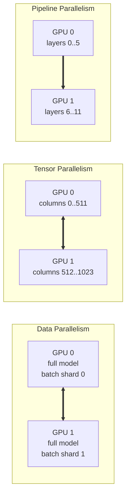
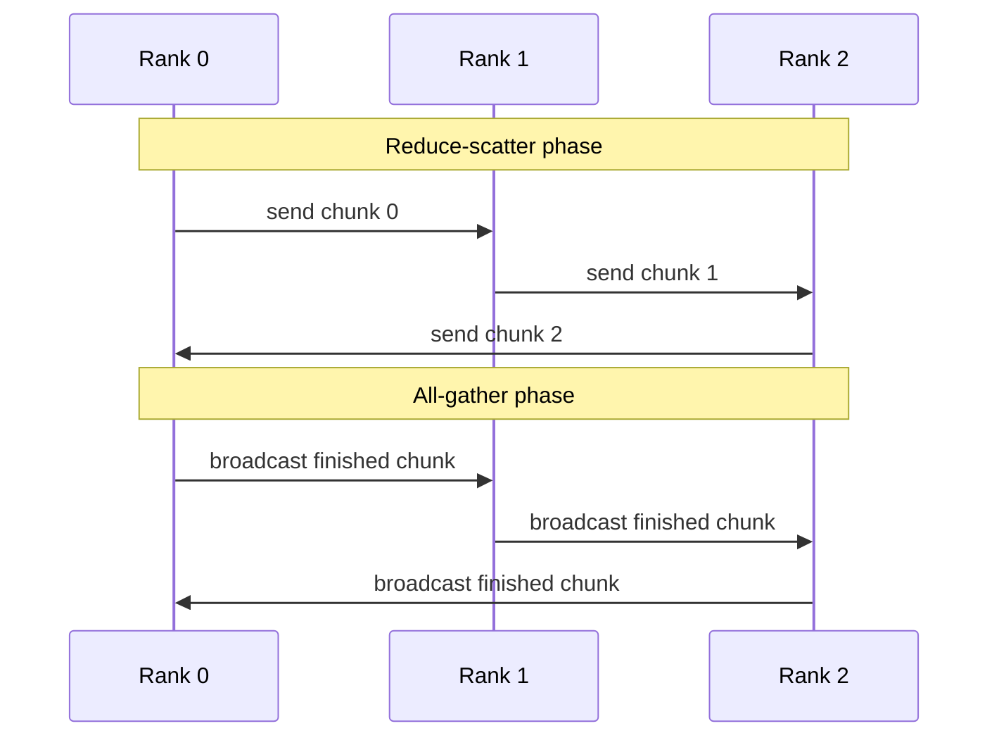
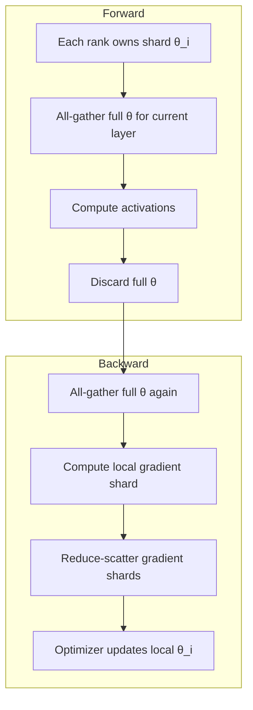
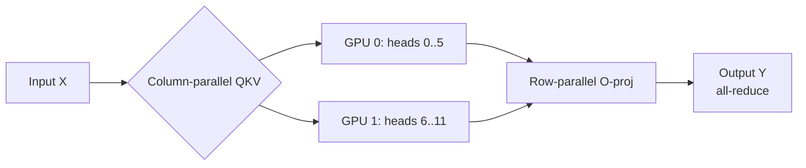
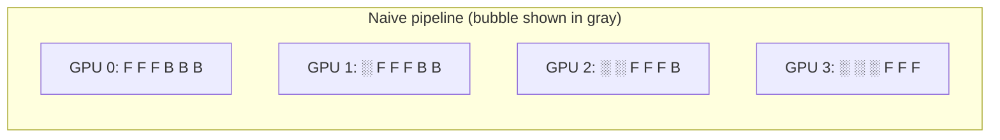
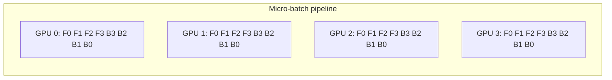
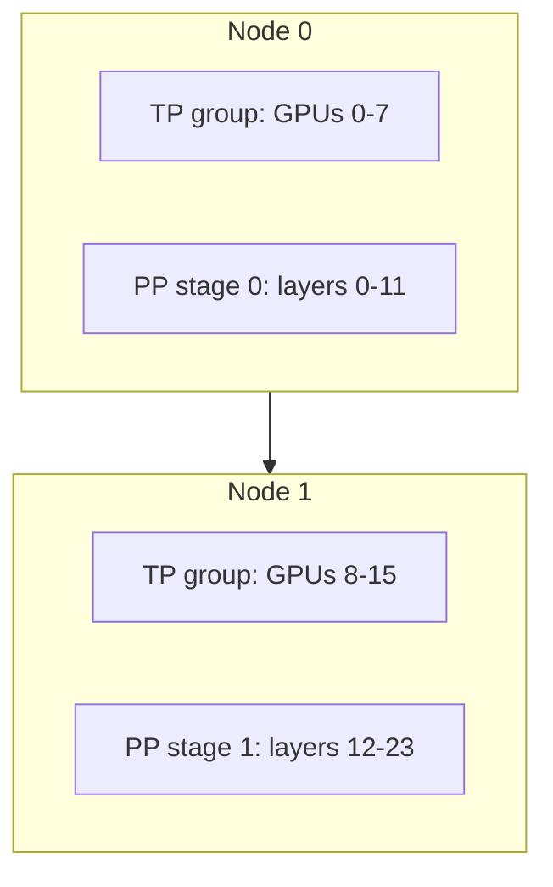

# Week 7 Instructor Notes — Distributed Training

> **Week theme**: From one GPU to many. How modern language models are trained across dozens, hundreds, or thousands of accelerators, and how the choices we made in earlier weeks (model architecture, optimizers, tokenizers, alignment) interact with scale.

---

## Goals for the Session

By the end of this 3-hour session students should be able to:

1. **Explain the four parallelism axes** used to train large models:
   - **Data Parallelism (DP / DDP)**: replicate the model, split the data.
   - **Tensor Parallelism (TP)**: split individual layers across devices.
   - **Pipeline Parallelism (PP)**: split layers sequentially across devices.
   - **Fully Sharded Data Parallelism (FSDP / ZeRO)**: shard parameters, gradients, and optimizer states.
2. **Launch a real multi-process PyTorch DistributedDataParallel job** using `torchrun` / `torch.multiprocessing` on both CPU (`gloo`) and GPU (`nccl`).
3. **Build quantitative intuition** for communication cost: all-reduce bandwidth, ring algorithm, scaling efficiency, and the difference between strong and weak scaling.
4. **Diagnose common distributed-training failures** (`MASTER_PORT` collisions, backend mismatches, hangs, diverging rank losses, deadlocks).
5. **Connect distributed training to other design choices**: why FSDP pairs well with **AdamW**, why **gradient clipping** and **mixed precision** change communication volume, and why **RMSNorm**, **SwiGLU**, **RoPE**, and **grouped query attention** are popular at scale.
6. **Compare training recipes**: DDP vs. FSDP vs. ZeRO-3 vs. 3D parallelism, and RLHF vs. RLVR for alignment.

---

## Why This Matters

Modern LLMs are trained on clusters, not on a single laptop GPU. A few motivating facts:

| Model | Params | Approx. GPUs | Training time | Parallelism used |
|-------|--------|--------------|---------------|------------------|
| GPT-3 (175B) | 175B | ~10,000 V100s | weeks | TP + PP + DP |
| LLaMA-2 70B | 70B | ~2,000 A100s | weeks | FSDP / TP / PP |
| Llama 3 405B | 405B | ~16,000 H100s | weeks | TP + DP + PP |
| DeepSeek-V3 | 671B (MoE) | thousands of H800s | weeks | EP + DP + TP + PP |

> **EP** = **Expert Parallelism**, used inside Mixture-of-Experts (MoE) models.

Training these models is a **systems problem**, not just a modeling problem. Every design decision has a distributed-systems consequence:

- **Batch normalization** is hard to synchronize across nodes → modern LLMs use **LayerNorm / RMSNorm**.
- **Learned positional embeddings** require storing a large embedding matrix → **RoPE** (rotary positional embeddings) became popular because it is parameter-free and composes cleanly with tensor parallelism.
- **Standard attention** has $\mathcal{O}(n^2)$ memory in sequence length → techniques like **FlashAttention**, **GQA**, and **sequence parallelism** reduce both memory and communication.
- **Dense models** with 70B+ parameters do not fit in a single GPU's 80 GB → **FSDP** shards weights, gradients, and optimizer states.
- **Alignment via RLHF** requires hosting a policy, a reference, a reward model, and a critic → distributed training and inference scheduling become critical.

In short: **if you cannot parallelize efficiently, you cannot train the model**.

---

## Suggested Timing (3 hours)

| Segment | Time | Activity | Notes |
|---------|------|----------|-------|
| **Opening & motivation** | 10 min | Why distributed training matters | Use the table above; ask students how big their laptop GPU memory is. |
| **Lecture: parallelism overview** | 30 min | DP, TP, PP, FSDP, 3D parallelism | Draw diagrams; compare pros/cons. |
| **Lecture: DDP internals** | 20 min | Rank, world, backends, all-reduce, `DistributedSampler` | Connect to `ddp_demo.py`. |
| **Live Demo 1: `ddp_demo.py`** | 20 min | Launch 2 CPU processes with `torchrun` | Show rank-specific prints and gradient sync. |
| **Break** | 10 min | — | — |
| **Lecture: FSDP / ZeRO** | 20 min | Sharding parameters, gradients, optimizer states | Connect to `fsdp_demo.py`. |
| **Live Demo 2: `fsdp_demo.py`** | 15 min | CPU syntax check or GPU run | Emphasize memory savings and extra communication. |
| **Lecture: communication cost** | 15 min | Ring all-reduce, bandwidth, scaling efficiency | Connect to `communication_cost.py`. |
| **Live Demo 3: `communication_cost.py`** | 10 min | Sweep world size and bandwidth | Fill the scaling-efficiency table live. |
| **Lab time** | 40 min | Students run demos and exercises | Circulate; help with `torchrun` setup. |
| **Wrap-up & discussion** | 10 min | Discussion prompts, homework | Exit ticket question. |

**Total**: 200 minutes ≈ 3 hours 20 minutes. Adjust by trimming live demos to 10 minutes if your cluster is slow.

---

## Lecture Outline

### 1. Why Distributed Training?

#### 1.1 The memory wall

A 70B-parameter model in **FP16/BF16** needs:

- **Parameters**: $70 \times 10^9 \times 2 \text{ bytes} = 140 \text{ GB}$
- **Gradients**: another 140 GB in FP16.
- **AdamW optimizer states** (momentum + variance in FP32): $2 \times 70 \times 10^9 \times 4 = 560 \text{ GB}$.
- **Activations** for a modest batch: tens to hundreds of GB.

Total: **> 1 TB of GPU memory** before activations. No single accelerator holds that. We must split across devices.

#### 1.2 The throughput wall

Training a 7B model on 1 T4 GPU might take months. On 8 A100s with good data parallelism it can take days. On hundreds of GPUs with 3D parallelism it can take hours per epoch. Distributed training is about both **capacity** (it fits) and **speed** (it finishes).

#### 1.3 Three (plus one) axes of parallelism

| Axis | What is split | Best for | Example framework |
|------|---------------|----------|-------------------|
| **Data Parallelism (DP/DDP/FSDP)** | The **data batch** | Small-to-medium models that fit on one GPU; scaling throughput | PyTorch DDP, FSDP |
| **Tensor Parallelism (TP)** | Individual **layers/weights** | Very wide layers (attention heads, MLP up-projection) | Megatron-LM, DeepSpeed Ulysses |
| **Pipeline Parallelism (PP)** | Model **depth / stages** | Very deep models; reduces point-to-point volume | PipeDream, PyTorch PiPPy |
| **Expert / Sequence Parallelism** | MoE experts or long **sequences** | MoE models, long-context training | DeepSpeed, Megatron-LM |



### 2. Data Parallelism with DDP

#### 2.1 The DDP recipe (per rank)

Each process/rank:

1. Loads a **full copy** of the model.
2. Samples a **different mini-batch** (usually via `DistributedSampler`).
3. Computes **local gradients**.
4. Calls **`all_reduce`** to sum/average gradients across ranks.
5. Runs `optimizer.step()` — because all ranks started from the same weights and receive the same averaged gradient, their weights stay identical.

Mathematically, this is equivalent to one large global batch:

```text
global_batch = local_batch_size × world_size
```

The local gradient on rank $r$ is:

```text
g_r = ∇L(θ; batch_r)
```

After all-reduce, every rank has:

```text
g_avg = (1 / R) × Σ_r g_r
```

where $R$ is the world size. This is the exact gradient of the loss on the global batch, **if the loss is an average over samples** (which cross-entropy is).

#### 2.2 Rank, world, backend

| Concept | Meaning | In the code |
|---------|---------|-------------|
| **World size** | Total number of processes | `world_size` argument / `WORLD_SIZE` env var |
| **Rank** | Unique 0-indexed process ID | `rank` argument / `RANK` env var |
| **Local rank** | ID inside a single node | `LOCAL_RANK` env var (used to pick GPU) |
| **Backend** | Communication library | `gloo` (CPU), `nccl` (NVIDIA GPU), `ucc` (generic) |

From `lab/ddp_demo.py`:

```python
os.environ.setdefault("MASTER_ADDR", "localhost")
os.environ.setdefault("MASTER_PORT", "12355")
dist.init_process_group(backend, rank=rank, world_size=world_size)
```

And later:

```python
device = torch.device(f"cuda:{rank}" if backend == "nccl" else "cpu")
model = TinyModel().to(device)
ddp_model = DDP(model, device_ids=[rank] if backend == "nccl" else None)
```

> **Teaching point**: DDP requires one process per GPU. Do not launch one process and move data to multiple GPUs inside it — that bypasses the distributed backend and will not synchronize gradients.

#### 2.3 All-reduce and the ring algorithm

The standard implementation of `all_reduce` for large tensors is the **ring all-reduce**. For $R$ ranks and a model with $P$ parameters, the total bytes moved over the network is:

```text
bytes ≈ 2 × (R - 1) / R × P × sizeof(param)
```

- **Reduce-scatter**: each rank receives a chunk of the summed gradient.
- **All-gather**: each rank broadcasts its completed chunk to all others.



For large $R$, the factor $2(R-1)/R$ approaches **2**, meaning every parameter is transmitted roughly twice. Communication volume therefore grows **linearly with model size**, not with world size.

#### 2.4 DistributedSampler

In the demo we use plain random data:

```python
torch.manual_seed(42 + rank)
x = torch.randn(256, 10)
y = torch.randint(0, 2, (256,))
```

This guarantees different shards per rank, but in production you should use:

```python
from torch.utils.data.distributed import DistributedSampler
sampler = DistributedSampler(dataset, num_replicas=world_size, rank=rank, shuffle=True)
loader = DataLoader(dataset, batch_size=..., sampler=sampler)
```

> **Key behavior**: call `sampler.set_epoch(epoch)` at the start of each epoch so shuffling changes every epoch. Without it, every epoch sees the same shard ordering.

### 3. Fully Sharded Data Parallelism (FSDP / ZeRO)

#### 3.1 The memory problem DDP cannot solve

DDP replicates the full model on every GPU. If the model does not fit on one GPU, DDP fails. FSDP addresses this by **sharding**.

#### 3.2 ZeRO stages

DeepSpeed ZeRO and PyTorch FSDP implement the same idea:

| Stage | Sharded | Memory per GPU (approx.) | Communication vs. DDP |
|-------|---------|--------------------------|-----------------------|
| **ZeRO-0 / DDP** | Nothing | Full model + grads + optimizer | Baseline |
| **ZeRO-1** | **Optimizer states** | Model + grads + (optimizer / R) | Same as DDP |
| **ZeRO-2** | Optimizer states + **gradients** | Model + (grads + optimizer) / R | Same as DDP |
| **ZeRO-3 / FSDP** | **Params + grads + optimizer** | (Model + grads + optimizer) / R | Higher (all-gather + reduce-scatter) |

PyTorch **FSDP** is essentially ZeRO-3 with auto-wrap policies.

#### 3.3 FSDP forward/backward flow



From `lab/fsdp_demo.py`:

```python
fsdp_model = FSDP(
    model,
    auto_wrap_policy=size_based_auto_wrap_policy(min_num_params=1000),
    device_id=device if backend == "nccl" else None,
)
```

`size_based_auto_wrap_policy` tells FSDP to wrap individual `nn.Linear` layers (or subtrees) that exceed 1,000 parameters. Smaller layers stay unsharded inside their parent; this trades memory for communication overhead.

#### 3.4 When to prefer FSDP over DDP

| Situation | Recommendation | Why |
|-----------|----------------|-----|
| Model fits in one GPU memory | **DDP** | Lower communication, simpler. |
| Model does not fit in one GPU | **FSDP / ZeRO-3** | Required for capacity. |
| Very large batches, small model | **DDP** | Better throughput per GPU. |
| Limited interconnect bandwidth | **DDP** | FSDP moves parameters twice per layer. |
| High-bandwidth NVLink / InfiniBand | **FSDP** | Extra communication is hidden by bandwidth. |

### 4. Tensor Parallelism (TP)

#### 4.1 Splitting a single linear layer

Consider a linear layer $Y = X W + b$ with input dim $d_{in}=1024$ and output dim $d_{out}=2048$. We can split $W$ **column-wise** across 2 GPUs:

```text
GPU 0: W[:, 0:1024]  →  Y0 = X W[:, 0:1024]
GPU 1: W[:, 1024:2048] →  Y1 = X W[:, 1024:2048]
Y = concat([Y0, Y1])
```

For the next layer we can split **row-wise** so the output of the column-parallel layer does not need to be all-gathered:

```text
GPU 0: W[0:1024, :]  →  receives Y0
GPU 1: W[1024:2048, :] →  receives Y1
Y = GPU0_out + GPU1_out   (all-reduce sum)
```

Megatron-LM's famous "column + row" pair keeps communication minimal.

#### 4.2 TP for attention

In multi-head attention we split **attention heads** across GPUs. Each GPU computes a subset of heads; the output projection is row-parallel so the final output is reduced across GPUs.



> **Teaching point**: TP requires very fast intra-node communication (NVLink) because every layer synchronizes. It is almost always used **inside a single node**, while DP/PP span nodes.

### 5. Pipeline Parallelism (PP)

#### 5.1 Splitting the model depth

A 24-layer transformer is split into 4 stages of 6 layers each:

```text
GPU 0: layers 0-5
GPU 1: layers 6-11
GPU 2: layers 12-17
GPU 3: layers 18-23
```

Forward pass: activations flow from GPU 0 → 1 → 2 → 3.  
Backward pass: gradients flow backwards.

#### 5.2 Bubble and micro-batching

The simplest pipeline (naive) leaves GPUs idle during the forward/backward bubble:



**Micro-batching** splits a batch into smaller chunks (e.g., batch 32 → 4 micro-batches of 8). This keeps the pipeline filled and reduces bubble size at the cost of higher activation memory.



> **Key formula**: bubble fraction ≈ $(P - 1) / M$ where $P$ = pipeline stages and $M$ = number of micro-batches. More micro-batches → less bubble.

### 6. 3D Parallelism and Modern Stacks

Real large-scale training combines DP, TP, and PP. For example, a 175B GPT-3 might use:

| Parallelism | World size | What it splits |
|-------------|------------|----------------|
| TP | 8 | Attention/MLP within a node |
| PP | 12 | Transformer layers across nodes |
| DP | 16 | Data batch across replicas |
| **Total GPUs** | **8 × 12 × 16 = 1,536** | — |



### 7. Communication Cost

#### 7.1 The ring-all-reduce formula

From `lab/communication_cost.py`:

```python
def all_reduce_volume(params, bytes_per_param=2.0, world_size=2):
    total_bytes = params * bytes_per_param
    return 2 * (world_size - 1) / world_size * total_bytes
```

For a 1B-parameter model in FP16 (2 bytes/param) on 8 GPUs:

```text
total_bytes = 1e9 × 2 = 2 GB
volume = 2 × 7/8 × 2 GB = 3.5 GB
```

At 400 Gbps (InfiniBand) with perfect utilization:

```text
bandwidth_bytes_per_ms = 400 × 1e9 / 8 / 1000 = 50 MB/ms
time = 3500 MB / 50 MB/ms = 70 ms
```

If compute time per step is 100 ms:

```text
total_time = 100 + 70 = 170 ms
overhead = 70 / 170 = 41%
```

#### 7.2 Strong vs. weak scaling

| Scaling type | What you keep constant | What you increase | Ideal behavior |
|--------------|------------------------|-------------------|----------------|
| **Strong scaling** | Total problem size (batch / data) | Number of GPUs | Time decreases linearly |
| **Weak scaling** | Problem size **per GPU** | Number of GPUs | Total throughput increases linearly |

LLM training is usually **weak scaling**: each GPU keeps the same local batch size, and we increase the global batch size with the cluster size. This is why learning-rate schedules must be adjusted when scaling up.

### 8. Algorithm Comparisons

This section places distributed training in the broader context of modern LLM design. Use it to reinforce ideas from previous weeks.

#### 8.1 DDP vs. FSDP

| Dimension | **DDP** | **FSDP (ZeRO-3)** |
|-----------|---------|-------------------|
| **Memory per GPU** | Full model + full grads + full optimizer | (model + grads + optimizer) / world_size |
| **Communication per step** | One all-reduce of gradients | All-gather params + reduce-scatter grads + all-gather params again |
| **Maximum model size** | Fits in single GPU | Can scale to trillion-parameter models |
| **Implementation** | `torch.nn.parallel.DistributedDataParallel` | `torch.distributed.fsdp.FullyShardedDataParallel` |
| **Best for** | Models ≤ ~7B params on 8×A100 | Models > ~7B params or limited GPU memory |
| **Pitfall** | Assumes model fits on one GPU | Requires careful auto-wrap policy; can be slower on slow interconnect |

#### 8.2 Tensor Parallelism vs. Pipeline Parallelism

| Dimension | **Tensor Parallelism (TP)** | **Pipeline Parallelism (PP)** |
|-----------|------------------------------|-------------------------------|
| **Splits** | Width of a layer | Depth / stages of the model |
| **Communication** | All-reduce / all-gather every layer | Point-to-point activations between stages |
| **Communication frequency** | High, within every layer | Lower, only between stages |
| **Hardware requirement** | Fast intra-node NVLink | Can tolerate slower inter-node links |
| **Drawback** | Splits attention heads; limited by layer width | Pipeline bubble; activation memory for micro-batches |
| **Best for** | Very wide layers, attention heads | Very deep models, sequential layers |

#### 8.3 LayerNorm vs. RMSNorm

| Dimension | **LayerNorm** | **RMSNorm** |
|-----------|---------------|-------------|
| **Formula** | $\hat{x} = \frac{x - \mu}{\sqrt{\sigma^2 + \epsilon}}$ | $\hat{x} = \frac{x}{\sqrt{\text{mean}(x^2) + \epsilon}}$ |
| **Mean centering?** | Yes | No |
| **Parameters** | $\gamma$ (and optionally $\beta$) | $\gamma$ only |
| **Compute cost** | Slightly higher (mean + variance) | Slightly lower |
| **Use in modern LLMs** | Original Transformer, BERT, GPT-2 | LLaMA, Mistral, Qwen, many modern LLMs |
| **Why it matters at scale** | Slightly more sync; RMSNorm simpler and often just as stable | Reduces per-device computation and memory pressure in TP/PP |

**Concrete example**:

```python
x = torch.tensor([1.0, 2.0, 3.0])
# LayerNorm
mean = x.mean()          # 2.0
var = x.var(unbiased=False)  # 2/3 ≈ 0.667
ln = (x - mean) / torch.sqrt(var + 1e-6)
# RMSNorm
rms = torch.sqrt((x ** 2).mean() + 1e-6)  # sqrt(14/3) ≈ 2.16
rmsnorm = x / rms
```

#### 8.4 RoPE vs. Learned Absolute Positional Embeddings

| Dimension | **Learned absolute embeddings** | **RoPE (Rotary Position Embedding)** |
|-----------|----------------------------------|--------------------------------------|
| **Parameters** | $d_{model} \times \text{max\_seq\_len}$ | None (closed-form rotation) |
| **Extrapolation** | Poor beyond training length | Better (especially with scaling tweaks like NTK / YaRN) |
| **Interaction with TP** | Embedding matrix must be replicated or split carefully | Applied per head; composes cleanly with TP |
| **Relative positions** | Not explicit | Encoded by rotation angles $m \theta_i$ |
| **Used in** | Original Transformer, GPT, BERT | LLaMA, PaLM, Mistral, Qwen, most modern LLMs |

**RoPE formula (pairwise)**:

For a 2D pair $(x_m^{(1)}, x_m^{(2)})$ at position $m$ and base angle $\theta$:

```text
[ cos(mθ)  -sin(mθ) ] [ x_m^(1) ]
[ sin(mθ)   cos(mθ) ] [ x_m^(2) ]
```

At position $m=0$, the rotation is the identity; at larger $m$ the vector rotates by $m\theta$. Relative distance $n$ appears as a rotation by $n\theta$ in the attention inner product.

#### 8.5 BPE vs. SentencePiece

| Dimension | **BPE (Byte-Pair Encoding)** | **SentencePiece (Unigram / BPE)** |
|-----------|------------------------------|-----------------------------------|
| **Training** | Merge most frequent pairs greedily | Starts with large vocabulary, prunes tokens by likelihood |
| **Pre-tokenization** | Usually required (whitespace, punctuation) | Treats text as raw stream; no pre-tokenizer needed |
| **Language agnostic** | Works best with space-delimited languages | Better for languages without spaces (Chinese, Japanese) |
| **Vocabulary pruning** | Harder | Natural via unigram probability |
| **Used in** | GPT-2, RoBERTa, LLaMA (BPE variant) | T5, PaLM, Qwen, many multilingual models |
| **At-scale relevance** | SentencePiece avoids brittle pre-tokenization when training on 100+ languages | |

**Concrete BPE example**:

```text
Corpus: "aaabdaaabac"
Initial vocabulary: {a, b, c, d}
Most frequent pair: "aa" → add "aa"
Next: "aaa" or "aa" again → add "aaa"
Final vocab may include {a, b, c, d, aa, aaa, aab, ...}
```

#### 8.6 RLHF vs. RLVR (Reinforcement Learning from Verifiable Rewards)

| Dimension | **RLHF** | **RLVR** |
|-----------|----------|----------|
| **Reward source** | Learned reward model (often trained on human preferences) | Verifiable signal: unit tests, math answer check, compiler output |
| **Reward model drift** | Yes — can overoptimize to proxy | No — reward is ground-truth (modulo false positives) |
| **Data needs** | Human preference pairs | Problems with known answers / tests |
| **Algorithms** | PPO, DPO, IPO | PPO, GRPO, REINFORCE, direct policy gradient |
| **Use cases** | General helpfulness, style, safety | Code generation, math, theorem proving, puzzle solving |
| **At-scale relevance** | Requires hosting policy + reference + reward + critic | Often simpler reward model; used in DeepSeek-R1, OpenAI o1-style training |

> **Teaching point**: RLVR is booming because verifiable rewards avoid the "reward hacking" problem of learned reward models and reduce the number of models that must be co-located during distributed training.

### 9. Mixed Precision, Gradient Clipping, and Communication

#### 9.1 Mixed precision

Using **FP16/BF16** for forward/backward and **FP32** for the optimizer master weights halves all-reduce volume:

```text
DDP all-reduce volume (FP32) ≈ 2 × P × 4 bytes = 8P bytes
DDP all-reduce volume (FP16) ≈ 2 × P × 2 bytes = 4P bytes
```

PyTorch DDP/FSDP automatically handle FP16/BF16 via `torch.cuda.amp` or `torch.compile`.

#### 9.2 Gradient clipping

Clipping is applied **after** gradients are synchronized, so every rank clips the same averaged gradient. Code pattern:

```python
loss.backward()
torch.nn.utils.clip_grad_norm_(ddp_model.parameters(), max_norm=1.0)
optimizer.step()
```

If you clip **before** all-reduce, ranks will clip different local gradients and the model copies will diverge.

---

## Common Misconceptions / Pitfalls

| Misconception | Why it is wrong | How to avoid |
|---------------|-----------------|--------------|
| "DDP makes the batch size bigger for free." | Communication and memory costs grow; very large batches need learning-rate warmup and LR scaling. | Track throughput (tokens/s) and validation loss, not just wall-clock time. |
| "FSDP is always faster than DDP." | FSDP adds all-gather/reduce-scatter overhead; on slow networks DDP can be faster for models that fit. | Benchmark both; prefer DDP when model fits. |
| "I can run DDP inside a Jupyter notebook cell." | `mp.spawn` and `torchrun` need separate processes; notebooks usually have one process. | Use scripts and terminal; or use `torchrun` from a notebook with `%%bash` magic carefully. |
| "Different losses per rank mean the model is broken." | In DDP each rank sees different data, so **local** losses differ; the **gradients** are synchronized. | Use `DistributedSampler`, verify `loss.backward()` calls all-reduce, and compare weights after `step()`. |
| "All-reduce time does not depend on world size." | Volume per rank approaches a constant, but latency and contention grow with more nodes. | Measure with `communication_cost.py`; use NVLink/InfiniBand. |
| "Tensor parallelism works across slow networks." | TP synchronizes every layer; slow links kill throughput. | Keep TP inside a node (NVLink). |
| "Pipeline parallelism has no overhead." | The pipeline bubble leaves GPUs idle unless micro-batches fill the pipe. | Use enough micro-batches; formula: bubble ≈ (P-1)/M. |
| "I should always use the largest batch size that fits." | Large batches can degrade generalization and require LR adjustments. | Use linear LR scaling or square-root scaling rules; monitor validation. |
| "FSDP and ZeRO are totally different." | PyTorch FSDP implements the same sharding idea as DeepSpeed ZeRO-3. | Explain them as the same conceptual stage with different APIs. |

---

## Teaching Tips for the 3-Hour Session

### Opening hook (5 minutes)

Ask: *"How much GPU memory do you have?"* On a laptop it might be 0–16 GB. Then show the 70B-parameter memory table. The gap creates the motivation.

### Lecture checkpoints

After each major concept, pause for a **check-for-understanding** question:

1. After DDP: *"If world size is 4 and local batch is 8, what is the global batch?"* (Answer: 32.)
2. After all-reduce: *"Does all-reduce move more data for a 1B model on 2 GPUs or 8 GPUs?"* (Answer: per-rank volume is similar; total volume grows slightly then saturates at ~2× model size.)
3. After FSDP: *"Why can FSDP train a model that DDP cannot?"* (Answer: it shards parameters.)
4. After TP vs. PP: *"Which one needs NVLink, and which one has a bubble?"* (TP needs NVLink; PP has a bubble.)

### Live-demo talking points

#### `ddp_demo.py`

```bash
python -m torchrun --nproc_per_node=2 teaching/week07/lab/ddp_demo.py
```

**Talking points**:

- Show the two rank-specific loss prints. They differ because each rank sees a different data shard.
- Add a print after `loss.backward()` showing a local gradient — it will differ across ranks **before** all-reduce.
- After `optimizer.step()`, verify that `list(model.parameters())[0]` is identical on both ranks (they should converge together).
- Change `world_size` to 4 and observe the throughput; on CPU it may actually slow down due to contention — discuss why.

#### `fsdp_demo.py`

```bash
python -m torchrun --nproc_per_node=2 teaching/week07/lab/fsdp_demo.py
```

**Talking points**:

- On CPU this runs for syntax; on GPU it shows memory savings.
- Explain `size_based_auto_wrap_policy(min_num_params=1000)`: each `nn.Linear(64,128)` has 64×128 + 128 = 8,320 params, so it gets wrapped individually.
- If you have GPUs, run `nvidia-smi` in another terminal and watch memory usage per process.
- Compare peak memory with DDP for the same model by temporarily wrapping with DDP instead of FSDP.

#### `communication_cost.py`

```bash
python teaching/week07/lab/communication_cost.py \
    --params 1e9 \
    --world_size 8 \
    --bandwidth 400 \
    --step_time_ms 100
```

**Talking points**:

- Sweep world size and bandwidth live. Ask students to predict before you run.
- Show that at 100 Gbps a 1B model spends most of its time communicating, while at 800 Gbps communication is almost hidden.
- Connect to real hardware: NVLink ~900 GB/s, InfiniBand NDR ~400 Gbps, cloud Ethernet ~25–100 Gbps.

### Engagement questions

- *"You have 8 A100s and a 13B model. DDP or FSDP?"* (DDP likely fits; simpler.)
- *"You have 8 A100s and a 70B model. DDP or FSDP?"* (FSDP required.)
- *"You have 64 H100s across 8 nodes and a 405B model. What parallelism mix?"* (TP within node, PP across nodes, DP across replicas.)
- *"Why did LLaMA choose RMSNorm over LayerNorm?"* (Simpler, no mean subtraction, works well at scale.)
- *"Why did modern LLMs move from learned absolute embeddings to RoPE?"* (No extra parameters, better extrapolation, clean TP composition.)

### Lab-time strategy

1. First 10 minutes: make sure everyone can launch `ddp_demo.py` with 2 CPU processes.
2. Next 15 minutes: have students complete Exercise 7.2 (scaling table) using `communication_cost.py`.
3. Next 15 minutes: challenge students to add `DistributedSampler` to `ddp_demo.py` (Exercise 7.3).
4. Final 10 minutes: group share-out of the most surprising result from the scaling table.

---

## Live Demo Script

### Demo 1 — DDP on CPU

1. Open `lab/ddp_demo.py` and walk through:
   - `setup_distributed`
   - `TinyModel`
   - `DDP` wrapper
   - the per-rank data shard
2. Run:
   ```bash
   python -m torchrun --nproc_per_node=2 teaching/week07/lab/ddp_demo.py --epochs 3 --batch_size 32
   ```
3. Expected output: two lines per epoch, one per rank, with similar but not identical losses.
4. On a multi-GPU machine run:
   ```bash
   python -m torchrun --nproc_per_node=2 teaching/week07/lab/ddp_demo.py --backend nccl
   ```

### Demo 2 — FSDP

1. Open `lab/fsdp_demo.py` and highlight:
   - `FSDP(...)` wrapper
   - `size_based_auto_wrap_policy`
   - `device_id=device` for GPU
2. Run on CPU for syntax:
   ```bash
   python -m torchrun --nproc_per_node=2 teaching/week07/lab/fsdp_demo.py --epochs 2
   ```
3. If GPUs are available, run with `--backend nccl` and monitor memory.

### Demo 3 — Communication Cost

1. Run the baseline:
   ```bash
   python teaching/week07/lab/communication_cost.py --params 1e9 --world_size 8 --bandwidth 400 --step_time_ms 100
   ```
2. Run a low-bandwidth scenario:
   ```bash
   python teaching/week07/lab/communication_cost.py --params 1e9 --world_size 8 --bandwidth 50 --step_time_ms 100
   ```
3. Discuss: at 50 Gbps communication dominates; scaling efficiency collapses.

---

## Lab Instructions for Students

### Required setup

1. Navigate to the week07 directory:
   ```bash
   cd teaching/week07
   ```
2. Ensure PyTorch is installed. If not:
   ```bash
   pip install torch
   ```

### Exercise sequence

1. **Launch DDP on your machine** (Exercise 7.1)
   - CPU:
     ```bash
     python -m torchrun --nproc_per_node=2 lab/ddp_demo.py
     ```
   - GPU:
     ```bash
     python -m torchrun --nproc_per_node=2 lab/ddp_demo.py --backend nccl
     ```
   - Deliverable: terminal output showing both ranks.

2. **Scaling-efficiency table** (Exercise 7.2)
   - Use `lab/communication_cost.py` to fill a table for:
     - world sizes: `[2, 4, 8]`
     - bandwidths: `[100, 400, 800]` Gbps
     - model: 1B params, 2 bytes/param, 100 ms compute
   - Deliverable: `exercises/scaling_table.md`.

3. **DistributedSampler** (Exercise 7.3)
   - Modify `lab/ddp_demo.py` to use `torch.utils.data.distributed.DistributedSampler`.
   - Add `sampler.set_epoch(epoch)` each epoch.
   - Verify each rank processes a non-overlapping shard.
   - Deliverable: `exercises/ddp_with_sampler.py`.

4. **FSDP memory comparison** (Exercise 7.4, if GPUs available)
   - Run `lab/fsdp_demo.py` on 2+ GPUs.
   - Measure peak memory per GPU with `nvidia-smi` or `torch.cuda.max_memory_allocated()`.
   - Compare with DDP on the same model.
   - Deliverable: `exercises/fsdp_memory_report.md`.

5. **Parallelism comparison** (Exercise 7.5)
   - Write a one-page comparison of DP, TP, and PP covering:
     - What is split across devices.
     - Communication pattern.
     - Best use case.
     - A real-world model that uses it.
   - Deliverable: `exercises/parallelism_comparison.md`.

### Optional stretch goals

- Launch DDP with 4 CPU processes and explain why throughput may not scale linearly.
- Profile `communication_cost.py` for a 7B and 70B model at 800 Gbps; discuss feasibility.
- Read `docs/en/chapter8/chapter8_第八章分布式训练.md` and identify one additional detail not covered in lecture.

---

## Discussion Prompts

Use these during lecture, lab, or the wrap-up:

1. **Why does DDP scale well for small models but poorly for very large ones?**
   - Small models: communication volume is tiny relative to compute; all-reduce is hidden.
   - Large models: all-reduce volume grows with model size; can saturate bandwidth.

2. **When would you prefer FSDP over DDP?**
   - When the model does not fit in a single GPU, or when you want larger effective batch sizes without replicating optimizer states.

3. **What is the theoretical speedup of data parallelism with 8 GPUs if communication is free?**
   - **8×** under weak scaling (same local batch). Under strong scaling it depends on Amdahl's law; not all operations parallelize perfectly.

4. **Why must `DistributedSampler` be used with DDP?**
   - To avoid every rank training on the same mini-batch, which would waste compute and produce identical (not averaged) gradients.

5. **Why is tensor parallelism usually limited to a single node?**
   - It synchronizes every layer; cross-node bandwidth is too slow.

6. **What is the pipeline bubble, and how do you reduce it?**
   - Idle time while the first/last stages finish; reduce by increasing the number of micro-batches.

7. **How does mixed precision change communication cost?**
   - FP16/BF16 halves the bytes moved during all-reduce compared to FP32.

8. **Why are verifiable rewards (RLVR) attractive at scale?**
   - They avoid reward-model drift and reduce the number of auxiliary models that must be co-scheduled during distributed RL.

---

## Troubleshooting

| Issue | Cause | Fix |
|-------|-------|-----|
| `Address already in use` | `MASTER_PORT` is occupied by another process | Change `MASTER_PORT` or kill the old process: `lsof -i :12355` |
| `Connection refused` | `MASTER_ADDR` points to a wrong/unreachable host | Use `localhost` for single-node; use the head-node IP for multi-node |
| DDP hangs | Backend mismatch (`gloo` vs `nccl`), rank mismatch, or one rank crashed | Use `gloo` for CPU, `nccl` for CUDA; check all ranks use same `world_size` |
| Different losses per rank | Data not sharded properly | Use `DistributedSampler`; ensure `sampler.set_epoch(epoch)` is called |
| Gradients not equal after step | `DDP` wrapper missing or `loss.backward()` not called on all ranks | Wrap model with `DDP`; check no rank skips batches |
| FSDP out-of-memory | Auto-wrap policy too coarse or activation memory too large | Use smaller `min_num_params`, gradient checkpointing, or activation checkpointing |
| CPU DDP is slower than serial | Process overhead + GIL contention on small models | Expected for tiny models; use real GPUs or larger workloads |
| `CUDA error: invalid device ordinal` | `--nproc_per_node` exceeds available GPUs | Set `--nproc_per_node` to the number of GPUs |
| NCCL timeout | Slow network or mismatched tensor shapes | Check all ranks create tensors of the same shape and dtype |

---

## Homework / Follow-Up

### Reading

- Read `docs/en/chapter8/chapter8_第八章分布式训练.md` in full.
- Skim the Megatron-LM paper (Shoeybi et al., 2019) for tensor-parallelism details.
- Skim the DeepSpeed ZeRO paper (Rajbhandari et al., 2020) for ZeRO-1/2/3 stages.

### Coding

- Implement a minimal ring-all-reduce in NumPy for a 1D tensor and verify it matches `dist.all_reduce`.
- Extend `communication_cost.py` to model a **3D parallelism** setup: TP inside node, PP across nodes, DP across replicas. Compute total communication time.
- Modify `ddp_demo.py` to log global throughput (samples/sec) across all ranks.

### Writing

- Write a one-page decision tree: *"Given model size, GPU memory, cluster size, and interconnect bandwidth, which parallelism strategy should I choose?"*
- Compare RLHF and RLVR for a coding-assistant scenario. Which reward signal would you use?

### Next session connection

Week 8 studies **scaling laws**: how model size and data jointly determine final loss. The distributed-training decisions made this week directly determine which points on the scaling-law curve are reachable (e.g., training a 70B model requires the parallelism strategies covered today).

---

## Quick Reference: One-Liners

| Task | Command |
|------|---------|
| DDP on 2 CPU processes | `python -m torchrun --nproc_per_node=2 lab/ddp_demo.py` |
| DDP on 2 GPUs | `python -m torchrun --nproc_per_node=2 lab/ddp_demo.py --backend nccl` |
| FSDP on 2 CPUs (syntax) | `python -m torchrun --nproc_per_node=2 lab/fsdp_demo.py` |
| Communication cost baseline | `python lab/communication_cost.py --params 1e9 --world_size 8 --bandwidth 400` |

---

*End of Week 7 instructor notes.*
