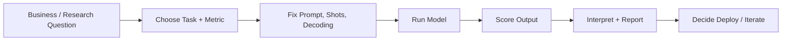
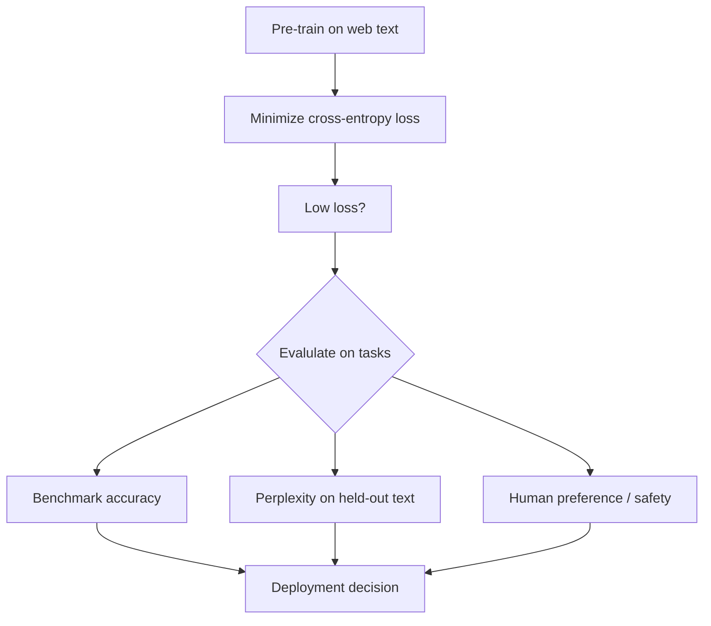
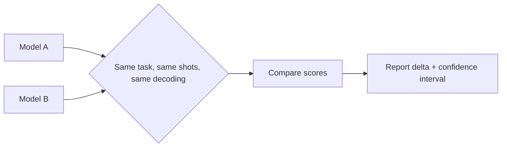
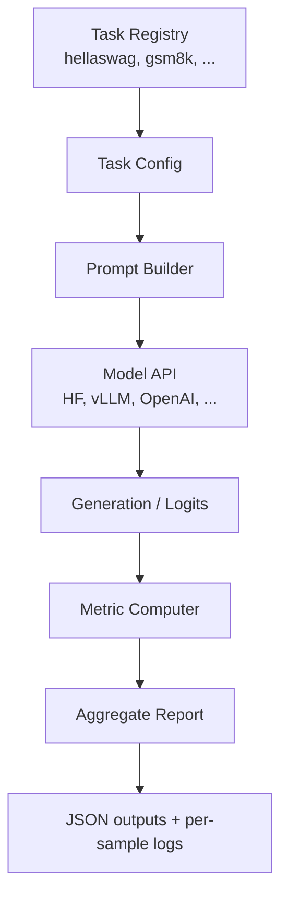
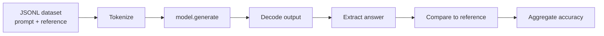

# Week 12 Instructor Notes — Evaluation Frameworks (3-Hour Session)

> This session closes the build-train-align-eval loop that students have followed since Week 1. Everything before today was about *producing* a model; today is about rigorously *judging* that model.

---

## Goals for the Session

1. **Teach students how to evaluate LLMs rigorously.**
   - Distinguish training loss, perplexity, benchmark accuracy, and real-world utility.
   - Explain what each metric actually measures and what it leaves out.
   - Show how evaluation design shapes model development (Goodhart’s law).

2. **Demonstrate standard frameworks and custom evaluation construction.**
   - Run the **EleutherAI `lm-evaluation-harness`** through `lab/lm_eval_demo.py`.
   - Build a domain-specific evaluator with `lab/custom_eval.py`.
   - Introduce **evalscope** as a visual/aggregated alternative.

3. **Emphasize fair comparison practices.**
   - Same prompt template, same shot count, same decoding hyperparameters, same split.
   - Why cost, latency, and qualitative inspection must accompany scores.

4. **Prepare students to write a defensible evaluation report.**
   - At least one standard benchmark result.
   - At least one custom task result.
   - Side-by-side comparison of two models.

---

## Why This Matters

Modern LLMs are released with long leaderboard tables, but **a score is not a capability**. In production you care about:

- **Correctness on the long tail** — rare user queries, edge cases, adversarial inputs.
- **Cost and latency** — a 2% better model that costs 10× more to serve may not be the right choice.
- **Alignment with user intent** — instruction following, tone, safety, and refusal behavior.
- **System-level behavior** — retrieval, tool use, multi-turn memory, and guardrails matter as much as base model perplexity.

Real-world evaluation is therefore a **systems engineering task**:



Without disciplined evaluation, teams routinely ship models that are overfit to public benchmarks, contaminated by pre-training data, or silently worse on the tasks their users actually care about. This session gives students the tools to avoid those traps.

---

## Suggested Timing (3 hours)

| Segment | Time | Activity | Instructor Notes |
|---------|------|----------|------------------|
| **1. Lecture: why evaluate + perplexity** | 20 min | Slides + whiteboard formulas | Start with the "evaluation crisis" poll. |
| **2. Lecture: benchmarks, shots, fair comparison** | 20 min | Tables + examples | Use concrete prompts on the board. |
| **3. Live demo: `lm_eval_demo.py`** | 25 min | Run on `gpt2` + inspect outputs | Show JSON report structure. |
| **4. Live demo: `custom_eval.py`** | 20 min | Build/tweak a custom task | Change a metric and re-run live. |
| **Break** | 10 min | — | — |
| **5. Lecture: validity, contamination, LLM-as-judge** | 15 min | Conceptual + diagrams | Tie back to data leakage discussion. |
| **6. Live demo / overview: `evalscope_demo.py`** | 15 min | Dashboard or config walkthrough | Usually optional if install is heavy. |
| **7. Lab time** | 40 min | Students run evaluations | Circulate; insist on a second model comparison. |
| **8. Wrap-up + course recap** | 15 min | Discuss results + next steps | Collect one surprising result from each table. |

**Teaching tip:** Keep a visible “Fair Comparison Checklist” on a slide throughout the session. Students should mentally tick it every time they see a leaderboard.

---

## Lecture Outline

### 1. Why Evaluate?

- **Training optimizes a proxy loss**, not downstream value.
  - Pre-training minimizes cross-entropy on internet text.
  - A model with lower training loss may still generate unsafe, unhelpful, or factually wrong outputs.
- **Benchmarks approximate capabilities** under controlled conditions.
  - They are simplified, reproducible, and comparable.
  - They are *not* the real world.
- **Evaluation decides deployment.**
  - Which checkpoint to release, which hyperparameters to freeze, when a model is "good enough."
- **The evaluation crisis.**
  - Benchmarks saturate (MMLU-Pro was created because MMLU became too easy).
  - Leaderboards can be gamed via prompt mining, test-set contamination, or length bias.
  - No single number captures everything we care about.



### 2. Perplexity: The Intrinsic Metric

**Definition.** For a dataset $D$ of $N$ tokens $x_1, \dots, x_N$, perplexity is the exponentiated average negative log-likelihood:

$$
\text{PPL}(D) = \exp\!\left( -\frac{1}{N} \sum_{i=1}^{N} \log p_{\theta}(x_i \mid x_{<i}) \right)
$$

- Lower is better.
- It measures how "surprised" the model is by each next token.
- It is **smooth** and **continuous**, which makes it excellent for scaling-law analysis.

**Toy example.** Suppose a model assigns the following probabilities to the next token:

| Token | Model probability | $-\log p$ |
|-------|-------------------|------------|
| `the` | 0.50 | 0.693 |
| `cat` | 0.25 | 1.386 |
| `.`   | 0.80 | 0.223 |
| **Average** | — | **0.767** |

Then $\text{PPL} = e^{0.767} \approx 2.15$.

**When to use it.**

| Use case | Why perplexity works |
|----------|----------------------|
| Pre-training progress | Directly tied to the loss being minimized. |
| Scaling-law experiments | Smooth function of model/data size. |
| Comparing base LMs on the same corpus | No annotation needed. |

**When *not* to use it.**

| Limitation | Explanation |
|------------|-------------|
| Not comparable across tokenizers | Different token vocabularies give different token counts. |
| Hard to verify for black-box APIs | Requires per-token log-probabilities. |
| Can be low while outputs are useless | A model can model web text well but hallucinate facts. |
| UNK / normalization tricks matter | Earlier models mapped rare words to `<unk>`, distorting PPL. |

### 3. Standard Benchmarks

A good benchmark is a **standardized dataset + metric + evaluation protocol**. Group them by capability:

| Capability | Benchmarks | Typical metric |
|------------|------------|----------------|
| **Language understanding** | HellaSwag, ARC (Easy/Challenge), OpenBookQA, BoolQ | Accuracy |
| **Knowledge / QA** | TriviaQA, Natural Questions, MMLU, MMLU-Pro | Accuracy / EM |
| **Math reasoning** | GSM8K, MATH, HumanEval (code), MBPP | Accuracy / pass@k |
| **Instruction following** | IFEval, AlpacaEval, WildBench | Constraint accuracy / LLM-as-judge |
| **Agentic / tool use** | SWE-Bench, CyBench, MLEBench | Pass rate / solved tasks |
| **Safety / alignment** | HarmBench, AIR-Bench, MT-Bench | Refusal rate / judge score |
| **Pure reasoning** | ARC-AGI, Big-Bench | Task-specific accuracy |

**Concrete example: HellaSwag.**

```text
Context: A woman is outside with a dog and a bucket.
         The dog runs around to avoid the bath. She...

A. Washes the bucket with soap, then blow-dries the dog's head.
B. Uses a hose to prevent it from getting wet.
C. Gets the dog wet, and it runs away again.
D. Gets into the bathtub with the dog.

Correct answer: C
```

This is a **commonsense reasoning** benchmark framed as multiple-choice sentence completion. The model must rank the most plausible continuation, not just produce fluent text.

**Concrete example: MMLU vs MMLU-Pro.**

| Feature | MMLU | MMLU-Pro |
|---------|------|----------|
| Options | 4 choices | 10 choices |
| Difficulty | Many easy / noisy questions | Curated harder questions |
| CoT standard | Usually direct | Usually chain-of-thought |
| Saturation | Many models > 90% | Spreads models out more |

### 4. Zero-Shot vs Few-Shot vs Chain-of-Thought

**Definitions.**

| Setting | Prompt contains... | Best for... |
|---------|---------------------|-------------|
| **Zero-shot** | Task instruction only | Quick screening, human-like first attempt, short contexts. |
| **Few-shot** | Task instruction + $K$ examples | Guiding output format, boosting performance without fine-tuning. |
| **Chain-of-thought (CoT)** | Instruction to "think step by step" | Math, logic, multi-hop reasoning. |
| **Few-shot + CoT** | Both examples and reasoning traces | Hard reasoning tasks (GSM8K, MATH). |

**Toy prompt comparison.**

Zero-shot:
```text
Q: Solve 2 + 3
A:
```

Few-shot ($K=2$):
```text
Q: Solve 1 + 1
A: 2

Q: Solve 5 - 2
A: 3

Q: Solve 2 + 3
A:
```

Few-shot + CoT:
```text
Q: Solve 1 + 1
A: 1 + 1 = 2. The answer is 2.

Q: Solve 5 - 2
A: 5 - 2 = 3. The answer is 3.

Q: Solve 2 + 3
A:
```

**Important nuance.** More shots is not always better:

- Context length limits eat into the available prompt budget.
- Recency bias can make the model parrot the *last* example rather than follow the underlying pattern.
- For small models, long few-shot prompts can degrade performance due to attention dilution.

### 5. Fair Comparison

A fair model comparison controls every variable except the model itself.

| Variable | Why it matters | Typical fixed value |
|----------|----------------|---------------------|
| **Prompt template** | Different phrasing can swing accuracy by double digits. | Use the benchmark's official template. |
| **Number of shots** | More shots usually help; compare only equal $K$. | 0, 5, or benchmark default. |
| **Decoding hyperparameters** | `temperature`, `top_p`, `max_new_tokens` change outputs. | Greedy (`do_sample=False`) for reproducibility. |
| **Evaluation split** | Test vs validation vs contaminated data. | Official test split. |
| **Tokenizer / chat template** | Different tokenizers change effective context and answer extraction. | Use each model's native template when comparing chat models. |
| **Batch size / hardware** | Affects numerical determinism on some kernels; mostly affects speed. | Report hardware and batch size. |

**Golden rule:** *If you change two things at once, you cannot attribute the score delta.*



### 6. `lm-evaluation-harness` Architecture

The lab script `lab/lm_eval_demo.py` checks whether `lm_eval` is installed and, if so, invokes the official CLI:

```bash
python -m lm_eval \
  --model hf \
  --model_args pretrained=gpt2 \
  --tasks hellaswag \
  --num_fewshot 0 \
  --batch_size 1 \
  --device cpu \
  --output_path week12/outputs/lm_eval \
  --log_samples
```

**What happens under the hood:**



- **Task registry:** defines prompts, answer choices, and metrics.
- **Model API:** abstracts Hugging Face Transformers, vLLM, OpenAI API, etc.
- **Metric computer:** exact match, loglikelihood-rank, BLEU, pass@k, etc.
- **Output:** aggregate scores plus per-sample predictions (`--log_samples`).

### 7. Custom Evaluation Pipeline (`custom_eval.py`)

For domain-specific tasks you usually cannot use a public benchmark. The lab script implements a minimal but complete evaluator:



Key code paths:

```python
# 1. Deterministic generation (greedy)
outputs = model.generate(
    **inputs,
    max_new_tokens=max_new_tokens,
    do_sample=False,
    pad_token_id=tokenizer.eos_token_id,
)
generated = tokenizer.decode(outputs[0], skip_special_tokens=True)

# 2. Reference-aware extraction
if isinstance(reference, int):
    predicted = extract_number(generated)  # last integer in text
    match = predicted == reference
else:
    predicted = generated.lower()
    match = reference in predicted        # substring match
```

**Why this matters:** `custom_eval.py` shows that evaluation is just four components:

1. A dataset of `(prompt, reference)` pairs.
2. A generation function.
3. A metric/extraction function.
4. An aggregator.

### 8. `evalscope` Overview

`evalscope` (ModelScope) is an alternative framework with a dashboard and built-in aggregation.

- The lab script `lab/evalscope_demo.py` checks for the package and prints a YAML config if missing.
- If installed, it runs a tiny task:

```python
config = TaskConfig(
    model=args.model,
    datasets=["gsm8k"],
    limit=5,
)
run_task(config)
```

**When to prefer which framework?**

| Framework | Strengths | Best for |
|-----------|-----------|----------|
| **lm-evaluation-harness** | Huge task library, de-facto standard, CLI-driven | Research papers, public benchmarks. |
| **evalscope** | Dashboards, visualization, Chinese tasks | Internal reporting, multi-model dashboards. |
| **Custom script** | Full control over prompt, extraction, metric | Domain-specific or proprietary tasks. |

### 9. Validity, Contamination, and Judgment Bias

**Train-test overlap.** With web-scale pre-training, guaranteeing a clean test set is hard. Contamination inflates scores. Mitigations:

- Use **n-gram overlap** detectors (e.g., GPT-3/4 overlap analyses).
- Prefer **fresh benchmarks** (Humanity's Last Exam, SWE-Bench Verified) and **private held-out sets**.
- Require model providers to report contamination analyses.

**Benchmark saturation.** When frontier models exceed ~90% on a benchmark, the signal becomes noisy. Response:

- Harder versions: MMLU → MMLU-Pro, GSM8K → MATH.
- Human or LLM-as-judge evaluation for open-ended tasks.

**LLM-as-judge bias.** Using a strong model (GPT-4) to score outputs is convenient but biased:

- **Length bias:** longer answers often get higher scores.
- **Position bias:** the answer listed first may be preferred.
- **Self-preference:** models favor their own outputs.

Mitigations: swap positions, use multiple judges, calibrate with human ratings.

---

## Algorithm Comparisons

> These options appear throughout the course. Include them here as a refresher so students can connect evaluation back to the models they have built.

### LayerNorm vs RMSNorm

| Aspect | **LayerNorm** | **RMSNorm** |
|--------|---------------|-------------|
| Formula | $\frac{x - \mu}{\sqrt{\sigma^2 + \epsilon}} \cdot \gamma$ | $\frac{x}{\sqrt{\text{mean}(x^2) + \epsilon}} \cdot \gamma$ |
| Re-centers? | Yes (subtracts mean) | No |
| Computational cost | Slightly higher | Slightly lower (~few % faster) |
| Stability | Very stable | Stable in practice; no mean subtraction |
| Typical use | Original Transformer, BERT, GPT-2/3 | LLaMA, Mistral, many modern LLMs |
| Pros | Mathematically well-understood; canonical | Faster, simpler, empirically works as well |
| Cons | Extra mean/statistics op | Slightly less theoretically grounded |
| Use when | Reproducing classic baselines | Training modern decoder-only LLMs at scale |

### RoPE vs Learned Absolute Embeddings

| Aspect | **Learned Absolute** | **RoPE (Rotary Position Embedding)** |
|--------|----------------------|--------------------------------------|
| How position is injected | Add a learned vector $p_i$ to token embedding $e_i$ | Rotate query/key vectors by a frequency matrix that depends on position $i$ |
| Relative position awareness | None by default; must be learned | Built-in via rotation angles |
| Extrapolation to longer contexts | Poor | Better (especially with scaling like NTK/YaRN) |
| Memory | Stores embedding matrix for positions | No extra parameters |
| Typical use | Original Transformer, GPT-2/3 | PaLM, LLaMA, Qwen, most modern LLMs |
| Pros | Simple, easy to implement | Combines relative inductive bias with no extra params |
| Cons | Fixed max length, weak length generalization | Slightly more math to implement/debug |
| Use when | Small fixed-context models | Large decoder-only LLMs, especially with long context |

### DDP vs FSDP

| Aspect | **DDP (DistributedDataParallel)** | **FSDP (Fully Sharded Data Parallel)** |
|--------|-----------------------------------|----------------------------------------|
| What is replicated | Gradients only | Model parameters, gradients, and optimizer states are sharded across GPUs |
| Memory per GPU | Full model + optimizer state | Shard of model + corresponding state |
| Communication | All-reduce of gradients | All-gather parameters, reduce-scatter gradients |
| Scalability | Good to ~8–16 GPUs | Better to 100s of GPUs and huge models |
| Implementation | `torch.nn.parallel.DistributedDataParallel` | `torch.distributed.fsdp.FullyShardedDataParallel` |
| Pros | Simple, stable, low overhead | Fits larger models, scales farther |
| Cons | Cannot fit very large models on single GPU | More complex; debugging sharding/strategy takes practice |
| Use when | Models that fit in one GPU | 7B+ models or clusters with many GPUs |

### RLHF vs RLVR (Reinforcement Learning from Verifiable Rewards)

| Aspect | **RLHF** | **RLVR** |
|--------|----------|----------|
| Reward source | Trained reward model (human preference data) | Rule-based or programmatic reward (e.g., exact answer, unit test passes) |
| Cost | Expensive (human labels, reward-model training) | Cheap if verifier exists |
| Bias risk | Reward model can be hacked | Verifier can be gamed if rules are incomplete |
| Examples | ChatGPT, InstructGPT-style alignment | GRPO on math/code with answer-checking |
| Pros | Captures nuanced human preferences | High signal-to-noise, scalable, easy to interpret |
| Cons | Reward hacking, costly labels | Limited to tasks with verifiable outcomes |
| Use when | Open-ended generation, tone, style, safety | Math, code, formal reasoning with ground-truth answers |

### BPE vs SentencePiece

| Aspect | **BPE (Byte-Pair Encoding)** | **SentencePiece (Unigram / BPE)** |
|--------|------------------------------|-----------------------------------|
| Training algorithm | Merge most frequent subword pairs | Starts with large vocabulary and prunes (unigram) or merges (BPE) |
| Pretokenization | Usually required (e.g., on whitespace) | Treats raw text as a sequence of Unicode characters; no pretokenization |
| Multilingual | Can be brittle for CJK / agglutinative | Better for multilingual / no-space scripts |
| Reversibility | Depends on implementation | Typically lossless (raw text → ids → raw text) |
| Typical use | GPT-2/3, RoBERTa | T5, LLaMA, Qwen, many multilingual models |
| Pros | Simple, widely supported | Handles any language, no whitespace assumptions |
| Cons | Whitespace handling can be inconsistent | Slightly more complex training pipeline |
| Use when | English-centric or reproduction work | Multilingual models, production systems |

---

## Concrete Examples

### Example 1: Manual Exact-Match Scoring

Dataset:

| Prompt | Reference |
|--------|-----------|
| Capital of France? | paris |
| 8 / 2 | 4 |

Model output for the first prompt: `"The capital of France is Paris."`

- Lowercase output → `"the capital of france is paris."`.
- Substring check: `"paris" in output` → **correct**.

Model output for the second prompt: `"8 / 2 equals 4"`

- Extract last integer → `4`.
- Compare to reference `4` → **correct**.

### Example 2: Computing Perplexity in PyTorch

```python
import torch
import torch.nn.functional as F

# logits: [batch, seq_len, vocab_size]
# tokens: [batch, seq_len]
logits = model(tokens).logits
shift_logits = logits[:, :-1, :].contiguous()
shift_labels = tokens[:, 1:].contiguous()
loss = F.cross_entropy(
    shift_logits.view(-1, shift_logits.size(-1)),
    shift_labels.view(-1),
)
ppl = torch.exp(loss)
```

This is exactly what `lm-eval` does for perplexity-based tasks.

### Example 3: A Few-Shot Prompt for Custom Eval

```text
Solve the following arithmetic problems and write only the final number.

Q: 1 + 1
A: 2

Q: 5 - 3
A: 2

Q: 3 * 4
A: 12

Q: 10 / 2
A: 5

Q: 7 + 6
A:
```

Greedy decoding with `do_sample=False` should produce `13`. If it produces `"7 + 6 = 13"`, your extraction logic must strip the prefix and parse the trailing number.

### Example 4: Interpreting an `lm-eval` Output

```json
{
  "results": {
    "hellaswag": {
      "acc": 0.2921,
      "acc_norm": 0.3005
    }
  }
}
```

For a 4-choice task, random guessing gives 25%. A score of 29% is only barely above chance — `gpt2` is weak on this benchmark. Always ask: *what is the random baseline?* and *what is the human ceiling?*

---

## Common Misconceptions / Pitfalls

| Misconception | Why it is wrong | How to avoid |
|---------------|-----------------|--------------|
| **"Higher accuracy always means a better model."** | Ignores cost, latency, safety, and qualitative behavior. | Report a scorecard with multiple dimensions. |
| **"Perplexity directly predicts downstream performance."** | PPL is smooth but not always aligned with task accuracy. | Track both PPL and task metrics. |
| **"I can use the test set to pick my best checkpoint."** | That is data leakage; the test set becomes a validation set. | Use a separate validation set for model selection. |
| **"More few-shot examples are always better."** | Context limits and recency bias can hurt. | Try $K = 0, 1, 5$ and report the best setup consistently. |
| **"Exact match is the only fair metric."** | Paraphrases and minor formatting are marked wrong. | Use substring/regex matching, F1, or model-based judges when appropriate. |
| **"Public benchmarks are contamination-free."** | Web-scale training often includes benchmark text. | Check overlap reports and use newer/hidden evaluations. |
| **"`do_sample=False` is always the right choice."** | Greedy is reproducible but can underperform on tasks needing diverse reasoning. | Match the evaluation protocol of the benchmark (greedy vs. pass@k). |
| **"LLM-as-judge is objective."** | Judges have length, position, and self-preference biases. | Use multiple judges, swap positions, calibrate on human ratings. |

---

## Teaching Tips for the 3-Hour Session

### Engagement Questions

1. *"If Model A scores 92% on MMLU and Model B scores 89%, which one would you deploy?"* (Answer: depends on cost, latency, safety, and your actual task.)
2. *"Why do we evaluate on a test set the model never saw, but pre-train on the whole internet?"* (Leads to contamination discussion.)
3. *"When is a substring match better than exact match? When is it worse?"*
4. *"If you had to pick one metric to watch during pre-training, what would it be?"* (PPL for smoothness; task accuracy for utility.)

### Live-Demo Talking Points

- **Before running `lm_eval_demo.py`:** predict the score. Ask students to write down a guess for `gpt2` on `hellaswag`.
- **While it runs:** explain the CLI flags in real time (`--model_args`, `--num_fewshot`, `--log_samples`).
- **After it finishes:** open the JSON report and show the per-sample log. Pick one wrong answer and diagnose why.
- **During `custom_eval.py`:** change the extraction regex live (e.g., from last integer to first integer) and show how accuracy changes. This drives home that *metrics are design choices*.

### Check-for-Understanding Moments

- Ask students to compute perplexity by hand for a 3-token toy example.
- Show two model outputs and ask which metric (exact match, F1, LLM judge) is most appropriate.
- Have pairs write a fair-comparison checklist for their own final project.

### Pacing Advice

- The first 40 minutes are concept-heavy; use the board for formulas and prompts.
- The live demos should run quickly on `gpt2` / CPU so the room does not stall.
- Reserve at least 40 minutes of hands-on lab time; evaluation is a skill best learned by doing.

---

## Live Demo Script

1. **Environment check.**
   ```bash
   cd teaching/week12
   python -c "import lm_eval; print('lm-eval OK')"
   python -c "import transformers; print('transformers OK')"
   ```

2. **Install if missing (do not run automatically in class if network is slow).**
   ```bash
   uv pip install lm-eval
   ```

3. **Run the standard benchmark.**
   ```bash
   python lab/lm_eval_demo.py \
     --model gpt2 \
     --tasks hellaswag \
     --num_fewshot 0 \
     --batch_size 1 \
     --device cpu
   ```
   Then inspect `week12/outputs/lm_eval/results.json`.

4. **Run the custom evaluator.**
   ```bash
   python lab/custom_eval.py \
     --model_dir gpt2 \
     --data week12/data/custom_eval.jsonl \
     --output week12/outputs/custom_eval_results.json \
     --max_new_tokens 20
   ```
   Show the generated JSON and discuss the per-sample results.

5. **Try a second model if available** (e.g., a Week 10 SFT checkpoint).
   ```bash
   python lab/custom_eval.py \
     --model_dir ../week10/outputs/sft_model \
     --data week12/data/custom_eval.jsonl \
     --output week12/outputs/custom_eval_sft.json
   ```
   Compare accuracy deltas.

6. **Optional: `evalscope` config walkthrough.**
   If installed, show:
   ```bash
   python lab/evalscope_demo.py --model gpt2
   ```
   Otherwise, show the printed YAML and explain how it maps to TaskConfig.

---

## Lab Instructions for Students

1. **Run the standard benchmark demo.**
   - Use `lab/lm_eval_demo.py` with at least one task (e.g., `hellaswag` or `arc_easy`).
   - Record the aggregate score and one surprising per-sample result.

2. **Create a custom evaluation for your domain of interest.**
   - Write at least 10 `(prompt, reference)` pairs in JSONL format.
   - Use `lab/custom_eval.py` as the starting point.
   - Adapt the extraction/metric logic to your answers (numbers, keywords, regex, etc.).

3. **Evaluate at least two models and compare them fairly.**
   - Examples: `gpt2` vs. a fine-tuned checkpoint; base vs. SFT; SFT vs. GRPO-aligned.
   - Fix `max_new_tokens`, `do_sample=False`, and the extraction logic across both runs.

4. **Write a short evaluation report containing:**
   - Benchmark(s) used and why you chose them.
   - Exact commands / code used.
   - Results table (model, task, metric, score).
   - One known limitation or potential source of bias.
   - A deployment recommendation based on the evidence.

---

## Discussion Prompts

- **What does a high benchmark score not tell you?**
  - It does not tell you about cost, latency, safety, user satisfaction, or behavior on the long tail.
- **When is perplexity a better metric than accuracy?**
  - During pre-training, for scaling laws, and for tasks without clear right-or-wrong answers.
- **How can evaluation data leak into training?**
  - Web crawl includes benchmark PDFs / GitHub repos; model providers may retrain on reported outputs.
- **If you can only afford one custom metric, what should it be?**
  - Usually the one closest to the production decision you actually care about.
- **Why might a smaller model be preferable to a larger one?**
  - Latency, cost, on-device deployment, and sometimes comparable accuracy after distillation.

---

## Troubleshooting

| Issue | Cause | Fix |
|-------|-------|-----|
| `lm-eval` not installed | Missing optional dependency | `uv pip install lm-eval` |
| `Task download fails` | Network / HF hub timeout | Set `HF_ENDPOINT`, use a local cache, or download ahead of time |
| `OOM during eval` | Large model or large batch on GPU/CPU | Reduce `--batch_size`, use `--device cpu` with tiny model, or enable quantization |
| `Custom metric always zero` | Bad reference matching or wrong answer format | Inspect `results` JSON; tighten/loosen extraction regex |
| `GPT-2 answers are nonsensical` | Model is too small for the task | Lower expectations; focus on metric design, not absolute score |
| `evalscope` import error | Not installed | `uv pip install evalscope`; if installation is slow, use the printed YAML config |
| `Deterministic but different scores across runs` | Different `transformers` / `lm-eval` versions, or task registry changes | Pin versions in `pyproject.toml` or report them |
| `Slow generation on CPU` | Greedy autoregressive decoding is CPU-bound | Use smaller model, fewer samples, or `--limit` flag in lm-eval |

---

## Homework / Follow-Up Suggestions

1. **Read the docs.** Review `docs/en/chapter12/chapter12_评估与基准测试.md` and note three benchmarks not covered in class.
2. **Run two lm-eval tasks.** Pick one reasoning task (e.g., `gsm8k`) and one knowledge task (e.g., `arc_challenge`). Report a fair comparison table.
3. **Design a custom task.** Choose a domain (law, medicine, code review, your native language). Write 20–50 samples, pick a metric, and evaluate `gpt2` plus one stronger model.
4. **Compare SFT vs. GRPO outputs.** Use the Week 10 SFT model and a Week 11 GRPO checkpoint on the same custom task. Discuss what changed.
5. **Contamination audit.** Pick 10 samples from a benchmark and use a substring search over a small training corpus (e.g., FineWeb sample). Report overlap.
6. **Implement a pass@k metric.** For a code-generation mini-task, generate $k$ samples per prompt and report whether *any* sample passes a unit test.
7. **Write a one-page evaluation memo.** Include the question, method, results, limitations, and recommendation. Treat it as a deliverable to a product manager.

---

## Course Wrap-Up

By now students have:

- Set up experiment tracking and reproducible workflows (Week 1).
- Built a tokenizer from scratch (Week 2).
- Implemented a Transformer language model (Weeks 3–4).
- Profiled GPUs and wrote optimized kernels (Weeks 5–6).
- Trained across multiple GPUs with DDP / FSDP (Week 7).
- Fit scaling laws to predict model performance (Week 8).
- Built a pre-training data-engineering pipeline (Week 9).
- Aligned a model with SFT, expert iteration, and GRPO (Weeks 10–11).
- Evaluated with standard and custom benchmarks (Week 12).

Encourage students to pick a favorite area for their final project. Remind them that **the best final projects are not just bigger models — they are well-evaluated models**.

---

## Quick-Reference Cheat Sheet

| Concept | One-liner |
|---------|-----------|
| **Perplexity** | How surprised the model is by the next token; $\text{PPL} = e^{-\frac{1}{N}\sum \log p}$. |
| **Zero-shot** | Prompt has task description only. |
| **Few-shot** | Prompt includes $K$ examples. |
| **Exact match** | Output string equals reference string. |
| **Pass@k** | At least one of $k$ generated samples is correct. |
| **Fair comparison** | Same prompt, shots, decoding, split. |
| **Contamination** | Test data appeared in training data. |
| **LLM-as-judge** | Powerful model scores outputs; watch for bias. |
